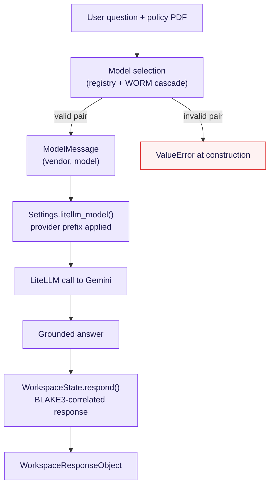
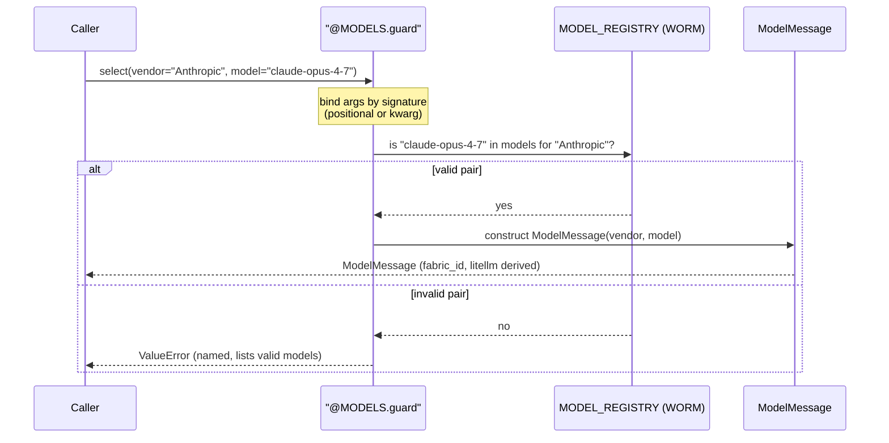

# Lab 1 — Building a Question Answering (QA) Agent

> The transformative evolution of Lab 1: a working demo becomes a governed
> foundation through **seven adaptations**, each selected by a real failure
> pressure. This README walks that evolution with workflow and sequence
> diagrams.

Part of the **Marimo Transformation** (Section 2). To run it, see
[`demo/lab1_run_guide.html`](../demo/lab1_run_guide.html) — both the Read–Eval–Print
Loop (REPL) and the Marimo notebook paths.

---

## The premise

The upstream demo works: hand a model a policy Portable Document Format (PDF)
plus a question, get a grounded answer. But it hardcodes the model string, reads
configuration ad hoc, and expresses agent relationships by convention. Lab 1
keeps the demo's happy path and hardens everything around it — so the same code
behaves well the day something is mistyped, unset, down, or moved.

We frame each change the way evolution frames a trait: a **pressure** appeared,
and the object is the **adaptation** that survived it.

---

## The end-to-end workflow

---

## The seven adaptations

### Adaptation 1 — the closed set (`enums.py`)
**Pressure:** a mistyped value is a valid string and crashes only at runtime; a
hand-rolled `StrEnum` shim is non-standard.
**Adaptation:** standard-library `StrEnum`/`IntEnum` with `@unique` and
`@verify(UNIQUE)`. Each Enum owns its derived facts — `AgentRole.port`,
`AgentRole.default_url()`, `Provider.prefix()` — and one `DEFAULT_HOST` constant
replaces scattered literals. A typo now fails at import.

### Adaptation 2 — the provider toggle (`config.py`)
**Pressure:** switching Gemini ↔ Vertex Artificial Intelligence (Vertex AI) meant
editing every file. `Settings` was doing three jobs.
**Adaptation:** `Settings` holds configuration and validates credentials only;
composition is delegated to the Enums (`litellm_model` → `Provider.prefix`,
`url_for` → `AgentRole.default_url`). One environment variable moves every agent.

### Adaptation 3 — provenance (`WorkspaceState.respond()`)
**Pressure:** parallel replies came back with no link to their request.
**Adaptation:** a response inherits the request's identity and sets
`correlation_id` to the request's BLAKE3 pair hash, so a reply is matchable by
hash regardless of arrival order. `source_agent` is a field, not a prompt the
model might forget.

### Adaptation 4 — vendor vs. provider, declared (`enums.py` + `registry.py`)
**Pressure:** "who owns the model" and "who serves it" were conflated, and the
model list was hand-maintained.
**Adaptation:** `Provider` (who serves) is distinct from the vendor (who owns).
The model registry is parsed directly from `fabric -L` — 78 models across 4
vendors — so it is the tools' truth, regenerated by re-pasting a fresh dump.

### Adaptation 5 — cascading validation (`cascade.py`)
**Pressure:** a wrong vendor/model pair only failed at the Application
Programming Interface (API). The guard was configured by raw string parameter
names — the very thing Enums abolish.
**Adaptation:** the **Write Once Reuse Many (WORM), Enum-keyed `Cascade`**. The
relationship it governs is a `CascadeKey` pair (`VENDOR → MODEL`), the registry
is frozen at import and immutable, and the guard validates the pair against the
decorated function's real signature — so a typo fails at **decoration** time, and
a wrong pair cannot be constructed. It is not limited to (vendor, model); the
same guard governs any parent→child relationship.

### Adaptation 6 — the whole config contract (`config.py`)
**Pressure:** configuration was whatever the environment happened to hold —
implicit and undocumented.
**Adaptation:** one typed Pydantic Version 2 (V2) `Settings` object that both
documents the contract and enforces it at load, validating credentials against
the selected provider.

### Adaptation 7 — two locking strategies (`locking.py`)
**Pressure:** a single down agent hung the whole chain.
**Adaptation:** a pessimistic `run_chain` (verify all prerequisites up front, via
`@requires`) **and** an optimistic, serially-reentrant `run_serially_reentrant`
(proceed, mark a down agent `NEED_INPUT`, resume on re-entry via the WORM
correlation chain). `SELECT … FOR UPDATE` vs. version-checked `UPDATE`.

---

## How a selection is validated (sequence)

## Request to correlated response (sequence)

```mermaid
sequenceDiagram
    participant Lab as "Lab 1 caller"
    participant WS as "WorkspaceState"
    participant Agent as "PolicyAgent"
    participant WR as "WorkspaceResponseObject"

    Lab->>WS: WorkspaceState(bgd_surrogate, fqdn, task_content)
    Note over WS: blake3_pair_hash computed
    WS->>Agent: task_content + skill_id
    Agent->>Agent: answer_query(policy PDF + question)
    Agent->>WS: respond(result, status, source_agent)
    WS->>WR: inherit identity&#59; correlation_id = request pair_hash
    WR-->>Lab: WorkspaceResponseObject (is_terminal)
    Note over Lab,WR: verify_correlation(req, resp) == True
```

---

## Why it adds up

The demo proves one path works. These seven adaptations make N paths safe: every
constraint is defined once and inherited, so the marginal cost of the next agent
is flat. The same objects — the registry, the WORM cascade, the
`ModelMessage`, the correlated envelope — carry directly into Lab 2, where the
QA agent leaves the REPL and rides a live Agent-to-Agent server.

---

*© Mind Over Metadata LLC · CSCI 381 — AI Tools for the Practitioner*
