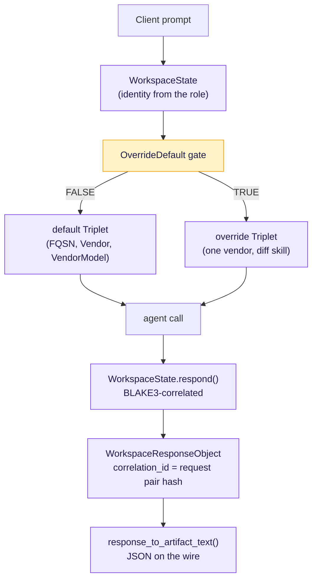
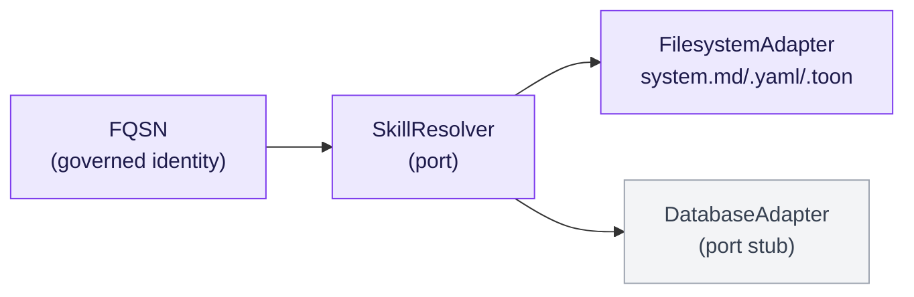
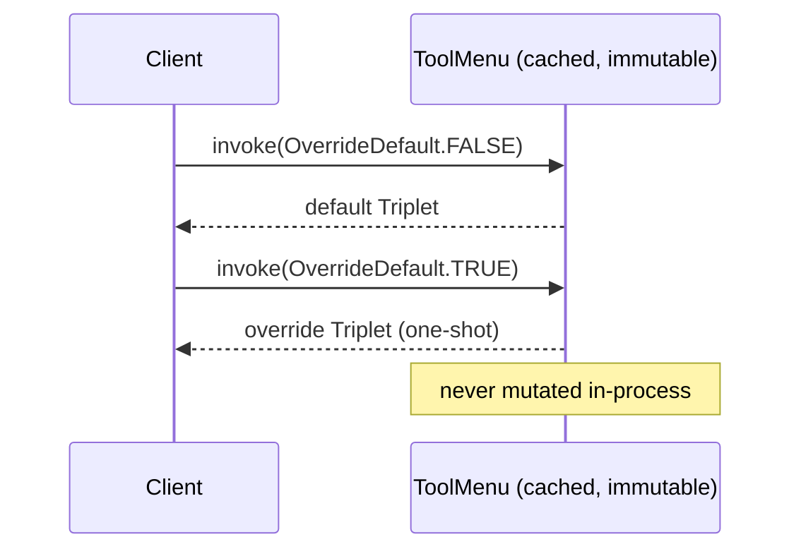

# Lab 2 — A Governed, Choosable Tool

> The evolution of Lab 2: the upstream Policy agent — a server that answers in
> bare text — becomes a governed, choosable tool through **three enhancements**,
> each selected by a real failure pressure. This README walks that evolution
> with workflow and sequence diagrams, then compares it gap-by-gap to upstream.

Part of the **Marimo Transformation** (Section 2). To run it, see
[`demo/lab2_run_guide.html`](../demo/lab2_run_guide.html) — both the
Read–Eval–Print Loop (REPL) and the Marimo notebook paths. Everything runs with
`uv`; the live server section runs on the cluster.

---

## The premise

The upstream demo works: a Policy agent answers an insurance question over an
Agent-to-Agent (A2A) server. But its executor returns **bare text** — the reply
carries no identity, no link to the request that produced it, and no source. The
skill identifier is hardcoded inline, the model is fixed, and the agent card is
assembled from literals.

Lab 2 keeps the happy path and hardens it the way Lab 1 did — and then adds one
real-world capability upstream never had: a tool that offers a **default and an
override** model choice, selected at runtime. We frame each change as evolution
frames a trait: a **pressure** appeared, and the object is the **adaptation**
that survived it.

---

## The end-to-end workflow



---

## The three enhancements

### Enhancement 1 — Correlation: the response carries its identity

**Pressure.** Upstream returns bare text via `new_agent_text_message`. Under
concurrent requests, a reply cannot be matched to the request that produced it.

**Adaptation.** The executor wraps the prompt in a `WorkspaceState`, which has a
BLAKE3 pair hash. `respond()` returns a `WorkspaceResponseObject` whose
`correlation_id` **is** that pair hash, with `source_agent` and
`answered_skill_id` as real fields.

**Use.** A gateway or orchestrator (Labs 7–8) attributes every answer to its
request, even out of order. `handle()` takes only the prompt — identity is
derived from the role, so nothing is hand-typed.

### Enhancement 2 — Fully Qualified Skills Name (FQSN): a polymorphic identity

**Pressure.** Upstream hardcodes the skill id (`'insurance_coverage'`) inline,
re-typed in the card and the handler. It is a flat string with no governance.

**Adaptation.** A skill is named by an FQSN — a governed identity defined once.
It is **polymorphic**: the same identity resolves through a `FilesystemAdapter`
(shipped) or a `DatabaseAdapter` (port stub) via one `SkillResolver` port. This
is the Hexagonal ports-and-adapters pattern at the naming layer.

**Use.** A gateway routes to a tool by its FQSN; the skill backing can move
substrate without changing the identity.



### Enhancement 3 — A default and an override, gated by `OverrideDefault`

**Pressure.** Upstream binds one hardcoded model. There is no way to offer an
alternative at invocation without editing code.

**Adaptation.** A tool holds two triplets `(FQSN, Vendor, VendorModel)` sharing
**one vendor**: a default and an override. The `OverrideDefault` gate
(`FALSE`/`TRUE`) is the whole runtime choice. The single vendor prevents a
vendor × model × skill cross product; the override commonly keeps the default's
vendor and model, choosing a different skill.

**Use.** A tool offers a curated alternative without a redeploy. The menu is
immutable in-process and evolves only across a server restart.



---

## The response submessage — one serializable form, three informative

| Form | Role | Produced by |
|---|---|---|
| JSON | **Serializable** — the narrative payload; the recipient reconstructs the object from it | the lab (`model_dump_json` / `to_wire`) |
| YAML | Informative — human-readable rendering | Fabric (`system.md` → yaml) |
| Token-Optimized Object Notation (TOON) | Informative — TOON rendering | the Medium-published TOON encoder |
| Markdown | Informative — the source `system.md` | the skill source |

Only JSON round-trips; the others are read, not parsed back. The lab authors the
JSON path; it does not reimplement the TOON encoder or duplicate Fabric.

---

## Upstream versus enhanced — gap by gap

| Upstream | Enhanced | Verdict |
|---|---|---|
| bare text reply | `WorkspaceResponseObject`, correlated | Fixes a real upstream gap |
| skill id inline, re-typed | FQSN polymorphic identity | Fixes a real upstream gap |
| card assembled inline | `build_agent_card` from registry | Matters once >1 agent (Labs 4/6/8) |
| one hardcoded model | default + override triplet, one vendor | NEW capability — no upstream menu to fix |
| no runtime choice | `OverrideDefault` gate (FALSE/TRUE) | NEW capability — real-world tool feature |

Honest framing: correlation and FQSN fix genuine upstream gaps; the
default/override menu is new real-world capability, not a fix. Both are
legitimate — for different reasons.

---

## Running it

```bash
# notebook (no model key needed for the demo cells)
uv run marimo edit marimo/lab2_a2a_server_policy_agent.py

# live governed server (cluster: needs A2A SDK + key + policy PDF)
uv run python -m a2a_labs.servers.policy_server
#   Policy A2A server (governed) on http://localhost:9999/
```

**Next — Lab 3:** the client that consumes the correlated response and verifies
the correlation on its own side.

---

*© 2026 Mind Over Metadata LLC.*
