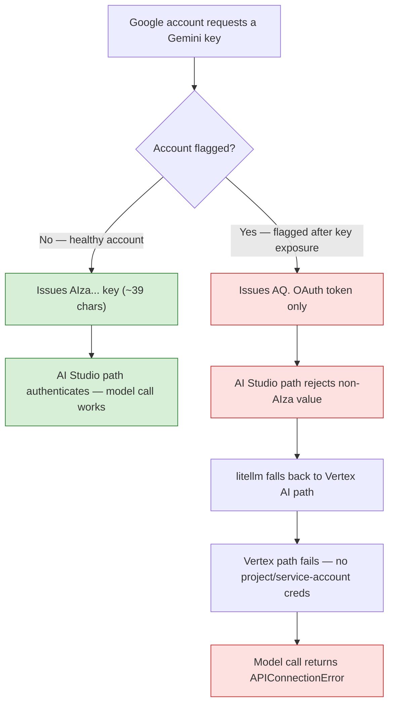
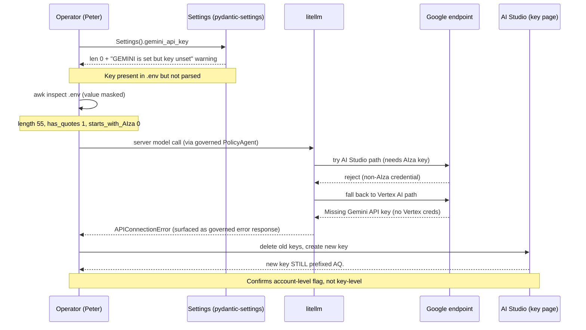
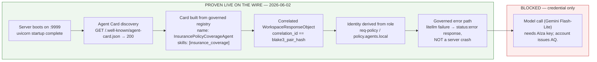
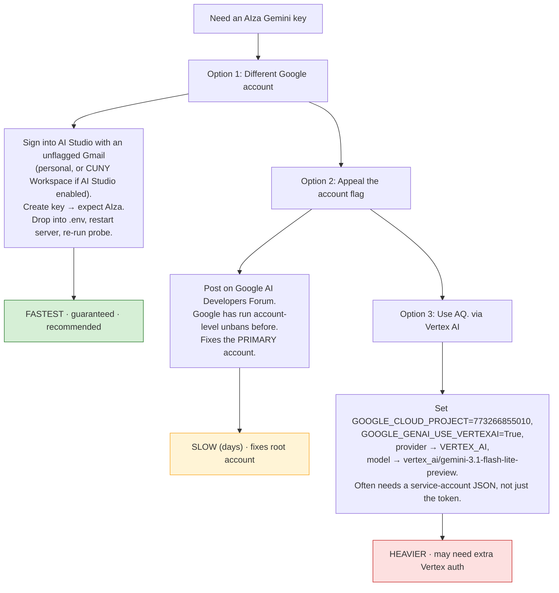

# Gemini Application Programming Interface (API) Credential Issue — `AQ.` Token Diagnosis

**Date:** 2026-06-02
**Author:** Peter Heller (Mind Over Metadata LLC)
**Context:** A2AWalkthrough — Lab 2 governed Agent-to-Agent (A2A) server, live model call
**Status:** Architecture proven on the wire; model call blocked on credential type
**Affected project:** `projects/773266855010` (Google Cloud project number `773266855010`)

---

## 1. Executive Summary

The Lab 2 governed A2A server is fully operational. Agent Card discovery,
the correlated WorkspaceResponseObject, role-derived identity, and the
governed error path are all proven live on the wire. The **only** unresolved
item is the model call itself, which fails because the Google account can
**only** issue OAuth tokens prefixed `AQ.` and **cannot** issue a standard
Google AI Studio API key prefixed `AIza`.

This is an **account-level flag**, not a tier problem, not a stale-key problem,
and not a code problem. Creating new keys (even in new projects) and deleting
old keys does not change the outcome — every issued credential is still `AQ.`.

**Acronyms:** API - Application Programming Interface; A2A - Agent-to-Agent;
OAuth - Open Authorization; AI - Artificial Intelligence; SDK - Software
Development Kit.

---

## 2. What Was Observed (Evidence Trail)

The diagnosis is grounded in observed terminal output and the API key details
panel, in this order:

| # | Observation | Interpretation |
|---|-------------|----------------|
| 1 | `Settings().gemini_api_key` read `len: 0` despite a value in `.env` | Value present but malformed / wrong type |
| 2 | `.env` line started `GEMINI_API_KEY="AQ...`, `length: 55`, `starts_with_AIza: 0`, `has_quotes: 1` | Quote-wrapped, 55 chars, **not** an `AIza` key |
| 3 | litellm traceback showed the **Vertex AI** path (`vertex_and_google_ai_studio_gemini.py`, `_get_token_and_url`) failing for "Missing Gemini API key" | litellm could not use the AI Studio path, fell back to Vertex, failed |
| 4 | New key created (named "A2A Gemini API Key", project `773266855010`) **still** prefixed `AQ.` | Not stale-key; account issues only `AQ.` |
| 5 | Both prior keys deleted; new keys **still** `AQ.` | Restriction is **account-level**, not key-level |

---

## 3. Root Cause — `AQ.` vs `AIza`

A standard Google AI Studio Gemini API key is prefixed **`AIza`** and is
approximately 39 characters. A value prefixed **`AQ.`** is a different
credential **type** — an OAuth / Vertex-style token, not an AI Studio API key.

The Google Generative Language SDK (and litellm's AI Studio path) expects the
`AIza` key. When it receives an `AQ.` value, it cannot authenticate via the
AI Studio endpoint and falls back to the Vertex AI path, which then fails for
lack of full Vertex credentials.

**The trigger:** the Google account has been flagged — most consistent with a
prior **exposed-key incident**. Once flagged, the account is restricted such
that *all* projects (including brand-new ones) generate `AQ.` tokens instead of
`AIza` keys, and new Google Cloud project creation may also be blocked. This is
a documented pattern on the Google AI Developers Forum (see §7 references).



---

## 4. Diagnostic Sequence (What We Ran, In Order)

This is the exact path that isolated the issue — useful to walk through in the
meeting to show the elimination was systematic, not guesswork.



---

## 5. Confirmation That the Architecture Is NOT at Fault

Critically for the meeting: the credential issue is **downstream** of all the
engineering. Everything up to the model call is proven working live.



The wire proof returned a real `WorkspaceResponseObject` whose
`correlation_id` was byte-identical to the request's `blake3_pair_hash`. The
`result` field carried the `APIConnectionError` string — meaning the failure
was captured **as a governed response**, which is the designed behaviour. A
working key swaps that error string for a real coverage answer; nothing in the
A2A layer changes.

---

## 6. Resolution Options (Ranked)



### Option 1 — Different Google account (recommended)
Sign into <https://aistudio.google.com/api-keys> with a Google account that has
**not** been flagged. Create an API key; confirm it is prefixed `AIza`. Place it
into `.env` (no quotes), restart the server, re-run the probe. ~2 minutes.

### Option 2 — Appeal the flag
File on the Google AI Developers Forum referencing the exposed-key incident and
that all new projects issue `AQ.` only. Documented account-level unbans have
occurred (e.g. a system-wide unban on 2026-03-02). Slow but fixes the primary
account.

### Option 3 — Vertex AI route (heaviest)
The `AQ.` credential is usable through the Vertex AI path, not AI Studio. This
requires the project (`773266855010` — visible in the key-details panel),
`GOOGLE_GENAI_USE_VERTEXAI=True`, switching `provider` to `Provider.VERTEX_AI`,
and the model string `vertex_ai/gemini-3.1-flash-lite-preview`. Vertex commonly
requires a service-account JSON (`GOOGLE_APPLICATION_CREDENTIALS`) rather than a
bare token, so this may not work with the `AQ.` value alone.

---

## 7. Key Facts to State in the Meeting

1. **`AQ.` is not a Gemini AI Studio key.** Valid AI Studio keys are prefixed
   `AIza` (~39 chars). If a value does not start with `AIza`, it is not a Gemini
   API key. Same format applies to **both free and paid tiers** — this is *not*
   a tier issue.
2. **The flag is account-level.** New keys, new projects, and key deletion all
   still produce `AQ.` — confirmed empirically (project `773266855010`).
3. **Most consistent cause:** the account was flagged after a previously exposed
   key. This is a documented Google pattern, not a local misconfiguration.
4. **Nothing is wrong with the code.** The governed A2A architecture is proven
   live; only the model credential is blocked.
5. **Recommended fix:** obtain an `AIza` key from an unflagged Google account
   (Option 1).

---

## 8. Open Question for the Meeting

> Which Google account should own the Gemini credential for the A2A lab work —
> a fresh personal account, or the CUNY Workspace account (if Google AI Studio
> is enabled there)? And separately: do we want to pursue an appeal to restore
> `AIza` key issuance on the flagged primary account, given it may be needed for
> other Google API work beyond this lab?

---

## 9. Post-Resolution Verification (Once an `AIza` Key Is In Place)

```bash
# In 02-marimo-transformation/, write the key cleanly (no quotes):
read -s -p "Paste AIza key: " KEY; echo
grep -v '^GEMINI_API_KEY=' .env > .env.tmp && mv .env.tmp .env
printf 'GEMINI_API_KEY=%s\n' "$KEY" >> .env
unset KEY
sed -i 's/\r$//' .env

# Verify Settings reads it:
uv run python -c "from a2a_labs.config import Settings; k=Settings().gemini_api_key or ''; print('len:',len(k),'AIza:',k.startswith('AIza'))"
# Target: len: 39  AIza: True

# Restart server (Ctrl+C, relaunch), then re-run the probe:
uv run python -m a2a_labs.servers.policy_server   # terminal 1
uv run python /tmp/lab2_probe.py                  # terminal 2
# Target: status:"ok" + real coverage answer; correlation_id == blake3_pair_hash
```

---

*Prepared 2026-06-02 for discussion the following day. Project reference:
`projects/773266855010`. No secret key values are recorded in this document.*
