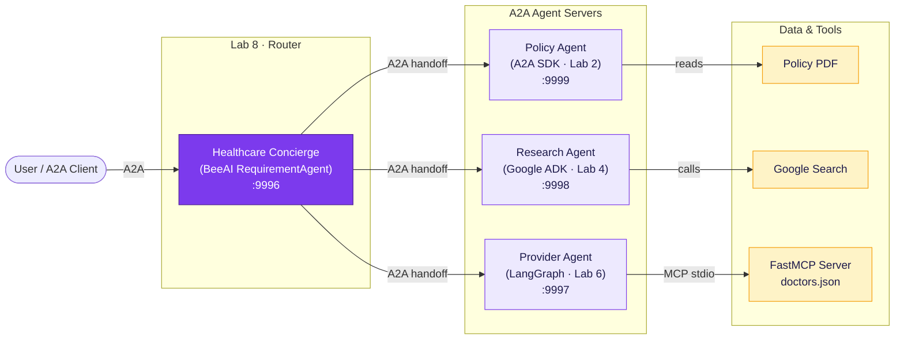
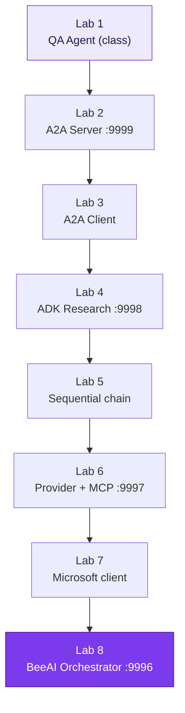

# Architecture — The Multi-Agent Healthcare System

The eight labs build up to one system: a Healthcare Concierge that coordinates
three specialist agents over the Agent-to-Agent (A2A) protocol. Each agent is an
Asynchronous Server Gateway Interface (ASGI) server on its own port.

## How the labs build toward this

## Two protocols, two jobs

The Model Context Protocol (MCP) connects an agent to **tools** (the Provider
agent calls the doctor-lookup tool over MCP stdio). The A2A protocol connects
agents to **each other** (the Concierge hands off to the three specialists). The
Provider agent plays both roles at once: an MCP client to its tool, and an A2A
server to the world.

## Ports (from `AgentPort` IntEnum / `example.env`)

| Agent | Port | Framework | Lab |
|-------|------|-----------|-----|
| Policy | 9999 | A2A SDK | 2 |
| Research | 9998 | Google ADK | 4 |
| Provider | 9997 | LangGraph + MCP | 6 |
| Healthcare (orchestrator) | 9996 | BeeAI | 8 |

All four must be running before the orchestrator starts. Use the parallel
launcher (`marimo/lab0_launcher.py`) — see `STANDARDS_AND_MARIMO.md`.
