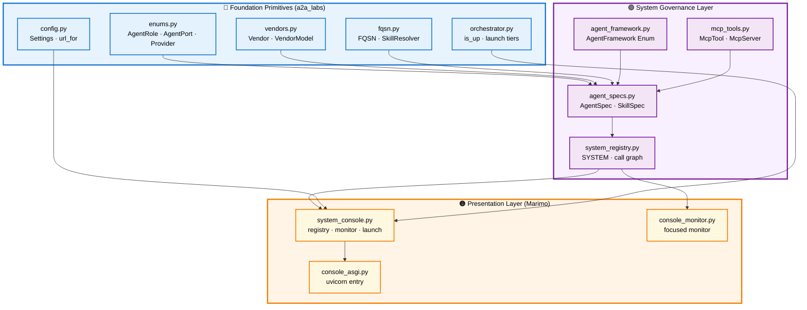
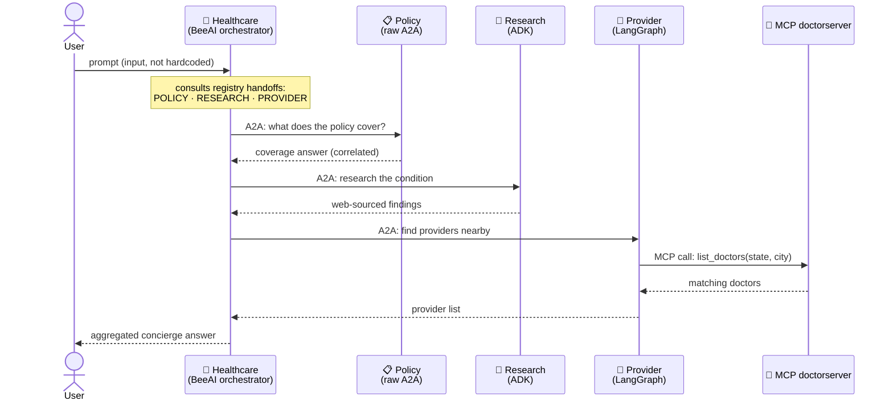
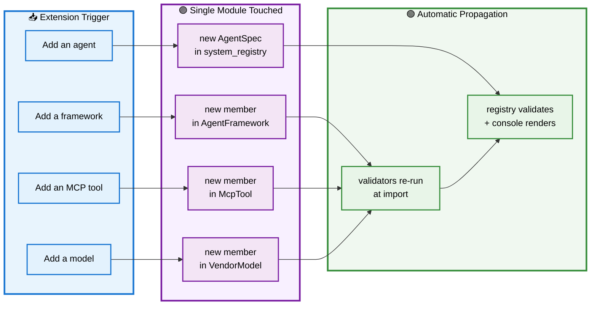
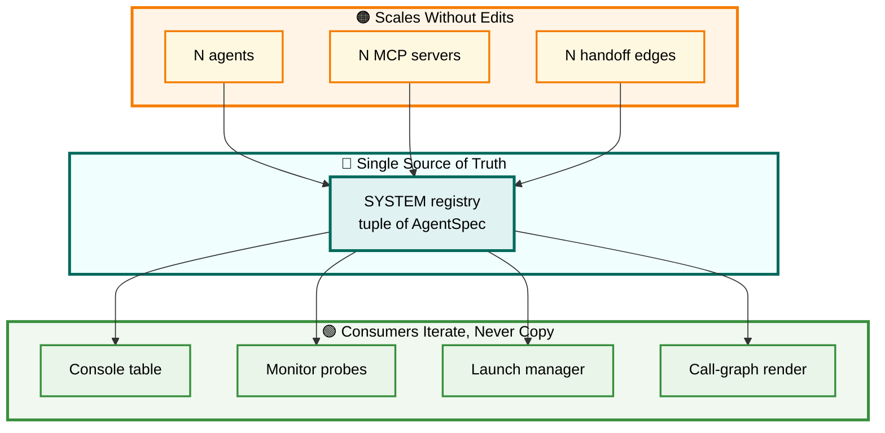

# 🏗️ A2A Unified System — Module Guide

> The four healthcare agents — **Policy**, **Research**, **Provider**, **Healthcare** — were five separate framework scripts glued together by environment variables. This guide documents the modules that fold them into **one governed, Enum-driven application** served through Marimo + uvicorn, with zero hardcoding of identity.

**Mermaid dialect note:** all diagrams use `classDef` + `class` for node styling (no fragile `linkStyle` index-counting) and `style` only for subgraph backgrounds, for the lowest render-error surface.

---

## 📑 Table of Contents

1. [🗺️ Overview — How It All Fits Together](#overview)
2. [🧩 agent_framework.py — The Framework Enum](#agent-framework)
3. [🔧 mcp_tools.py — Governed MCP Tools](#mcp-tools)
4. [📇 agent_specs.py — Validated Agent Specifications](#agent-specs)
5. [🗂️ system_registry.py — The WORM System Registry](#system-registry)
6. [🖥️ system_console.py — The Marimo System Console](#system-console)
7. [📊 console_monitor.py — The Focused Monitor](#console-monitor)
8. [🚀 console_asgi.py — The Uvicorn ASGI Entry](#console-asgi)

---

## 🗺️ Overview — How It All Fits Together

### 🎯 The Problem This Solves

The upstream A2A Walkthrough is a **segmented application**: each of the four agents is written against a different framework (raw A2A Software Development Kit, Google Agent Development Kit, LangGraph, Microsoft Agent Framework, BeeAI), and each agent script independently hardcodes its own identity — its port via `os.getenv`, its model as a string literal, its skill metadata inline, and (for the orchestrator) the set of agents it calls. The Model Context Protocol (MCP) tool name `"find_healthcare_providers"` appears as a free-form string in three places, while the MCP server actually names the tool `list_doctors` — a mismatch held together only by convention.

The unified application removes every one of those loose strings. **Identity becomes governed:** ports come from an Enum, models from a validated Enum, frameworks from an Enum, MCP tool names from an Enum, and skill identities from a Fully Qualified Skills Name (FQSN). The four agents are assembled once into a single immutable registry whose call graph is validated at import. A **prompt remains input** — it is the one string a user supplies at runtime — but nothing about *identity* is ever hand-typed.

### 🧱 The Layered Architecture

The application is built in layers, each depending only on the layer beneath it. The foundation (`a2a_labs`) supplies governed primitives; the new modules compose them into a system; the Marimo console consumes the system without ever touching a literal.

**Reading the layers:** the foundation primitives (blue) are the closed sets and validated models that already shipped in `a2a_labs`. The governance layer (purple) is what this work adds — it composes those primitives into agent specifications and a validated registry. The presentation layer (orange) is the Marimo console, which reads the registry to render the system, monitor reachability, and launch agents. **Dependency flows strictly downward**: the console never imports an agent script or a literal; it imports the registry.

[↑ Back to TOC](#-table-of-contents)

### 🔄 The Runtime Workflow — Healthcare Concierge Round Trip

At runtime the Healthcare agent (the BeeAI orchestrator) is the front door. A user prompt arrives, the orchestrator consults its handoff list — which is governed by the registry, not hardcoded — and calls the Policy, Research, and Provider agents over A2A. The Provider agent in turn calls the MCP doctor server. This sequence shows the full path a single concierge query travels.

**Why this matters for the design:** the orchestrator's three handoff edges are not written into the BeeAI agent as literals — they are declared once on the Healthcare `AgentSpec` and validated by the registry to point at real, registered roles. Change the call graph by editing one spec; the workflow above reshapes automatically.

[↑ Back to TOC](#-table-of-contents)

### 🧩 Extensibility — Adding to the System

The governance layer is designed so that each kind of addition touches exactly one place and never the UI. The following workflow shows what a developer does for each type of extension, and which single module absorbs the change.

**The extensibility contract, stated plainly:**

- **A new agent** is one `AgentSpec` added to the registry tuple. If it declares a handoff to an unregistered role, the registry refuses to build — the error surfaces at import, not at runtime.
- **A new framework** is one `AgentFramework` member. The console's framework labels and the per-agent cards pick it up with no further change.
- **A new MCP tool** is one `McpTool` member that names its server; the `SERVER_TOOLS` view and the console's MCP table derive it automatically.
- **A new model** is one `VendorModel` member carrying its owning vendor; the cascade validation guarantees no agent can pair a model with the wrong vendor.

Because every addition is a closed-set member or a validated model, **a typo fails at import, not in production** — the same discipline the foundation already enforces, now extended to the whole system.

[↑ Back to TOC](#-table-of-contents)

### 📈 Scaling — From Four Agents to Many

The registry pattern scales along three independent axes without architectural change, because the system is data (a tuple of specs) governed by validators, not a hand-wired graph.

| 📐 Scaling Axis | What Grows | What Stays Fixed |
|---|---|---|
| **More agents** | The `SYSTEM` tuple grows; ports come from `AgentPort` | Console, monitor, and launch logic — they iterate the registry |
| **More MCP servers** | `McpServer` / `McpTool` gain members; fan-out is derived | The Provider-style consumption pattern — one client, many tools |
| **Deeper call graphs** | Handoff tuples lengthen; multiple orchestrators allowed | Graph-closure validation — every edge still proven at import |
| **Horizontal instances** | Each agent is an independent uvicorn process | `is_up` health-probing; the monitor polls whatever exists |

The scaling story rests on one structural fact: **the registry is the single source of truth, navigated rather than copied.** The console does not contain a list of agents — it iterates `SYSTEM`. The monitor does not know four ports — it asks each spec for its role's port. The launch manager does not hardcode four scripts — it maps roles to scripts in one place. Add a fifth, sixth, or tenth agent, and every consumer scales with it because none of them holds a private copy of the agent list.

[↑ Back to TOC](#-table-of-contents)

### 🗂️ The Seven Modules at a Glance

| Module | Layer | Responsibility |
|---|---|---|
| `agent_framework.py` | Governance | The five frameworks as a closed Enum |
| `mcp_tools.py` | Governance | MCP tool + server names as Enums; eliminates the repeated literal |
| `agent_specs.py` | Governance | `AgentSpec` / `SkillSpec` with cross-object validators |
| `system_registry.py` | Governance | The four specs as one validated, immutable registry |
| `system_console.py` | Presentation | Full Marimo console: registry, call graph, monitor, launch |
| `console_monitor.py` | Presentation | Focused reachability monitor page |
| `console_asgi.py` | Presentation | Uvicorn ASGI entry that serves the console |

Each of the following sections documents one module in depth, with the workflow or sequence diagram that clarifies its internal behavior.

[↑ Back to TOC](#-table-of-contents)

---
