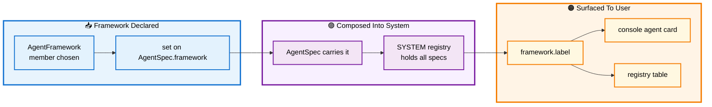

# 🧩 Section 2 — `agent_framework.py`

> The framework Enum: how the unified application reasons about *which stack serves which agent* without ever parsing an import line. Part of the A2A Unified System guide; autonomous and self-contained.

[← Overview / Section 1](SYSTEM_GUIDE.md)

---

## 📑 Table of Contents

1. [🎯 Purpose](#purpose)
2. [🔍 The Problem It Removes](#problem)
3. [🧱 The Enum Definition](#definition)
4. [🔄 Workflow — Where the Framework Identity Travels](#workflow)
5. [📐 Design Principles Applied](#principles)
6. [🧩 Extending It](#extending)

---

<a id="purpose"></a>

## 🎯 Purpose

`agent_framework.py` defines one closed Enum, `AgentFramework`, naming the five stacks the system is built on: the raw Agent-to-Agent Software Development Kit (A2A SDK), Google Agent Development Kit (ADK), LangGraph with Model Context Protocol (MCP) tools, the Microsoft Agent Framework, and BeeAI. Each agent in the system *is implemented against* exactly one of these, and that fact is now a first-class, referenceable value rather than something a reader must infer from a script's import block.

[↑ Back to TOC](#-table-of-contents)

---

<a id="problem"></a>

## 🔍 The Problem It Removes

In the upstream application, the framework an agent uses is **implicit knowledge** — it lives only in which libraries that agent's script happens to import. The Policy agent hand-rolls an `AgentExecutor` and a Starlette application; the Research agent imports Google ADK's `LlmAgent` and `to_a2a`; the Provider agent imports LangGraph's `create_agent` and the MCP adapters; the orchestrator imports BeeAI's `RequirementAgent`. Nothing in the system can *answer the question* "which framework serves the Research role?" without a human reading source files.

That implicit knowledge becomes a problem the moment you want a unified console: a monitor that labels each agent by framework, a registry that validates framework choices, or documentation that stays in sync. `AgentFramework` makes the choice **explicit and closed** — a fixed set of named members the rest of the application can reason over.

[↑ Back to TOC](#-table-of-contents)

---

<a id="definition"></a>

## 🧱 The Enum Definition

The module is deliberately small — a single `StrEnum` with the standard-library `@unique` constraint and one derived `label` property. Each member's inline comment records the concrete construct that stack uses, so the Enum doubles as a quick map from framework to its signature API.

```python
@unique
class AgentFramework(StrEnum):
    """Which stack implements an agent server. One member per framework."""

    RAW_A2A = "raw_a2a"          # a2a-sdk: hand-rolled AgentExecutor + Starlette
    ADK = "adk"                  # Google ADK: LlmAgent + to_a2a()
    LANGGRAPH_MCP = "langgraph"  # LangGraph create_agent + MCP tools
    MICROSOFT = "microsoft"      # agent_framework.a2a.A2AAgent (client/interop)
    BEEAI = "beeai"              # BeeAI RequirementAgent orchestrator

    @property
    def label(self) -> str:
        """Human display name — owned by the member, not hand-typed by callers."""
        return {
            AgentFramework.RAW_A2A: "Raw A2A SDK",
            AgentFramework.ADK: "Google ADK",
            AgentFramework.LANGGRAPH_MCP: "LangGraph + MCP",
            AgentFramework.MICROSOFT: "Microsoft Agent Framework",
            AgentFramework.BEEAI: "BeeAI",
        }[self]
```

Two design points are worth naming. First, it subclasses `StrEnum`, so each member *is* a string (`AgentFramework.ADK == "adk"`) — convenient for serialization and comparison while remaining a closed set. Second, the human-readable `label` is **owned by the member**, not hand-typed at every call site; a console that wants to display "Google ADK" asks `framework.label` rather than carrying its own mapping that could drift.

[↑ Back to TOC](#-table-of-contents)

---

<a id="workflow"></a>

## 🔄 Workflow — Where the Framework Identity Travels

`AgentFramework` is not consumed in isolation. It is set once on each agent's specification, carried into the registry, and surfaced by the console. The diagram below traces that path — from declaration, through composition, to display — showing why making the framework explicit pays off downstream.



**Reading the flow:** the framework is declared once (blue), composed into the agent specification and the system registry (purple), and surfaced through the single `label` property wherever the user sees it (orange). Because the value flows from one declaration rather than being re-typed at each display site, the console and the registry table can never disagree about what framework an agent uses.

[↑ Back to TOC](#-table-of-contents)

---

<a id="principles"></a>

## 📐 Design Principles Applied

| 🧭 Principle | How This Module Honors It |
|---|---|
| **No hardcoding** | A framework is a referenced Enum member, never a string typed at a call site. |
| **Single Responsibility** | The module's one job is to name the frameworks; the `label` lives with the member that owns it. |
| **Keep It Simple and Standard** | Standard-library `StrEnum` + `@unique`; no custom machinery. |
| **Closed set** | `@unique` forbids duplicate values, so the set of frameworks is fixed and typo-proof at import. |

[↑ Back to TOC](#-table-of-contents)

---

<a id="extending"></a>

## 🧩 Extending It

Adding a sixth framework is a one-line change plus its label: add the member, add its entry to the `label` mapping. Nothing else in the system needs editing — the registry will accept an `AgentSpec` that uses it, and the console will display its label automatically, because every consumer reaches the framework through this Enum rather than holding a private list.

```python
    CREWAI = "crewai"   # new member
    # ...and in label:
    AgentFramework.CREWAI: "CrewAI",
```

The discipline to preserve: **never** reintroduce a framework as a bare string elsewhere. The instant a `"crewai"` literal appears in an agent script instead of `AgentFramework.CREWAI`, the closed-set guarantee is lost and the drift this module exists to prevent creeps back in.

[↑ Back to TOC](#-table-of-contents)

[← Overview / Section 1](SYSTEM_GUIDE.md)
