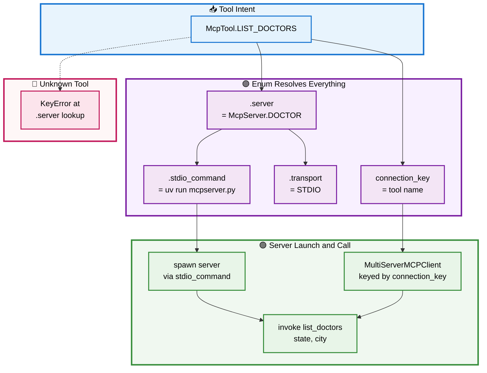

# 🔧 Section 3 — `mcp_tools.py`

> Model Context Protocol (MCP) tools as a governed Enum: how a tool name that was a free-form string repeated three times — and mismatched against the server — becomes a single closed value that owns its server, transport, and launch command. Autonomous and self-contained.

[← Overview / Section 1](SYSTEM_GUIDE.md)

---

## 📑 Table of Contents

1. [🎯 Purpose](#purpose)
2. [🔍 The Hardcoding It Removes](#problem)
3. [🧱 The Two Enums](#definition)
4. [🔄 Workflow — Resolving a Tool Call](#workflow)
5. [⚖️ Before and After](#beforeafter)
6. [📐 Design Principles Applied](#principles)
7. [🧩 Extending It](#extending)

---

<a id="purpose"></a>

## 🎯 Purpose

`mcp_tools.py` defines two closed Enums — `McpServer` and `McpTool` — that turn MCP identity into governed values. An `McpTool` member *is* the wire tool name, and it owns which `McpServer` provides it; an `McpServer` member owns its launch script, its transport, and the command line to spawn it. Anywhere the application needs to name, locate, or launch an MCP tool, it references a member instead of typing a string.

A prompt is **input**, not hardcoding, so prompts are not modeled here. A tool *name*, however, is drawn from a fixed known set — so it is an Enum.

[↑ Back to TOC](#-table-of-contents)

---

<a id="problem"></a>

## 🔍 The Hardcoding It Removes

In the upstream Provider agent the MCP tool name `"find_healthcare_providers"` is a free-form string that appears **three times** — as the `MultiServerMCPClient` connection key, as the advertised `AgentSkill` id, and inside the agent's system prompt. Worse, none of those three match the name the MCP server actually registers: `mcpserver.py` declares its tool as `list_doctors` via `@mcp.tool()`. The system works only because the LangGraph agent discovers the real tool through the connection at runtime — the human-facing string and the wire name are simply different, and nothing enforces a relationship between them.

That is four strings (three copies of one name, plus the server's true name) held together by convention. `mcp_tools.py` collapses them: there is one `McpTool.LIST_DOCTORS` whose value **is** the server's real tool name, and whose `connection_key` is that same value — so the key and the tool name cannot drift apart, because they are the same source.

[↑ Back to TOC](#-table-of-contents)

---

<a id="definition"></a>

## 🧱 The Two Enums

`McpServer` models the server process; `McpTool` models a callable tool and points back at its server. Each owns the facts derived from it (Single Responsibility Principle), so callers ask the member rather than rebuilding a mapping.

```python
@unique
class McpServer(StrEnum):
    """An MCP server process the labs can launch. Owns its launch command."""

    DOCTOR = "doctorserver"  # matches FastMCP("doctorserver") in mcpserver.py

    @property
    def script(self) -> str:
        return {McpServer.DOCTOR: "mcpserver.py"}[self]

    @property
    def transport(self) -> TransportMode:
        return TransportMode.STDIO

    def stdio_command(self) -> list[str]:
        return ["uv", "run", self.script]


@unique
class McpTool(StrEnum):
    """A callable MCP tool. Its value IS the wire tool name — one source."""

    LIST_DOCTORS = "list_doctors"  # the actual @mcp.tool name in mcpserver.py

    @property
    def server(self) -> McpServer:
        return {McpTool.LIST_DOCTORS: McpServer.DOCTOR}[self]

    @property
    def connection_key(self) -> str:
        return self.value   # key IS the tool name — cannot drift


SERVER_TOOLS: dict[McpServer, list[McpTool]] = {
    s: [t for t in McpTool if t.server is s] for s in McpServer
}
```

Three things to note. First, `McpServer.DOCTOR`'s value `"doctorserver"` matches the `FastMCP("doctorserver")` name in `mcpserver.py` — the Enum is anchored to the real server. Second, `stdio_command()` **composes** the launch argv from the script rather than storing a literal command, so the transport and command stay consistent. Third, `SERVER_TOOLS` is a **derived view** — it is computed from `McpTool`'s own `server` property, never hand-maintained, so it cannot fall out of sync with the tool definitions.

[↑ Back to TOC](#-table-of-contents)

---

<a id="workflow"></a>

## 🔄 Workflow — Resolving a Tool Call

When the Provider agent needs to call a doctor lookup, it starts from an `McpTool` member and lets the Enum resolve everything else — the connection key, the server, the transport, and the spawn command. The diagram traces that resolution, ending at the live MCP call. The error path (an unknown tool) is shown dashed.



**Reading the flow:** a single intent (blue) — the `McpTool` member — fans out through the Enum's properties (purple) into the connection key, server, transport, and spawn command. Those drive the live launch and call (green). If a member's `server` mapping is missing, the lookup raises immediately (pink, dashed) rather than failing silently at runtime — the closed-set guarantee surfaces the mistake at the resolution step.

[↑ Back to TOC](#-table-of-contents)

---

<a id="beforeafter"></a>

## ⚖️ Before and After

| Aspect | 🔴 Upstream (hardcoded) | 🟢 Governed (`mcp_tools.py`) |
|---|---|---|
| Tool name | `"find_healthcare_providers"` typed 3× | `McpTool.LIST_DOCTORS`, one source |
| Name vs server | mismatched (`find_healthcare_providers` vs `list_doctors`) | identical by construction |
| Connection key | a separate literal | `connection_key` == the tool name |
| Server location | implied by the connection dict | `McpTool.server` owns it |
| Launch command | inline `["uv","run","mcpserver.py"]` | `McpServer.stdio_command()` composes it |
| Server↔tool map | none (manual) | `SERVER_TOOLS` derived automatically |

[↑ Back to TOC](#-table-of-contents)

---

<a id="principles"></a>

## 📐 Design Principles Applied

| 🧭 Principle | How This Module Honors It |
|---|---|
| **No hardcoding** | The tool name exists once, as an Enum value; the connection key references it. |
| **Single source of truth** | `connection_key` and the wire name are the same value — they cannot diverge. |
| **Single Responsibility** | The server owns its launch command; the tool owns its server pointer. |
| **Derived, never copied** | `SERVER_TOOLS` is computed from the tools, not hand-maintained. |
| **Fail at import / lookup** | A missing `server` mapping raises immediately, not at runtime. |

[↑ Back to TOC](#-table-of-contents)

---

<a id="extending"></a>

## 🧩 Extending It

Adding a tool is one member plus its `server` mapping. Adding a server is one member plus its `script` mapping. The derived `SERVER_TOOLS` view absorbs both with no edit.

```python
# a second tool on the same server:
class McpTool(StrEnum):
    LIST_DOCTORS = "list_doctors"
    DOCTOR_DETAIL = "doctor_detail"      # new

    @property
    def server(self) -> McpServer:
        return {
            McpTool.LIST_DOCTORS: McpServer.DOCTOR,
            McpTool.DOCTOR_DETAIL: McpServer.DOCTOR,   # new mapping
        }[self]
```

The discipline to preserve: the Enum **value must equal the server's real `@mcp.tool` name**. That equality is the whole guarantee — it is why the connection key, the advertised name, and the wire name can never drift. Introduce a member whose value does not match the server's registered tool, and the mismatch this module exists to prevent returns.

[↑ Back to TOC](#-table-of-contents)

[← Overview / Section 1](SYSTEM_GUIDE.md)
