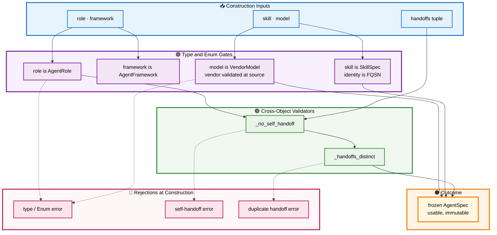

# 📇 Section 4 — `agent_specs.py`

> Validated agent specifications: how an agent's identity — role, framework, skill, model, handoffs — stops being inline strings scattered across a script and becomes one frozen, cross-validated object whose invariants are enforced by Pydantic decorators at construction. Autonomous and self-contained.

[← Overview / Section 1](SYSTEM_GUIDE.md)

---

## 📑 Table of Contents

1. [🎯 Purpose](#purpose)
2. [🔍 The Scattered Identity It Consolidates](#problem)
3. [🧱 SkillSpec — Identity Governed, Content Free](#skillspec)
4. [🧱 AgentSpec — The Governed Agent](#agentspec)
5. [🔄 Workflow — The Validation Gates](#workflow)
6. [📊 Field Governance Map](#fields)
7. [📐 Design Principles Applied](#principles)
8. [🧩 Extending It](#extending)

---

<a id="purpose"></a>

## 🎯 Purpose

`agent_specs.py` defines two frozen Pydantic models — `SkillSpec` and `AgentSpec` — that fold an agent's entire identity into one governed object. Every field is drawn from a governed source: the role from `AgentRole`, the framework from `AgentFramework`, the skill identity from a Fully Qualified Skills Name (FQSN), the model from `VendorModel`, and any backing tool from `McpTool`. Cross-object invariants the upstream scripts left to convention — no self-handoff, distinct handoffs, a model that belongs to its vendor — are enforced by decorators that run at construction. The only free-form strings permitted are the human-facing description and examples, which are **content, not identity**.

[↑ Back to TOC](#-table-of-contents)

---

<a id="problem"></a>

## 🔍 The Scattered Identity It Consolidates

In the upstream system, an agent's identity is spread across its script as loose values. The Policy agent builds an `AgentSkill` from inline strings (`id="insurance_coverage"`, a name, a description, example literals), fixes its model as a string, reads its port from `os.getenv("POLICY_AGENT_PORT")`, and — in the orchestrator's case — names the agents it calls as bare URLs assembled from more environment variables. Nothing connects these values or checks them against each other: a typo in the skill id, a model that the chosen vendor does not serve, or a handoff to a non-existent agent all pass silently and fail only at runtime, if at all.

`agent_specs.py` consolidates that scatter into a single object per agent and adds the checks convention previously supplied by hope. Because the model is **frozen** and validated **after construction**, an invalid agent cannot exist — the error is raised the moment the spec is built, at import time, not when a user finally triggers the broken path.

[↑ Back to TOC](#-table-of-contents)

---

<a id="skillspec"></a>

## 🧱 SkillSpec — Identity Governed, Content Free

`SkillSpec` separates the two kinds of information an advertised skill carries. The **identity** is an FQSN — a governed, structured name — and the A2A skill id is *derived* from it rather than re-typed. The **content** — name, description, examples — is human-facing prose. An optional `mcp_tool` links the skill to a governed `McpTool` member when the skill is backed by one.

```python
class SkillSpec(BaseModel):
    model_config = ConfigDict(frozen=True)

    identity: FQSN                       # governed identity (not a flat string)
    name: str                            # human content
    description: str                     # human content
    examples: tuple[str, ...] = ()       # human content
    mcp_tool: McpTool | None = None      # Enum member when MCP-backed

    @property
    def id(self) -> str:
        """The A2A AgentSkill id — derived from the FQSN, never re-typed."""
        return self.identity.name
```

The crucial line is the `id` property: the upstream `AgentSkill.id="insurance_coverage"` literal becomes `self.identity.name`, computed from the FQSN. The skill id and the skill's governed identity are therefore the same source — they cannot drift, and the dotted display form is produced, never stored twice.

[↑ Back to TOC](#-table-of-contents)

---

<a id="agentspec"></a>

## 🧱 AgentSpec — The Governed Agent

`AgentSpec` binds the role, framework, skill, model, and handoff list into one frozen object, then enforces the cross-object invariants with `@model_validator(mode="after")` decorators. Derived facts — URL and port — are computed from the role (Single Responsibility Principle), and the LiteLLM model string is composed through `Settings`, never typed.

```python
class AgentSpec(BaseModel):
    model_config = ConfigDict(frozen=True)

    role: AgentRole
    framework: AgentFramework
    skill: SkillSpec
    model: VendorModel
    description: str
    handoffs: tuple[AgentRole, ...] = ()   # roles this agent calls over A2A

    @model_validator(mode="after")
    def _no_self_handoff(self) -> "AgentSpec":
        if self.role in self.handoffs:
            raise ValueError(f"{self.role.value} cannot hand off to itself")
        return self

    @model_validator(mode="after")
    def _handoffs_distinct(self) -> "AgentSpec":
        if len(set(self.handoffs)) != len(self.handoffs):
            raise ValueError(f"{self.role.value}: duplicate handoff target")
        return self

    @property
    def url(self) -> str:
        return self.role.default_url()     # composed from the role

    @property
    def port(self) -> int:
        return int(self.role.port)

    def litellm_model(self, settings) -> str:
        return settings.litellm_model(self.model)
```

Note that the **model-belongs-to-vendor** check is not duplicated here — it already lives on `VendorModel`, where each member stores its owning vendor. `AgentSpec` references that governed model rather than re-validating it, so the cascade is enforced once, at the source.

[↑ Back to TOC](#-table-of-contents)

---

<a id="workflow"></a>

## 🔄 Workflow — The Validation Gates

Constructing an `AgentSpec` is a gated process: Pydantic coerces and type-checks each field against its Enum or model, then the `@model_validator` decorators run the cross-object invariants. Only a spec that clears every gate becomes a usable, frozen object. The diagram shows the gates in order, with the rejection paths dashed.



**Reading the gates:** inputs (blue) pass first through type and Enum coercion (purple) — a non-`AgentRole` role or a non-`VendorModel` model is rejected here. Surviving values reach the cross-object validators (green): self-handoff and duplicate-handoff checks. Only after every gate clears does the frozen `AgentSpec` exist (orange, emphasized). Each rejection (pink, dashed) is raised at construction, so an invalid agent never enters the system.

[↑ Back to TOC](#-table-of-contents)

---

<a id="fields"></a>

## 📊 Field Governance Map

| Field | Governed By | Identity or Content |
|---|---|---|
| `role` | `AgentRole` Enum | Identity — also yields port and URL |
| `framework` | `AgentFramework` Enum | Identity |
| `skill.identity` | `FQSN` | Identity — yields the skill id |
| `skill.mcp_tool` | `McpTool` Enum (optional) | Identity |
| `model` | `VendorModel` (vendor validated at source) | Identity |
| `handoffs` | tuple of `AgentRole`, cross-validated | Identity — the call graph |
| `description`, `skill.name`, `skill.examples` | free strings | **Content** (allowed) |

The line between identity and content is the whole governance boundary: identity is always an Enum or governed model; content is the human prose a person actually reads.

[↑ Back to TOC](#-table-of-contents)

---

<a id="principles"></a>

## 📐 Design Principles Applied

| 🧭 Principle | How This Module Honors It |
|---|---|
| **No hardcoding** | Every identity field is an Enum or governed model; only prose is free. |
| **Validate once, at the source** | Model-vs-vendor lives on `VendorModel`; `AgentSpec` references it, never re-checks. |
| **Fail at construction** | `@model_validator(mode="after")` rejects invalid specs at import, not runtime. |
| **Single Responsibility** | URL and port are derived from the role, owned by the role. |
| **Immutability** | `frozen=True` — a spec cannot be mutated after it passes the gates. |

[↑ Back to TOC](#-table-of-contents)

---

<a id="extending"></a>

## 🧩 Extending It

A new cross-object invariant is a new `@model_validator(mode="after")` method — for example, requiring that any skill carrying an `mcp_tool` also belongs to an agent whose framework can host MCP. The gate is added in one place and runs automatically on every spec thereafter.

```python
    @model_validator(mode="after")
    def _mcp_requires_capable_framework(self) -> "AgentSpec":
        if self.skill.mcp_tool and self.framework is not AgentFramework.LANGGRAPH_MCP:
            raise ValueError(
                f"{self.role.value}: MCP-backed skill needs an MCP-capable framework"
            )
        return self
```

The discipline to preserve: invariants belong **here**, as validators on the spec, not as scattered `if` checks in the agent scripts or the console. Centralizing them is what guarantees every agent in the system is checked the same way, every time it is built.

[↑ Back to TOC](#-table-of-contents)

[← Overview / Section 1](SYSTEM_GUIDE.md)
