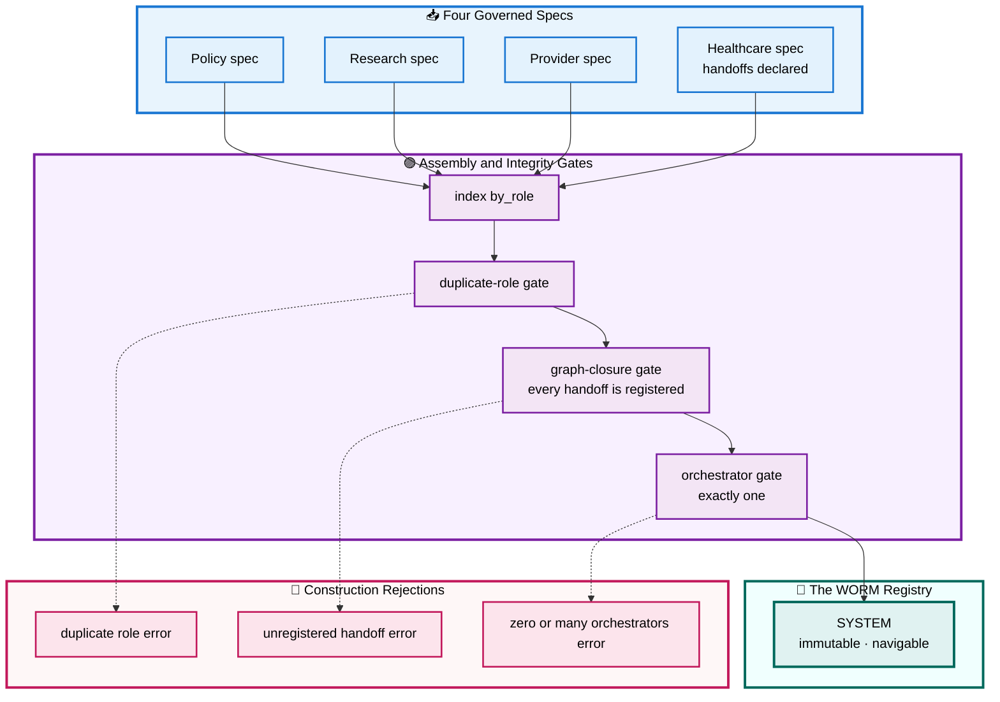

# 🗂️ Section 5 — `system_registry.py`

> The Write Once Reuse Many (WORM) registry: where the four framework-diverse agents become one immutable object whose call graph is *proven closed* at import. Autonomous and self-contained.

[← Overview / Section 1](SYSTEM_GUIDE.md)

---

## 📑 Table of Contents

1. [🎯 Purpose](#purpose)
2. [🔍 What It Replaces](#problem)
3. [🧱 The Four Governed Specs](#specs)
4. [🧱 The SystemRegistry Class](#class)
5. [🔄 Workflow — Assembly and Graph-Closure](#workflow)
6. [🧭 Navigation API](#api)
7. [📐 Design Principles Applied](#principles)
8. [🧩 Extending It](#extending)

---

<a id="purpose"></a>

## 🎯 Purpose

`system_registry.py` is where the segmented upstream system becomes **one object**. It declares the four `AgentSpec` instances — Policy, Research, Provider, Healthcare — and assembles them once, at import, into an immutable `SystemRegistry` named `SYSTEM`. A registry-level validator proves the call graph is **closed**: every handoff target names a registered role. From that point on, every consumer in the application navigates `SYSTEM` rather than holding its own copy of the agent list.

This is the keystone module: sections 2–4 supply governed parts; this section assembles them into the validated whole.

[↑ Back to TOC](#-table-of-contents)

---

<a id="problem"></a>

## 🔍 What It Replaces

In the upstream system there is no registry. The set of agents exists only as four separate scripts, and the call graph exists only inside the orchestrator, which builds A2A client URLs from environment variables and trusts that the agents on the other end are running and correctly named. There is nothing to ask "what agents make up this system?" or "does every handoff point at a real agent?" — those facts are distributed across files and verified only when a request happens to traverse them.

`SystemRegistry` makes the system a first-class, queryable object and proves its integrity before anything runs. If the Healthcare agent declared a handoff to a role no spec defines, the registry **refuses to construct** at import — the broken graph is caught at startup, not when a user's concierge query finally reaches the missing branch.

[↑ Back to TOC](#-table-of-contents)

---

<a id="specs"></a>

## 🧱 The Four Governed Specs

Each agent is declared as an `AgentSpec` whose identity fields are Enum/model references and whose only free strings are description and examples. The Provider spec links its skill to a governed `McpTool`; the Healthcare spec declares its three handoffs as `AgentRole` members — the call graph, as data.

```python
_PROVIDER = AgentSpec(
    role=AgentRole.PROVIDER,
    framework=AgentFramework.LANGGRAPH_MCP,
    model=VendorModel.GEMINI_FLASH_LITE,
    description="Find healthcare providers by location and specialty.",
    skill=SkillSpec(
        identity=FQSN.parse("provider.find_providers"),
        name="Find healthcare providers",
        description="Finds providers based on location/specialty.",
        examples=("Psychiatrists near Boston, MA?", "Find a pediatrician in Springfield, IL."),
        mcp_tool=McpTool.LIST_DOCTORS,          # Enum, not a repeated literal
    ),
)

_HEALTHCARE = AgentSpec(
    role=AgentRole.HEALTHCARE,
    framework=AgentFramework.BEEAI,
    model=VendorModel.GEMINI_FLASH_2_5,
    description="A personal concierge for healthcare information, customized to your policy.",
    skill=SkillSpec(
        identity=FQSN.parse("healthcare.concierge"),
        name="Healthcare concierge",
        description="Orchestrates policy, research, and provider agents.",
        examples=("I'm in Boston with anxiety — what's covered and who can I see?",),
    ),
    handoffs=(AgentRole.POLICY, AgentRole.RESEARCH, AgentRole.PROVIDER),
)
```

The Healthcare `handoffs` tuple is the entire call graph expressed as governed values. There is no URL-building, no environment lookup, no string — three `AgentRole` members that the registry will verify all exist.

[↑ Back to TOC](#-table-of-contents)

---

<a id="class"></a>

## 🧱 The SystemRegistry Class

The class does three things at construction: index the specs by role, reject duplicate roles, and prove graph closure. Then it offers a small navigation surface and is never mutated.

```python
class SystemRegistry:
    """The four specs as one immutable, validated registry (WORM)."""

    def __init__(self, specs: tuple[AgentSpec, ...]) -> None:
        by_role = {s.role: s for s in specs}
        if len(by_role) != len(specs):
            raise ValueError("duplicate role in system registry")
        # Graph closure: every handoff target must be a registered role.
        for spec in specs:
            for target in spec.handoffs:
                if target not in by_role:
                    raise ValueError(
                        f"{spec.role.value} hands off to unregistered {target.value}"
                    )
        self._by_role = by_role
        self._specs = specs

    def __iter__(self):
        return iter(self._specs)

    def spec(self, role: AgentRole) -> AgentSpec:
        return self._by_role[role]               # navigated, raises if absent

    @property
    def roles(self) -> tuple[AgentRole, ...]:
        return tuple(self._by_role)

    def orchestrator(self) -> AgentSpec:
        orchestrators = [s for s in self._specs if s.handoffs]
        if len(orchestrators) != 1:
            raise ValueError("system must have exactly one orchestrator")
        return orchestrators[0]


# Built once at import — the WORM system registry.
SYSTEM = SystemRegistry((_POLICY, _RESEARCH, _PROVIDER, _HEALTHCARE))
```

Two integrity rules beyond closure: **no duplicate roles** (the by-role index must match the spec count) and **exactly one orchestrator** (precisely one spec may carry handoffs). Both are checked in code, not assumed.

[↑ Back to TOC](#-table-of-contents)

---

<a id="workflow"></a>

## 🔄 Workflow — Assembly and Graph-Closure

`SYSTEM` is built in a single statement at import, but that statement runs a sequence of integrity checks. The diagram traces assembly from the four specs through the duplicate-role and graph-closure gates to the immutable registry, with each failure path dashed.



**Reading the assembly:** the four specs (blue) are indexed and passed through three integrity gates (purple) — duplicate role, graph closure, single orchestrator. Clearing all three yields the immutable `SYSTEM` (teal, emphasized). Any failure (pink, dashed) raises at import, so the application cannot start with a broken or ambiguous system definition.

[↑ Back to TOC](#-table-of-contents)

---

<a id="api"></a>

## 🧭 Navigation API

The registry is designed to be **navigated, never copied**. Consumers reach into `SYSTEM` for exactly what they need:

| Member | Returns | Used By |
|---|---|---|
| `iter(SYSTEM)` | each `AgentSpec` in order | console table, monitor cards |
| `SYSTEM.spec(role)` | one spec, raises if absent | targeted lookups |
| `SYSTEM.roles` | tuple of registered roles | iteration, validation |
| `SYSTEM.orchestrator()` | the single agent with handoffs | call-graph rendering |

Because every consumer calls these rather than maintaining its own agent list, adding an agent changes the system in exactly one place and propagates everywhere automatically.

[↑ Back to TOC](#-table-of-contents)

---

<a id="principles"></a>

## 📐 Design Principles Applied

| 🧭 Principle | How This Module Honors It |
|---|---|
| **WORM** | Built once at import; never mutated thereafter. |
| **Single source of truth** | Consumers navigate `SYSTEM`; none holds a private copy. |
| **Fail at startup** | Duplicate roles, open handoffs, and orchestrator-count errors raise at import. |
| **Graph integrity** | Every handoff edge is proven to point at a registered role. |
| **Identity governed** | Every spec field is an Enum or governed model; only prose is free. |

[↑ Back to TOC](#-table-of-contents)

---

<a id="extending"></a>

## 🧩 Extending It

Adding a fifth agent is one new `AgentSpec` appended to the `SYSTEM` tuple. If it declares a handoff, the closure gate verifies the target exists; if it adds a second orchestrator, the orchestrator gate rejects the build. The console, monitor, and launch logic require no change — they iterate the registry.

```python
_BILLING = AgentSpec(
    role=AgentRole.BILLING,                 # new AgentRole member required first
    framework=AgentFramework.ADK,
    model=VendorModel.GEMINI_FLASH_LITE,
    description="Explains claims and out-of-pocket costs.",
    skill=SkillSpec(identity=FQSN.parse("billing.claims"), name="Claims", description="..."),
)

SYSTEM = SystemRegistry((_POLICY, _RESEARCH, _PROVIDER, _HEALTHCARE, _BILLING))
```

The discipline to preserve: keep the registry the **only** place the agent set is enumerated. The moment a consumer hardcodes "the four agents" instead of iterating `SYSTEM`, the single-source guarantee breaks and a fifth agent silently goes unmonitored.

[↑ Back to TOC](#-table-of-contents)

[← Overview / Section 1](SYSTEM_GUIDE.md)
