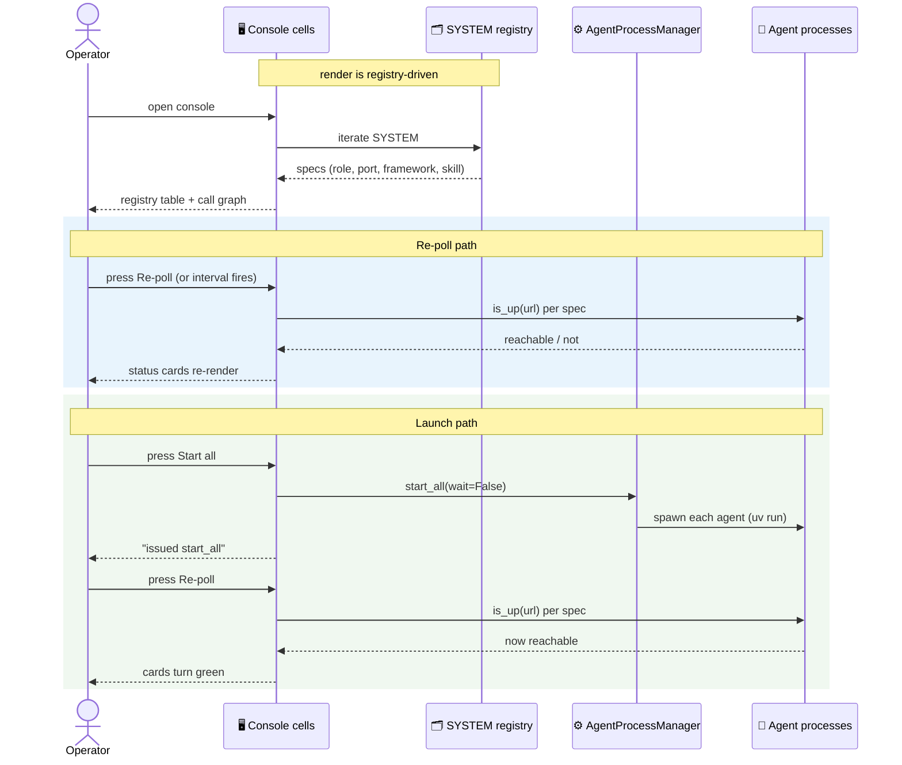
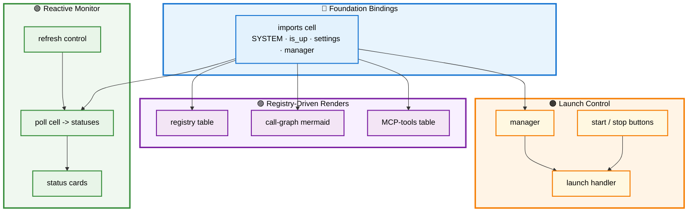

# 🖥️ Section 6 — `system_console.py`

> The Marimo system console: how the governed registry becomes a live, reactive operator interface — a registry table, a call-graph render, status cards, launch buttons, and an MCP-tools view — without the UI ever touching a literal. Autonomous and self-contained.

[← Overview / Section 1](SYSTEM_GUIDE.md)

---

## 📑 Table of Contents

1. [🎯 Purpose](#purpose)
2. [🧩 Marimo in One Paragraph](#marimo)
3. [🧱 The Cells, in Order](#cells)
4. [🔄 Workflow — Reactive Dataflow](#workflow)
5. [🔁 The Reactive Cell Graph](#dag)
6. [📐 Design Principles Applied](#principles)
7. [🧩 Extending It](#extending)

---

<a id="purpose"></a>

## 🎯 Purpose

`system_console.py` is a Marimo notebook that renders the whole system as a live operator console. It reads `SYSTEM` from the registry and presents five surfaces: a **registry table** (every agent's role, port, framework, skill, model, MCP tool, handoffs), a **call-graph diagram** generated from the orchestrator's handoffs, **status cards** that poll each agent's reachability, **launch controls** wired to the subprocess manager, and an **MCP-tools table**. Crucially, the console holds no agent list of its own — it iterates the registry — so it stays correct as the system grows.

[↑ Back to TOC](#-table-of-contents)

---

<a id="marimo"></a>

## 🧩 Marimo in One Paragraph

A Marimo notebook is a **reactive** Python program: each `@app.cell` is a function whose inputs are the variables it names in its signature, and whose outputs are the variables it returns. Marimo builds a dependency graph from those names and re-runs a cell automatically whenever one of its inputs changes. There is no hidden execution order and no stale state — if the `refresh` control fires, every cell that names `refresh` re-runs, and everything downstream of those re-runs in turn. This is why the console needs no manual "reload" logic: reactivity is the reload mechanism.

[↑ Back to TOC](#-table-of-contents)

---

<a id="cells"></a>

## 🧱 The Cells, in Order

The notebook is a sequence of cells, each with one responsibility. The import cell binds the foundation; every later cell consumes those bindings.

```python
@app.cell
def _():
    from a2a_labs import AgentRole, get_settings
    from a2a_labs.orchestrator import (
        AgentProcessManager, is_up, tier1_terminal_commands,
    )
    from a2a_labs.system_registry import SYSTEM
    from a2a_labs.mcp_tools import McpTool, SERVER_TOOLS
    settings = get_settings()
    return (AgentProcessManager, AgentRole, McpTool, SERVER_TOOLS,
            SYSTEM, is_up, settings, tier1_terminal_commands)
```

| Cell | Responsibility | Key inputs |
|---|---|---|
| Imports | bind foundation: `SYSTEM`, `is_up`, `settings`, manager | — |
| Registry table | iterate `SYSTEM` → identity table | `SYSTEM` |
| Call graph | render orchestrator handoffs as Mermaid | `SYSTEM` |
| Refresh control | the re-poll button / interval | — |
| Poll | probe each agent via `is_up` | `SYSTEM`, `is_up`, `settings`, `refresh` |
| Status cards | one card per agent, green/red | `SYSTEM`, `statuses` |
| Launch buttons | start-all / stop-all run buttons | — |
| Manager | one `AgentProcessManager` for the session | — |
| Launch handler | react to button press | `manager`, buttons |
| MCP table | tools from `SERVER_TOOLS` | `McpTool`, `SERVER_TOOLS` |
| Tier-1 fallback | printable terminal commands | `tier1_terminal_commands` |

The poll cell is the reactive heart: it names `refresh`, so pressing the button — or the chosen interval elapsing — re-runs the probe, and the status-cards cell (which names `statuses`) re-renders in turn.

[↑ Back to TOC](#-table-of-contents)

---

<a id="workflow"></a>

## 🔄 Workflow — Reactive Dataflow

Two user actions drive the console: re-polling (to watch reachability) and launching (to bring the system up). The sequence diagram shows both paths — the probe loop on the left, the launch path on the right — and how each flows through Marimo's reactivity to a re-rendered surface.



**Reading the sequence:** the initial render is registry-driven — the console asks `SYSTEM` for the specs and draws the table and call graph. The re-poll path (blue) probes each agent and re-renders cards. The launch path (green) tells the manager to spawn the agents, then a follow-up re-poll shows them turning reachable. The two paths are deliberately separate: launching issues the spawn; polling observes the result — "did we start it" and "does it answer" are distinct questions.

[↑ Back to TOC](#-table-of-contents)

---

<a id="dag"></a>

## 🔁 The Reactive Cell Graph

Marimo's dependency graph is what makes the console self-updating. This diagram shows which cells feed which — the import cell as the root, `refresh` driving the poll, and `statuses` driving the cards.



**Reading the graph:** the import cell (blue) is the single root every other cell depends on. Registry-driven renders (purple) draw once from `SYSTEM`. The reactive monitor chain (green) re-runs whenever `refresh` fires. The launch chain (orange) reacts to button presses through the session's one manager. No cell holds its own copy of the agent list — they all reach the same `SYSTEM` binding.

[↑ Back to TOC](#-table-of-contents)

---

<a id="principles"></a>

## 📐 Design Principles Applied

| 🧭 Principle | How This Module Honors It |
|---|---|
| **No hardcoding** | Every displayed value comes from `SYSTEM`/Enums; the UI types no agent name, port, or model. |
| **Single source of truth** | The console iterates the registry; it never lists agents itself. |
| **Reactivity over manual reload** | `refresh` and `statuses` drive re-renders; no reload code. |
| **Observe vs act, separated** | Launch issues a spawn; polling observes reachability — distinct cells. |
| **Safe to open** | Buttons launch nothing until pressed; opening the console starts no processes. |

[↑ Back to TOC](#-table-of-contents)

---

<a id="extending"></a>

## 🧩 Extending It

A new surface is a new cell that names the bindings it needs. To add, say, a per-agent log viewer, add a cell that names `manager` and reads its log files — Marimo wires it into the graph automatically. Because the registry is iterated, a fifth agent appears in the table, the cards, and the call graph with no console edit at all.

```python
@app.cell(hide_code=True)
def _(SYSTEM, mo, statuses):
    # new surface: count reachable agents — reacts to statuses automatically
    up = sum(1 for s in SYSTEM if statuses[s.role]["up"])
    mo.md(f"**{up} / {len(SYSTEM.roles)} agents reachable**")
    return
```

The discipline to preserve: a new cell should **name** the data it needs (so Marimo tracks the dependency) and should reach values through `SYSTEM` and the Enums, never re-type them. A cell that hardcodes "policy, research, provider, healthcare" instead of iterating `SYSTEM` breaks both the reactivity and the single-source guarantee.

[↑ Back to TOC](#-table-of-contents)

[← Overview / Section 1](SYSTEM_GUIDE.md)
