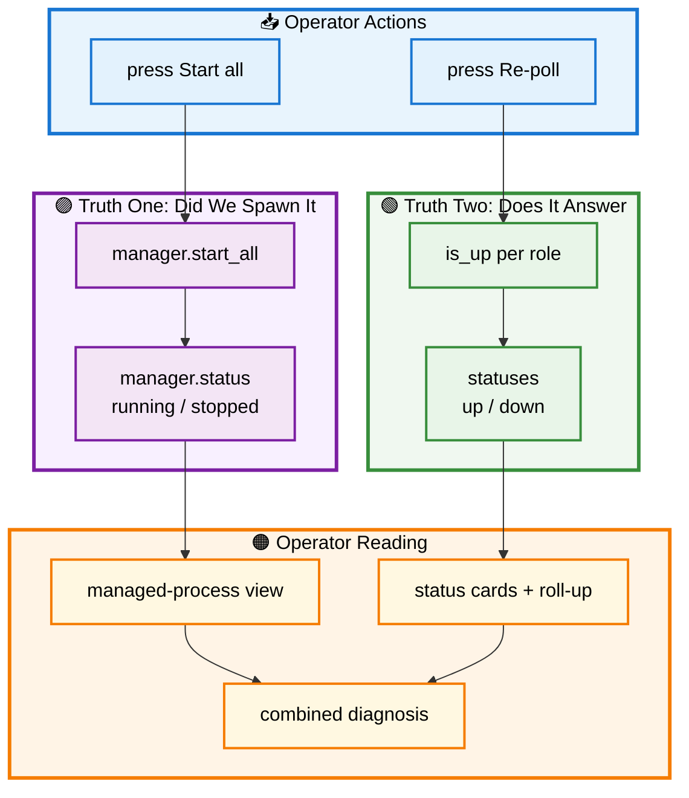

# 📊 Section 7 — `console_monitor.py`

> The focused monitor: a leaner page than the full console, built around one idea worth isolating — the difference between *did we spawn it* and *does it answer*. Autonomous and self-contained.

[← Overview / Section 1](SYSTEM_GUIDE.md)

---

## 📑 Table of Contents

1. [🎯 Purpose](#purpose)
2. [🔍 How It Differs from the Full Console](#differs)
3. [🧱 The Cells, in Order](#cells)
4. [🔄 Workflow — Two Truths About an Agent](#workflow)
5. [🩺 The Health-Check Itself](#healthcheck)
6. [📐 Design Principles Applied](#principles)
7. [🧩 Extending It](#extending)

---

<a id="purpose"></a>

## 🎯 Purpose

`console_monitor.py` is a Marimo notebook dedicated to **watching the four agents** — reachability cards, a roll-up table, launch controls, and a managed-process view. It is the page an operator keeps open while bringing the system up and confirming it answers. It reuses the foundation only; no agent code is duplicated here.

[↑ Back to TOC](#-table-of-contents)

---

<a id="differs"></a>

## 🔍 How It Differs from the Full Console

The monitor and the full system console (Section 6) share the reactive monitor pattern, but differ in two deliberate ways:

| Aspect | `system_console.py` | `console_monitor.py` |
|---|---|---|
| Agent source | iterates `SYSTEM` (the registry) | iterates `AgentRole` (the enum) |
| Scope | registry table, call graph, MCP table, monitor | monitor + launch, focused |
| Unique surface | call-graph render | **managed-process view** (`manager.status()`) |

The first difference is worth understanding. Iterating `AgentRole` means the monitor watches **every role the enum defines**, whether or not a spec exists for it — useful as a pure infrastructure monitor. Iterating `SYSTEM` (the console's approach) means watching **exactly the agents the system registers**. Both are valid; the monitor's enum-driven view is the wider net, the console's registry-driven view is the precise one.

The second difference is the monitor's distinctive contribution: it shows **two independent truths** about each agent — whether the process manager spawned it, and whether the network probe reaches it. The next sections center on that.

[↑ Back to TOC](#-table-of-contents)

---

<a id="cells"></a>

## 🧱 The Cells, in Order

| Cell | Responsibility | Key inputs |
|---|---|---|
| Imports | bind `AgentRole`, `is_up`, `settings`, manager, tiers | — |
| Refresh control | re-poll button / interval | — |
| Poll | probe each `AgentRole` via `is_up` | `AgentRole`, `is_up`, `settings`, `refresh` |
| Status cards | one card per role, green/red | `statuses` |
| Roll-up table | compact table + "N/M reachable" | `statuses` |
| Launch buttons | start-all / stop-all | — |
| Manager | one `AgentProcessManager` per session | — |
| Launch handler | react to button press | `manager`, buttons |
| **Managed-process view** | `manager.status()` running/stopped | `manager` |
| Tier-1 fallback | printable terminal commands | `tier1_terminal_commands` |

The poll cell names `refresh`, so it re-runs on press or interval; the cards and roll-up name `statuses`, so they re-render when the poll completes. The managed-process view names `manager`, so it reflects spawn state independently of the network probe.

[↑ Back to TOC](#-table-of-contents)

---

<a id="workflow"></a>

## 🔄 Workflow — Two Truths About an Agent

An agent can be in four combined states across the two truths: not spawned and unreachable (idle), spawned but not yet reachable (starting up), spawned and reachable (healthy), and — the diagnostic case — not spawned yet reachable (running outside the manager, e.g. a Tier-1 terminal). The monitor surfaces both truths so an operator can tell these apart. The diagram shows the two independent probes converging on the operator's reading.



**Reading the two truths:** the spawn truth (purple) flows from `manager.start_all` to `manager.status()` — what the manager believes it launched. The network truth (green) flows from `is_up` per role to `statuses` — what actually answers on the wire. They are intentionally independent: an agent spawned but crashed shows *running-then-down*; an agent started in a terminal shows *not-managed-but-up*. The combined reading (orange) is what lets an operator diagnose, not just observe.

[↑ Back to TOC](#-table-of-contents)

---

<a id="healthcheck"></a>

## 🩺 The Health-Check Itself

The network truth rests on the foundation's `is_up`, which does not merely open a socket — it fetches the agent's Agent Card and checks for a `200`. An agent that is listening but not correctly serving its card reads as *down*, which is the honest answer: the A2A contract is "serves its Agent Card," not "has an open port."

```python
def is_up(url: str, timeout: float = 2.0) -> bool:
    card_url = url.rstrip("/") + "/.well-known/agent-card.json"
    try:
        return httpx.get(card_url, timeout=timeout).status_code == 200
    except Exception:
        return False
```

The monitor's poll cell calls this once per role, building the `statuses` map the cards and roll-up render. Because the check targets the Agent Card, "reachable" in the monitor means "speaks A2A," not just "accepts a connection."

[↑ Back to TOC](#-table-of-contents)

---

<a id="principles"></a>

## 📐 Design Principles Applied

| 🧭 Principle | How This Module Honors It |
|---|---|
| **Two truths, not one** | Spawn state and network state are separate cells, never conflated. |
| **Honest health-check** | `is_up` verifies the Agent Card, not a bare port. |
| **No hardcoding** | Roles, ports, URLs all come from `AgentRole`/`settings`. |
| **Reactivity** | `refresh` → poll → cards; no manual reload. |
| **Safe to open** | Launch buttons start nothing until pressed. |

[↑ Back to TOC](#-table-of-contents)

---

<a id="extending"></a>

## 🧩 Extending It

To monitor on a registry basis rather than every enum role, switch the poll cell from `for _role in AgentRole` to `for _spec in SYSTEM` — the same change that aligns it with the full console. To add a latency reading, have the poll cell time the `is_up` call and store it in `statuses`; the cards re-render automatically because they name `statuses`.

```python
@app.cell
def _(AgentRole, is_up, settings, refresh):
    import time
    refresh
    statuses = {}
    for _role in AgentRole:
        _url = settings.url_for(_role)
        _t = time.perf_counter()
        _up = is_up(_url)
        statuses[_role] = {"url": _url, "port": int(_role.port),
                           "up": _up, "ms": round((time.perf_counter() - _t) * 1000)}
    statuses
    return (statuses,)
```

The discipline to preserve: keep the two truths separate. Folding `manager.status()` and `is_up` into one "status" value would hide exactly the diagnostic the monitor exists to provide — the gap between what was launched and what answers.

[↑ Back to TOC](#-table-of-contents)

[← Overview / Section 1](SYSTEM_GUIDE.md)
