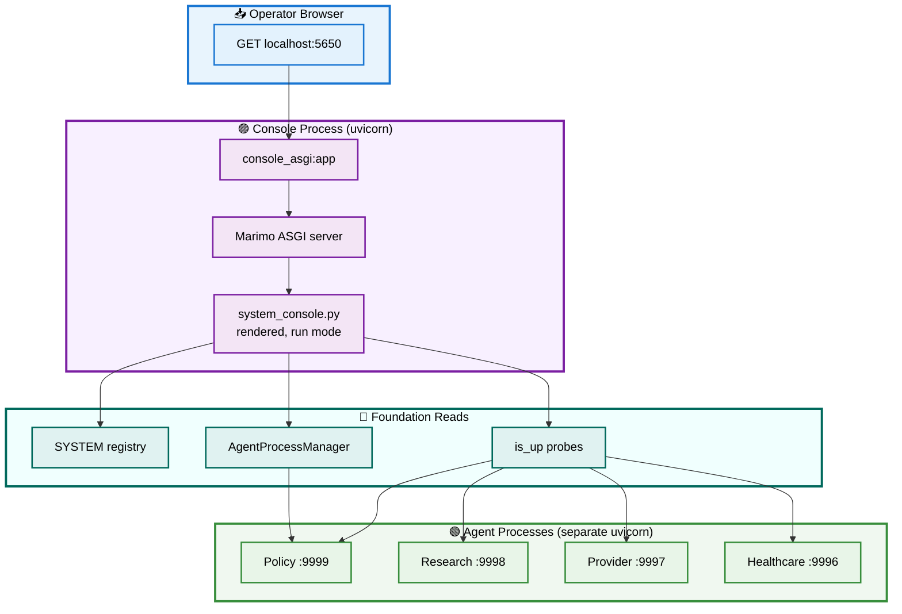

# 🚀 Section 8 — `console_asgi.py`

> The uvicorn entry: how the system console stops being a notebook you *edit* and becomes an app you *serve* — and where it sits relative to the four agents it watches. Autonomous and self-contained.

[← Overview / Section 1](SYSTEM_GUIDE.md)

---

## 📑 Table of Contents

1. [🎯 Purpose](#purpose)
2. [🔍 Serve Mode vs Edit Mode](#modes)
3. [🧱 The Entry, Line by Line](#entry)
4. [🔄 Workflow — Deployment Topology and Request Flow](#workflow)
5. [▶️ Running It](#running)
6. [📐 Design Principles Applied](#principles)
7. [🧩 Extending It](#extending)

---

<a id="purpose"></a>

## 🎯 Purpose

`console_asgi.py` is the Asynchronous Server Gateway Interface (ASGI) entry point that serves the system console as a running web application under uvicorn — in **run mode**, not the Marimo editor. It is six lines of real code: it builds a Marimo ASGI app, mounts `system_console.py` at the root path, and exposes the resulting `app` object for uvicorn to serve. The four agents remain their own separate uvicorn processes; this module serves only the console that observes and launches them.

[↑ Back to TOC](#-table-of-contents)

---

<a id="modes"></a>

## 🔍 Serve Mode vs Edit Mode

A Marimo notebook can be opened two ways, and the distinction matters for an operator console:

| Mode | Command | What the user gets |
|---|---|---|
| **Edit** | `marimo edit system_console.py` | the full editor — code cells visible and editable |
| **Serve** (this module) | `uvicorn console_asgi:app` | the rendered app only — controls, tables, cards; no code surface |

An operator monitoring agents should not be handed an editable notebook — they need the dashboard, not the source. `console_asgi.py` produces the serve-mode artifact: a standard ASGI `app` that any ASGI server (uvicorn here) can host, with the console's cells already marked `hide_code=True` so only the rendered surfaces show.

[↑ Back to TOC](#-table-of-contents)

---

<a id="entry"></a>

## 🧱 The Entry, Line by Line

The module's whole job is to turn one notebook file into one mounted ASGI app. It resolves its own directory so the mount works regardless of the working directory uvicorn is launched from.

```python
from pathlib import Path
import marimo

_HERE = Path(__file__).parent          # this module's directory

server = (
    marimo.create_asgi_app()           # an empty Marimo ASGI server
    .with_app(path="", root=str(_HERE / "system_console.py"))  # mount the console at /
)

app = server.build()                   # the ASGI callable uvicorn serves
```

Three points. `create_asgi_app()` produces a Marimo ASGI server that can host one or more notebooks. `.with_app(path="", root=...)` mounts the system console at the root path `""` (so it serves at `/`). `server.build()` returns the ASGI `app` — the object named in the `uvicorn console_asgi:app` command. Using `Path(__file__).parent` to locate `system_console.py` means the entry works whether uvicorn is launched from the `marimo/` directory or the project root.

[↑ Back to TOC](#-table-of-contents)

---

<a id="workflow"></a>

## 🔄 Workflow — Deployment Topology and Request Flow

This module is where the console's place in the running system becomes concrete. The console is **one uvicorn process**; each agent is **its own uvicorn process**; the console reaches the agents only as a client (probes and launches), never by hosting them. The diagram shows that topology and the path a browser request travels.



**Reading the topology:** a browser request (blue) hits the console process (purple) — `console_asgi:app` → the Marimo server → the rendered console. The console reads the foundation (teal): the registry for its tables, `is_up` for reachability, the manager for launching. It reaches the four agent processes (green) **only as a client** — probing their cards and spawning them — never by hosting them in its own process. This separation is the whole point: the console can restart without touching the agents, and an agent can crash without taking the console down.

[↑ Back to TOC](#-table-of-contents)

---

<a id="running"></a>

## ▶️ Running It

```bash
# from the marimo/ directory
uv run uvicorn console_asgi:app --port 5650
# then open http://localhost:5650/
```

The console serves at the chosen port; the agents are brought up separately — either from the console's own launch buttons (Tier 2 subprocess manager) or by the Tier 1 terminal commands the console prints. Nothing about serving the console starts an agent; the two concerns stay independent.

[↑ Back to TOC](#-table-of-contents)

---

<a id="principles"></a>

## 📐 Design Principles Applied

| 🧭 Principle | How This Module Honors It |
|---|---|
| **Serve, not edit** | Produces a run-mode ASGI app — a dashboard, not an editor. |
| **Process isolation** | The console is one process; agents are their own — a crash in one does not cascade. |
| **Client, never host** | The console reaches agents over HTTP; it never hosts them. |
| **Location-independent** | `Path(__file__).parent` makes the mount work from any working directory. |
| **Keep It Simple and Standard** | Standard Marimo ASGI factory + standard uvicorn; six lines, no custom server. |

[↑ Back to TOC](#-table-of-contents)

---

<a id="extending"></a>

## 🧩 Extending It

A Marimo ASGI server can mount more than one notebook. To serve the focused monitor alongside the full console, chain a second `.with_app` at a different path:

```python
server = (
    marimo.create_asgi_app()
    .with_app(path="", root=str(_HERE / "system_console.py"))      # /
    .with_app(path="/monitor", root=str(_HERE / "console_monitor.py"))  # /monitor
)
app = server.build()
```

Now `/` serves the full console and `/monitor` serves the focused monitor from the same uvicorn process. The discipline to preserve: keep this entry **thin** — its single job is mounting. Application logic belongs in the notebooks and the foundation, never in the ASGI shim; an entry that grows business logic is an entry that has stopped being a deployment detail and started being a place bugs hide.

[↑ Back to TOC](#-table-of-contents)

---

## ✅ Guide Complete

This is the final section. The eight parts together document the unified A2A system end to end:

| Section | Module | Layer |
|---|---|---|
| [1 — Overview](SYSTEM_GUIDE.md) | — | fit-together · extensibility · scaling |
| [2 — agent_framework](SYSTEM_GUIDE_02_agent_framework.md) | `agent_framework.py` | governance |
| [3 — mcp_tools](SYSTEM_GUIDE_03_mcp_tools.md) | `mcp_tools.py` | governance |
| [4 — agent_specs](SYSTEM_GUIDE_04_agent_specs.md) | `agent_specs.py` | governance |
| [5 — system_registry](SYSTEM_GUIDE_05_system_registry.md) | `system_registry.py` | governance |
| [6 — system_console](SYSTEM_GUIDE_06_system_console.md) | `system_console.py` | presentation |
| [7 — console_monitor](SYSTEM_GUIDE_07_console_monitor.md) | `console_monitor.py` | presentation |
| 8 — console_asgi *(this file)* | `console_asgi.py` | presentation |

[← Overview / Section 1](SYSTEM_GUIDE.md)
