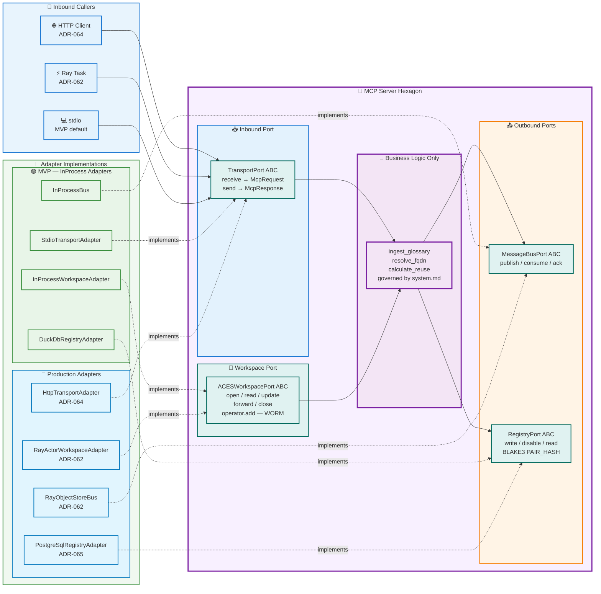
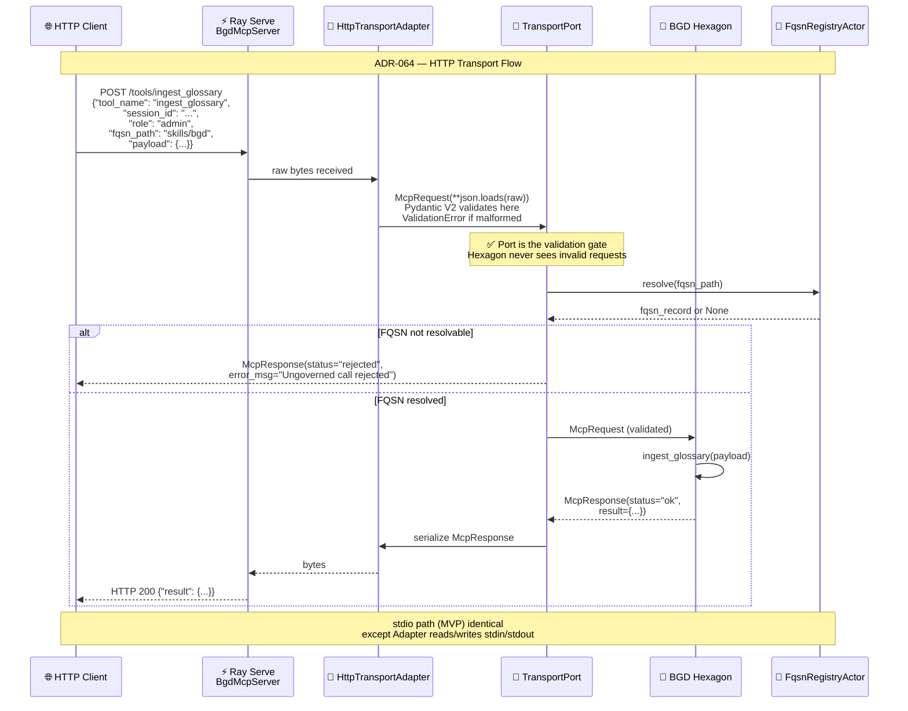
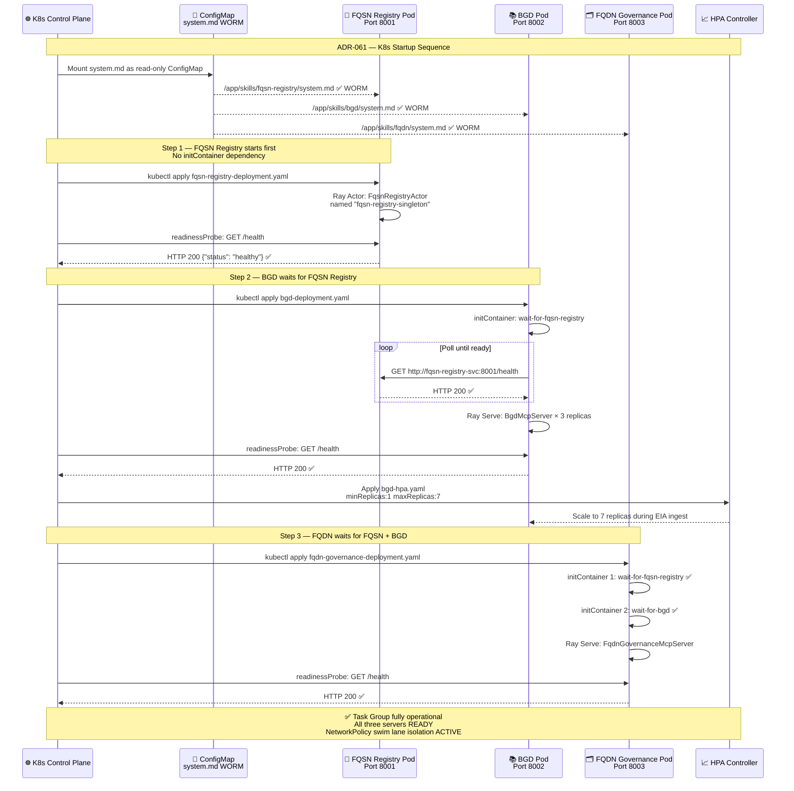
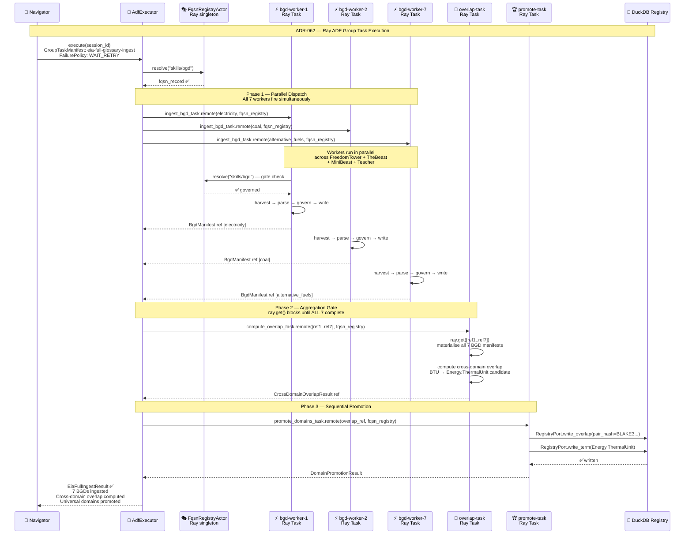
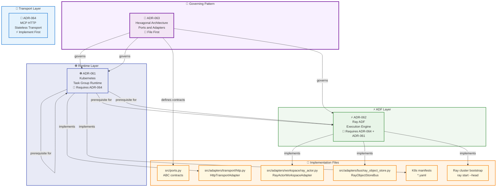

# 🏗️ ACES D⁴ Database Design — Architecture Documentation   

> **Mind Over Metadata LLC © 2026**
> Navigator: Peter Heller | Driver: Claude Sonnet 4.6
> Repository: `QCadjunct/aces-d4-database-design`

---

## 📋 Table of Contents

- [Section 1 — Overview & Architecture](#-section-1--overview--architecture)
  - [1.1 What This System Is](#-11-what-this-system-is)
  - [1.2 The Three-Layer Stack](#-12-the-three-layer-stack)
  - [1.3 Task Group — `task-group.d4-database-design`](#-13-task-group--task-groupd4-database-design)
  - [1.4 Cluster Topology](#-14-cluster-topology)
  - [1.5 Startup Sequence](#-15-startup-sequence)
  - [1.6 The EIA BGD Parallel Ingest DAG](#-16-the-eia-bgd-parallel-ingest-dag)
  - [1.7 Complete Architecture Diagram](#-17-complete-architecture-diagram)
- [Section 2 — D⁴ Methodology](#-section-2--d4-methodology) 
- [Section 3 — Hexagonal Architecture](#-section-3--hexagonal-architecture) 
- [Section 4 — ADF & Ray](#-section-4--adf--ray) 
- [Section 5 — Repository Structure](#-section-5--repository-structure) 
- [Section 6 — Governance & Session Discipline](#-section-6--governance--session-discipline)
- [Section 7 — K8s / Ray / MCP Umbrella Architecture](#-section-7--k8s--ray--mcp-umbrella-architecture) 

---

# 🔷 Section 1 — Overview & Architecture

## 🎯 1.1 What This System Is

`aces-d4-database-design` is the canonical implementation of
`task-group.d4-database-design` — an ACES (Agentic Cognitive Execution
System) Task Group that governs the D⁴ (Domain-Driven Database Design)
methodology through a set of MCP (Model Context Protocol) servers running
on a distributed Kubernetes + Ray cluster.

**In one sentence:** This system ingests any industry glossary, governs
every term through D⁴ taxonomy, persists the result as a governed BGD
(Business Glossary Domain) registry, and computes cross-domain overlap
across multiple glossaries — fully distributed, fully governed, fully
auditable.

**What it is not:**

- It is not a chatbot wrapper
- It is not a one-time ETL pipeline
- It is not a monolithic application

It is a **governed agentic system** — every agent operates under a
`system.md` behavioral contract, every message crosses a typed port
boundary, and every registry record carries a BLAKE3-256 PAIR_HASH
as its externally referenceable identity.

---

## 🏛️ 1.2 The Three-Layer Stack

The architecture is organized into three layers. Each layer owns
exactly one concern. No layer reaches into another layer's responsibility.
This is SRP (Single Responsibility Principle) applied at the
architectural level.

| Layer | Technology | Owns | Does NOT Own |
|-------|-----------|------|-------------|
| **Task Group** | Kubernetes | Pod lifecycle, startup sequence, swim lane isolation, health gating | Work distribution, task dependency, aggregation |
| **ADF** | Ray | Work decomposition, node assignment, parallel execution, aggregation, failure policy | Pod scheduling, network policy, inference engines |
| **Inference** | MaaS (TheBeast + MiniBeast) | LLM model serving, GPU allocation, inference scaling | Agent orchestration, work routing, task governance |

```
┌─────────────────────────────────────────────────────┐
│  Layer 3 — Task Group Coordinator                   │
│  Kubernetes Namespace: d4-database-design           │
│  Controls: Pod lifecycle, startup sequence,         │
│            swim lane isolation, health gating       │
└──────────────────────┬──────────────────────────────┘
                       │
┌──────────────────────▼──────────────────────────────┐
│  Layer 2 — ADF Execution Engine                     │
│  Ray Cluster: FreedomTower (head) +                 │
│               TheBeast + MiniBeast + Teacher        │
│  Controls: Work distribution, DAG execution,        │
│            failure policy, aggregation              │
└──────────────────────┬──────────────────────────────┘
                       │
┌──────────────────────▼──────────────────────────────┐
│  Layer 1 — Inference Substrate                      │
│  MaaS: TheBeast (dual RTX 5090)                     │
│        MiniBeast (dual RTX 4090)                    │
│  Controls: LLM inference, GPU allocation,           │
│            model serving                            │
└─────────────────────────────────────────────────────┘
```

> **Governing principle:** Each layer is replaceable independently.
> K8s can be swapped for another orchestrator without touching Ray.
> Ray can be swapped for another ADF without touching the MCP servers.
> MaaS endpoints can change without touching the ADF.

---

## 🔩 1.3 Task Group — `task-group.d4-database-design`

The Task Group contains three MCP servers. Each is a sovereign SRP
swim lane. Each is governed by its own `system.md` behavioral contract.
Each runs as a Kubernetes Deployment (Pod) within the
`d4-database-design` namespace.

### 🔑 The Three MCP Servers

| # | Server Name | SRP Responsibility | K8s Port |
|---|-------------|-------------------|----------|
| 1 | `task.d4-database-design.fully-qualified-skill-name-registry` | FQSN resolution, registration, validation — the constitutional registry. Discovery handshake gate. No agent operates without a resolved FQSN. | 8001 |
| 2 | `task.d4-database-design.business-glossary-domain` | BGD ingestion, canonical term governance, D⁴ taxonomy assignment, BLAKE3 PAIR_HASH generation, reuse analysis | 8002 |
| 3 | `task.d4-database-design.fully-qualified-domain-name-governance` | FQDN definition for new targets, migration, enhancement cycles, client-approval gate, propagation to related FQDNs | 8003 |

### 🔐 FQSN Access Model

Every operation against any server is governed by a role claim
carried in the session identity.

| Role | Permissions |
|------|-------------|
| **Admin** | Read, Update, Disable — never Delete |
| **Agent** | Read only — FQSN-routed calls |
| **Client** | Read only — observable, not operable |

> **No hard deletes — ever.**
> Disable is the governance primitive.
> A disabled FQSN is still in the registry, still auditable,
> still recoverable. The registry is an append-only audit trail.

### 🏠 Hexagonal Ports per Server

Each MCP server is a **hexagon** in Cockburn's Hexagonal Architecture
(Ports and Adapters, 2005). It exposes four ports:

| Port | Direction | Semantic Role | WORM? |
|------|-----------|--------------|-------|
| `TransportPort` | Inbound | Work unit delivery (HTTP, stdio, Ray Task) | No |
| `ACESWorkspacePort` | Bidirectional | ACESWorkspaceContext propagation | Yes — append only |
| `MessageBusPort` | Outbound | Work result exchange between agents | No |
| `RegistryPort` | Outbound | BGD registry writes (BLAKE3 keys, no deletes) | Yes |

**Pydantic V2 is the message contract for all four ports** by
constitutional inheritance from `ACESBaseModel`. Validation fires
at port boundaries — not inside the hexagon. The port is the
validation gate. Malformed messages never reach business logic.

---

## 🖥️ 1.4 Cluster Topology

The cluster runs on existing hardware connected via Tailscale mesh.
No new infrastructure is required for Phase 1.

```
FreedomTower ────── Ray Head Node / K8s Control Plane
  RTX 5080             Primary coordinator
  WSL2 Ubuntu          FQSN Registry Actor (singleton)
  Tailscale IP         BGD Registry DuckDB writer
       │
       ├── TheBeast ── Ray Worker Node A / K8s Worker
       │   Dual RTX 5090   GPU-bound inference (MaaS)
       │   Tailscale IP    High-throughput LLM endpoint
       │
       ├── MiniBeast ─ Ray Worker Node B / K8s Worker
       │   Dual RTX 4090   GPU-bound inference (MaaS)
       │   Tailscale IP    Secondary LLM endpoint
       │
       ├── Teacher ─── Ray Worker Node C / K8s Worker
       │   GTX 1060         CPU-bound lightweight tasks
       │   Tailscale IP     BGD ingest, metadata extraction
       │
       └── Synology DS920+ ─ PersistentVolume Provider
           NAS storage         DuckDB registry files
           NFS mount           Obsidian vault dual-remote
```

### 🏷️ Node Affinity Rules

| Task Type | Affinity | Nodes |
|-----------|---------|-------|
| BGD ingest | `CPU_ANY` | Any node |
| LLM inference | `GPU_HIGH` | TheBeast, MiniBeast |
| Lightweight inference | `GPU_LOW` | Teacher |
| Coordinator tasks | `HEAD_ONLY` | FreedomTower |

---

## 🚀 1.5 Startup Sequence

The startup sequence is enforced by Kubernetes `initContainers` and
`readinessProbes` — **not by application code**. This is the
architectural distinction between ADR-061 (K8s) and the prior design
where `MCPSessionManager` owned startup ordering.

```
Step 1 ── FQSN Registry Pod starts
          └── No initContainer (root — no dependencies)
          └── Ray Actor: FqsnRegistryActor named "fqsn-registry-singleton"
          └── readinessProbe: GET /health → passes
          └── Status: READY ✓

Step 2 ── BGD Pod starts
          └── initContainer: wait-for-fqsn-registry
              └── Polls GET http://fqsn-registry-svc:8001/health
              └── Blocks until FQSN Registry is READY
          └── Ray Serve: BgdMcpServer (3 replicas)
          └── readinessProbe: GET /health → passes
          └── Status: READY ✓

Step 3 ── FQDN Governance Pod starts
          └── initContainer 1: wait-for-fqsn-registry
          └── initContainer 2: wait-for-bgd
              └── Both must pass before Pod starts
          └── Ray Serve: FqdnGovernanceMcpServer
          └── readinessProbe: GET /health → passes
          └── Status: READY ✓

Step 4 ── AdfExecutor loads GroupTaskManifest
          └── Dispatches work per manifest
          └── Task Group is operational
```

> **The invariant:** No server operates before its dependency is
> healthy. The control plane enforces this. Application code does not.

---

## 📊 1.6 The EIA BGD Parallel Ingest DAG

The first Group Task is the canonical proof of the architecture:
ingest all seven EIA (U.S. Energy Information Administration) fuel
group glossaries in parallel, govern them through D⁴ taxonomy, and
compute cross-domain overlap.

### 🔬 Why Seven Fuel Groups

The EIA glossary at `eia.gov/tools/glossary/` organizes terms into
seven fuel group tabs. The electricity glossary (127 terms) was the
Phase 1 POC, producing 847 governed domains — a **6.7x expansion ratio**
that is the planning benchmark for all future BGD ingestions.

| Fuel Group | Terms (est.) | Status |
|-----------|-------------|--------|
| Electricity | 127 | ✅ Reference BGD — POC complete |
| Coal | ~80 | 🔲 Pending |
| Natural Gas | ~90 | 🔲 Pending |
| Nuclear | ~70 | 🔲 Pending |
| Petroleum | ~110 | 🔲 Pending |
| Renewable | ~85 | 🔲 Pending |
| Alternative Fuels | ~75 | 🔲 Pending |

### 🔗 Cross-Domain Overlap — The Canonical Case

**BTU (British Thermal Unit)** appears in all seven fuel groups but
plays a different semantic role in each. This is the proof that
cross-domain overlap requires architectural treatment — not just
deduplication.

| Domain Context | BTU Role | D⁴ Schema |
|---------------|---------|-----------|
| Electricity | Denominator in heat rate (BTU/kWh) | `Generation.HeatRate` |
| Natural Gas | Primary pricing/volume unit (MMBtu) | `Gas.EnergyContent` |
| Coal | Quality grade (BTU/ton) | `Coal.HeatContent` |
| Petroleum | Energy equivalence conversion | `Petroleum.EnergyEquivalence` |
| Nuclear | Thermal output unit (BTU/hour) | `Nuclear.ThermalOutput` |
| Renewable | Baseline comparison unit | `Renewable.EnergyBaseline` |
| Alternative Fuels | Energy density comparison | `AltFuel.EnergyDensity` |

**Universal ancestor:** `Energy.ThermalUnit` — the D⁴ schema that
sits above all seven sector BGDs. This is the first candidate for
the `Energy.` universal schema layer.

### 🗺️ DAG Execution Flow

```
Group Task: eia-full-glossary-ingest
│
├── [PARALLEL — all seven fire simultaneously]
│   ├── Task: ingest-electricity      → bgd-worker-1
│   ├── Task: ingest-coal             → bgd-worker-2
│   ├── Task: ingest-natural-gas      → bgd-worker-3
│   ├── Task: ingest-nuclear          → bgd-worker-4
│   ├── Task: ingest-petroleum        → bgd-worker-5
│   ├── Task: ingest-renewable        → bgd-worker-6
│   └── Task: ingest-alternative      → bgd-worker-7
│
│   [AGGREGATION GATE — waits for all seven]
│
├── Task: compute-cross-domain-overlap → aggregator agent
│   └── DependsOn: all seven ingest tasks
│   └── BTU → Energy.ThermalUnit promotion candidate
│
└── Task: promote-universal-domains   → fqdn-governance agent
    └── DependsOn: compute-cross-domain-overlap
    └── Writes promoted domains to BGD registry
```

**FailurePolicy: `WAIT_RETRY`** — if any ingest task fails, it
retries up to 3 times before the aggregation gate escalates.
The remaining six tasks continue running during retry.

---

## 📐 1.7 Complete Architecture Diagram

```mermaid
flowchart TD

    subgraph NAVIGATOR ["🧭    Navigator    /    Driver    Session"]
        N1[👤 Navigator: Peter Heller]
        N2[🤖 Driver: Claude Sonnet 4.6]
        N3[📋 GroupTaskManifest\nACESBaseModel — WORM]
    end

    subgraph K8S ["☸️    Kubernetes    Namespace:    d4-database-design"]
        subgraph PODS ["🔲    MCP    Server    Pods"]
            P1[🔑 FQSN Registry\ntask.d4...fqsn-registry\nPort 8001]
            P2[📚 BGD Server\ntask.d4...business-glossary\nPort 8002 × 3 replicas]
            P3[🗂️ FQDN Governance\ntask.d4...fqdn-governance\nPort 8003]
        end
        subgraph INFRA ["🏗️    K8s    Infrastructure"]
            K1[⚡ initContainers\nStartup Sequence Gate]
            K2[❤️ readinessProbes\nHealth Gate]
            K3[🔒 NetworkPolicy\nSwim Lane Isolation]
            K4[📈 HPA\nmaxReplicas: 7]
            K5[📄 ConfigMap\nsystem.md — WORM mount]
        end
    end

    subgraph RAY ["⚡    Ray    Cluster    —    ADF    Execution    Engine"]
        subgraph HEAD ["🖥️    FreedomTower    —    Head    Node"]
            R1[🎭 FqsnRegistryActor\nsingleton — always-on]
            R2[💾 BgdRegistryActor\nDuckDB writer]
            R3[🎯 AdfExecutor\nGroupTaskManifest reader]
        end
        subgraph WORKERS ["⚙️    Worker    Nodes"]
            W1[🔵 bgd-worker-1\nFreedomTower\nCPU_ANY]
            W2[🟣 bgd-worker-2\nTheBeast\nCPU_ANY]
            W3[🟢 bgd-worker-3\nTheBeast\nCPU_ANY]
            W4[🟠 bgd-worker-4\nMiniBeast\nCPU_ANY]
            W5[🔴 bgd-worker-5\nMiniBeast\nCPU_ANY]
            W6[🟡 bgd-worker-6\nTeacher\nCPU_ANY]
            W7[⚪ bgd-worker-7\nTeacher\nCPU_ANY]
        end
        subgraph AGG ["🔗    Aggregation    Gate"]
            A1[🧮 compute-cross-domain-overlap\nDependsOn: all 7 workers]
            A2[🏆 promote-universal-domains\nDependsOn: overlap result]
        end
    end

    subgraph MAAS ["🤖    MaaS    —    Inference    Substrate"]
        M1[🔥 TheBeast\nDual RTX 5090\nGPU_HIGH]
        M2[💪 MiniBeast\nDual RTX 4090\nGPU_HIGH]
    end

    subgraph PORTS ["🔌    Hexagonal    Ports    per    MCP    Server"]
        PT1[📡 TransportPort\nHTTP / stdio / Ray]
        PT2[🗂️ ACESWorkspacePort\nACESWorkspaceContext\noperator.add — WORM]
        PT3[📨 MessageBusPort\npublish / consume / ack]
        PT4[🗄️ RegistryPort\nBLAKE3 PAIR_HASH\nno deletes]
    end

    subgraph STORAGE ["💿    Persistent    Storage"]
        S1[(🦆 DuckDB\nBGD Registry\nSynology NAS)]
        S2[(📦 BGD.Registry\nBGD.Term\nBGD.Overlap)]
    end

    subgraph EIA ["🌐    EIA    Glossary    Sources"]
        E1[⚡ Electricity\n127 terms ✅ POC]
        E2[🪨 Coal]
        E3[🔥 Natural Gas]
        E4[☢️ Nuclear]
        E5[🛢️ Petroleum]
        E6[🌱 Renewable]
        E7[⛽ Alternative Fuels]
    end

    %% Navigator → Manifest
    N1 --> N3
    N2 --> N3

    %% Manifest → AdfExecutor
    N3 --> R3

    %% K8s startup sequence
    K1 --> P1
    K1 --> P2
    K1 --> P3
    K2 --> P1
    K2 --> P2
    K2 --> P3
    K5 --> P1
    K5 --> P2
    K5 --> P3

    %% Ports → MCP servers
    PT1 --> P2
    PT2 --> P2
    P2 --> PT3
    P2 --> PT4

    %% AdfExecutor → workers
    R3 --> W1
    R3 --> W2
    R3 --> W3
    R3 --> W4
    R3 --> W5
    R3 --> W6
    R3 --> W7

    %% EIA sources → workers
    E1 --> W1
    E2 --> W2
    E3 --> W3
    E4 --> W4
    E5 --> W5
    E6 --> W6
    E7 --> W7

    %% Workers → aggregation gate
    W1 --> A1
    W2 --> A1
    W3 --> A1
    W4 --> A1
    W5 --> A1
    W6 --> A1
    W7 --> A1

    %% Aggregation → promotion
    A1 --> A2

    %% Registry writes
    A2 --> PT4
    PT4 --> S1
    S1 --> S2

    %% FQSN Registry Actor
    R1 --> P1
    R1 --> P2
    R1 --> P3

    %% MaaS inference
    W2 -.-> M1
    W3 -.-> M1
    W4 -.-> M2
    W5 -.-> M2

    %% Styling — subgraph backgrounds
    style NAVIGATOR fill:#f8f0ff,stroke:#7b1fa2,stroke-width:2px
    style K8S fill:#e8f4fd,stroke:#1976d2,stroke-width:3px
    style PODS fill:#e3f2fd,stroke:#1976d2,stroke-width:2px
    style INFRA fill:#e8eaf6,stroke:#3f51b5,stroke-width:2px
    style RAY fill:#f0f8f0,stroke:#388e3c,stroke-width:3px
    style HEAD fill:#e8f5e8,stroke:#388e3c,stroke-width:2px
    style WORKERS fill:#f1f8e9,stroke:#689f38,stroke-width:2px
    style AGG fill:#fff8e1,stroke:#f57c00,stroke-width:2px
    style MAAS fill:#fce4ec,stroke:#c2185b,stroke-width:2px
    style PORTS fill:#e0f2f1,stroke:#00695c,stroke-width:2px
    style STORAGE fill:#fff4e6,stroke:#f57c00,stroke-width:2px
    style EIA fill:#e1f5fe,stroke:#0277bd,stroke-width:2px

    %% Node styling — classDef
    classDef navStyle fill:#f3e5f5,stroke:#7b1fa2,stroke-width:2px
    classDef mcpStyle fill:#e3f2fd,stroke:#1976d2,stroke-width:2px
    classDef k8sStyle fill:#e8eaf6,stroke:#3f51b5,stroke-width:2px
    classDef rayStyle fill:#e8f5e8,stroke:#388e3c,stroke-width:2px
    classDef workerStyle fill:#f1f8e9,stroke:#689f38,stroke-width:2px
    classDef aggStyle fill:#fff8e1,stroke:#f57c00,stroke-width:3px
    classDef maasStyle fill:#fce4ec,stroke:#c2185b,stroke-width:2px
    classDef portStyle fill:#e0f2f1,stroke:#00695c,stroke-width:2px
    classDef storageStyle fill:#fff3e0,stroke:#ff9800,stroke-width:2px
    classDef eiaStyle fill:#e1f5fe,stroke:#0277bd,stroke-width:2px

    class N1,N2,N3 navStyle
    class P1,P2,P3 mcpStyle
    class K1,K2,K3,K4,K5 k8sStyle
    class R1,R2,R3 rayStyle
    class W1,W2,W3,W4,W5,W6,W7 workerStyle
    class A1,A2 aggStyle
    class M1,M2 maasStyle
    class PT1,PT2,PT3,PT4 portStyle
    class S1,S2 storageStyle
    class E1,E2,E3,E4,E5,E6,E7 eiaStyle
```



---

## 🔑 1.8 Key Architectural Decisions (ADR Index)

The four ADRs governing this system form a dependency chain.
ADR-063 is the governing architectural pattern. ADR-064, ADR-061,
and 067 are its implementations. No ADR in the chain can be
implemented before its prerequisite is satisfied.

| ADR | Title | Status | Gates |
|-----|-------|--------|-------|
| ADR-063 | Hexagonal Architecture: Ports and Adapters | Proposed | **File first — governs all** |
| ADR-064 | MCP HTTP Stateless Transport | Proposed | ADR-061, ADR-062 |
| ADR-061 | Kubernetes as ACES Task Group Runtime | Proposed | ADR-064 |
| ADR-062 | Ray as ACES ADF Execution Engine | Proposed | ADR-064, ADR-061 |

> **Filing sequence:** ADR-063 → ADR-064 → ADR-061 → ADR-062
>
> **Implementation sequence:** ADR-064 → ADR-061 → ADR-062
>
> ADR-063 is the governing pattern — file it first.
> ADR-064 is the prerequisite gate — implement it first.

---

### 🔌 1.8.1 ADR-063 — Hexagonal Architecture: Ports and Adapters

**What it decides:** Every MCP server is a hexagon (Cockburn 2005).
It exposes four ports. The server never knows which adapter
delivered its request. The port is the validation gate.
Pydantic V2 is the message contract for all four ports by
constitutional inheritance from `ACESBaseModel`.

**Why it governs the others:** ADR-064 implements `HttpTransportAdapter`
(a TransportPort adapter). ADR-062 implements `RayObjectStoreBus`
(a MessageBusPort adapter) and `RayActorWorkspaceAdapter`
(an ACESWorkspacePort adapter). Without ADR-063's port contracts,
there is nothing to implement against.

**The extensibility guarantee:** Zero modified files when a new
adapter is added. Ports are WORM. Adapters are governed mutable.



---

### 🔄 1.8.2 ADR-064 — MCP HTTP Stateless Transport

**What it decides:** Replace `stdio` transport with HTTP stateless
transport for all MCP servers. This is the prerequisite gate that
enables K8s Pod deployment (ADR-061) and Ray Serve wrapping (ADR-062).
A Pod cannot be independently deployed without an HTTP endpoint.

**Why `stdio` is insufficient:** `stdio` transport binds the MCP
server to the calling process. It cannot be independently deployed
as a K8s Pod, cannot be load-balanced across replicas, and cannot
be health-checked by a `readinessProbe`. HTTP removes all three
constraints simultaneously.

**Ray Serve as the implementation:** Ray Serve provides the HTTP
endpoint layer. Each MCP server becomes a Ray Serve deployment.
`HttpTransportAdapter` implements `TransportPort` (ADR-063).
ADR-064 and ADR-062 are co-dependent on the same implementation.



---

### ☸️ 1.8.3 ADR-061 — Kubernetes as ACES Task Group Runtime

**What it decides:** Kubernetes is the Task Group runtime — not a
deployment target. The control plane enforces startup sequence,
health gating, swim lane isolation, and scaling. Application code
owns none of these concerns. `MCPSessionManager` is narrowed to
session protocol only.

**The critical distinction:** K8s schedules Pods to nodes by
resource availability. The ADF (ADR-062) schedules work units
to agents by FQSN, data locality, and task dependency ordering.
These are different layers. Both are required.

**WORM contracts as ConfigMaps:** Every MCP server's `system.md`
is mounted read-only as a ConfigMap. The container cannot modify
its own governing contract. This is WORM enforcement at the
infrastructure layer — not application layer.



---

### ⚡ 1.8.4 ADR-062 — Ray as ACES ADF Execution Engine

**What it decides:** Ray is the Agentic Distribution Framework (ADF)
execution engine — the middle layer between K8s (infrastructure)
and MaaS (inference). Ray Tasks map to ACES Tasks. Ray Actors map
to stateful singleton agents. Ray DAGs and DCGs are the Group Task
execution engine — DAG for acyclic dependency pipelines, DCG for
iterative agent workflows where termination is governed by the
agent's `system.md` contract. Ray Serve provides the HTTP transport
(fulfilling ADR-064).

**`GroupTaskManifest` is WORM:** The manifest is written once per
Group Task design. Execution instances carry their own `session_id`
and audit trail but do not modify the manifest. The manifest is the
constitution of the Group Task. Execution instances are citizens
bound by it.

**`TopologyType` governs execution shape:** `DAG` for acyclic
pipelines. `DCG` for iterative workflows. `DCG` requires an explicit
`DcgPolicy` — Pydantic V2 enforces this at instantiation. No
ungoverned cyclic execution is possible.

**`FailurePolicy` eliminates ambiguity:** Three governed states —
`CONTINUE_PARTIAL`, `WAIT_RETRY`, `ABORT`. No undeclared failure
behavior. No NULL-equivalent fallback.

**DCG termination is two-layer governed:**
- **Layer 1 — WORM default:** The agent's `system.md` defines
  termination semantics. The agent emits `McpResponse.status="continue"`
  when not done, `"ok"` when complete. The AdfExecutor trusts this signal.
- **Layer 2 — Instance override:** `ACESWorkspaceContext.dcg_override`
  carries a `DcgTerminationOverride` for this execution instance only.
  Override may specify `convergence_field`, `termination_signal`, or
  a tighter `max_iterations` ceiling. It cannot exceed the manifest's
  `DcgPolicy` constitutional ceiling. `system.md` is never mutated.

**`DcgPolicy` is the safety guard:** `max_iterations` and
`timeout_seconds` are the constitutional ceilings. No agent or
override can exceed them. AdfExecutor aborts if either is reached.



---

### 🗺️ 1.8.5 ADR Dependency Graph



---

[🔝 Back to TOC](#-table-of-contents)

---

*Section 1 of 6 — Continue, but append to a separate section from where you left off to avoid duplication and corruption.*
