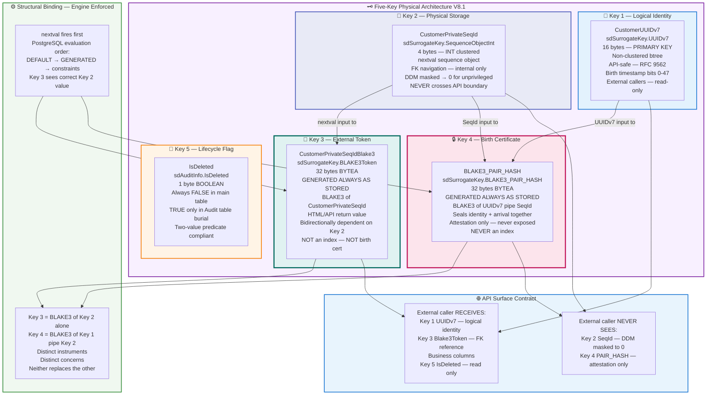

# 🗄️ Section 2 — D⁴ Methodology
## Version: V8.2 — 2026-05-15
## Changes from V8.1: Coarser FQDN domains · Self-identifying sentinels · Three-layer constraint architecture · Claim 4 MDM reduction · 15.1.17

> *Mind Over Metadata LLC © 2026*
> *Navigator: Peter Heller | Driver: Claude Sonnet 4.6*
> *IP Attorney review pending — not for public disclosure*

---

## 📋 Section 2 Table of Contents

- [2.1 What D⁴ Is](#-21-what-d4-is)
- [2.2 The Four Governed Identifiers](#-22-the-four-governed-identifiers)
- [2.3 The Five-Key Physical Architecture](#-23-the-five-key-physical-architecture) ← **V8.2 UPDATED**
- [2.4 BLAKE3-256 — The Cryptographic Governance Primitive](#-24-blake3-256--the-cryptographic-governance-primitive) ← **V8.1 UPDATED**
- [2.5 AES-FF3-1 FPE — Format-Preserving Encryption](#-25-aes-ff3-1-fpe--format-preserving-encryption) ← **V8.1 REPLACES Feistel**
- [2.6 Two-Value Predicate Logic](#-26-two-value-predicate-logic)
- [2.7 Allen Interval Temporal Referential Integrity](#-27-allen-interval-temporal-referential-integrity)
- [2.8 The BGD — Business Glossary Domain](#-28-the-bgd--business-glossary-domain)
- [2.9 The 6.7× Expansion Ratio](#-29-the-67x-expansion-ratio)
- [2.10 D⁴ Taxonomy Tree](#-210-d4-taxonomy-tree)
- [2.11 Cross-Domain Overlap Architecture](#-211-cross-domain-overlap-architecture)
- [2.12 ANSI DDM Extension — TC56 Contribution](#-212-ansi-ddm-extension--tc56-contribution) ← **V8.1 NEW**
- [2.13 D⁴ Glossary of Terms](#-213-d4-glossary-of-terms) ← **V8.2 UPDATED**

---

## 🎯 2.1 What D⁴ Is

**D⁴ — Domain-Driven Database Design** is a methodology for
governing data at the semantic layer before any physical database
is designed. It was originated by Peter Heller in 2003 during
the NYC DCAS EC3 energy billing system and refined over 20+ years
of enterprise data architecture practice.

D⁴ makes three claims that distinguish it from conventional data
modeling:

**Claim 1 — Physical Data Model first.**
D⁴ starts with the Physical Data Model, not the Logical or
Conceptual. The business domain vocabulary drives the physical
structure. There is no translation layer between business intent
and database implementation — the domain name *is* the column
name convention.

**Claim 2 — Fully Qualified Domain Names as B-tree navigation paths.**
Every column in every table carries a Fully Qualified Domain Name
(`SchemaName.DomainName`) that is machine-readable, human-readable,
and a valid B-tree navigation path. The FQDN is not metadata about
the column. It *is* the column's governed identity.

**Claim 3 — NULL elimination through two-value predicate logic.**
Every column has a default value. Every column has a CHECK constraint.
NULL is never permitted. The database enforces this — not the
application, not the developer's discipline.

**Claim 4 — Significant MDM reduction through governed column declaration.**
A governed column declaration — the pairing of a ColumnName and a FQDN
— enforces golden record consistency at the schema layer. 60-80% of
enterprise column surface reuses existing governed FQDNs. The framework
is an Architectural Framework customized per business through the BGD.
The governance is dynamic and fluid — it evolves when the design changes
structurally. The schema IS the master data system. MDM is significantly
reduced by construction.

---

## 🔑 2.2 The Four Governed Identifiers

D⁴ defines four identifier types that govern every artifact in the
system. Each is unique within its scope. Each is a filesystem-style
path that is both human-readable and machine-navigable.

| Identifier | Format | Scope | Example |
|-----------|--------|-------|---------|
| **BGD** | `{industry-domain}` | One per engagement | `electricity` |
| **FQDN** | `{SchemaName}.{DomainName}` | Unique DomainName per schema | `ElectricSystem.Voltage` |
| **FQTN** | `{SchemaName}.{TableName}` | Unique TableName per schema | `Generation.Plant` |
| **FQSN** | `skills/{skill-name}` | Filesystem path | `skills/task.d4.bgd` |

> **The DomainName uniqueness rule:** The SchemaName is reusable
> across many tables. The DomainName is unique within its schema.
> The FQDN is a derived column — never stored directly.

---

## 🗝️ 2.3 The Five-Key Physical Architecture
### V8.1 — 2026-05-15 — Replaces Three-Key (V7) and Four-Key (V8)

Every governed table in a D⁴ database carries five keys. Each key
owns exactly one concern. SRP at the physical storage level.



### 📐 Five-Key Reference Table

| # | Column | FQDN | Size | Role | External? |
|---|---|---|---|---|---|
| 1 | `CustomerUUIDv7` | `sdSurrogateKey.UUIDv7` | 16 bytes | PRIMARY KEY — non-clustered — logical identity | ✅ API-safe |
| 2 | `CustomerPrivateSeqId` | `sdSurrogateKey.SequenceObjectInt` | 4 bytes | Clustered index — FK navigation — physical storage | ❌ Never |
| 3 | `CustomerPrivateSeqIdBlake3` | `sdSurrogateKey.BLAKE3Token` | 32 bytes | External token — BLAKE3(SeqId) — HTML/API return value | ✅ Opaque |
| 4 | `BLAKE3_PAIR_HASH` | `sdSurrogateKey.BLAKE3_PAIR_HASH` | 32 bytes | Birth certificate — BLAKE3(UUIDv7∥SeqId) — attestation only | ❌ Never |
| 5 | `IsDeleted` | `sdAuditInfo.IsDeleted` | 1 byte | Lifecycle flag — always FALSE in main table | Read-only |

### 🔬 Five-Key DDL — Sales.Customer

```sql
-- ═══════════════════════════════════════════════════════════════
-- D⁴ Five-Key Physical Architecture — V8.1
-- Sales.Customer — PostgreSQL 18
-- Mind Over Metadata LLC © 2026
-- ═══════════════════════════════════════════════════════════════

-- Bootstrap: Extensions
CREATE EXTENSION IF NOT EXISTS "uuid-ossp";
CREATE EXTENSION IF NOT EXISTS "pg_blake3";

-- Bootstrap: Schemas
CREATE SCHEMA IF NOT EXISTS "Sales";
CREATE SCHEMA IF NOT EXISTS "Audit";
CREATE SCHEMA IF NOT EXISTS "PkSequence";
CREATE SCHEMA IF NOT EXISTS "sdSurrogateKey";
CREATE SCHEMA IF NOT EXISTS "sdSysTime";
CREATE SCHEMA IF NOT EXISTS "sdAuditInfo";
CREATE SCHEMA IF NOT EXISTS "sdLookupInfo";  -- V8.2: replaces sdCustomerInfo — coarser, reusable
CREATE SCHEMA IF NOT EXISTS "sdBusinessInfo"; -- V8.2: replaces sdCustomerInfo — coarser, reusable
CREATE SCHEMA IF NOT EXISTS "sdMaskPolicy";

-- Bootstrap: FQDN Domains — zero bare types anywhere
CREATE DOMAIN "sdSurrogateKey"."UUIDv7"              AS UUID NOT NULL;
CREATE DOMAIN "sdSurrogateKey"."SequenceObjectInt"   AS INTEGER NOT NULL;
CREATE DOMAIN "sdSurrogateKey"."SequenceObjectBig"   AS BIGINT NOT NULL;
CREATE DOMAIN "sdSurrogateKey"."BLAKE3Token"         AS BYTEA NOT NULL;
CREATE DOMAIN "sdSurrogateKey"."BLAKE3_PAIR_HASH"    AS BYTEA NOT NULL;
CREATE DOMAIN "sdSysTime"."AuditTriggerTimestamp"    AS TIMESTAMPTZ NOT NULL;
CREATE DOMAIN "sdAuditInfo"."IsDeleted"              AS BOOLEAN NOT NULL DEFAULT FALSE;
CREATE DOMAIN "sdAuditInfo"."RecordSource"           AS VARCHAR(100) NOT NULL DEFAULT 'RecordSource UNKNOWN';
-- V8.2: coarser reusable domains — self-identifying sentinels — DomainName embedded
-- These serve any FQTN — not customer-specific
-- Column override via ALTER TABLE SET DEFAULT embeds ColumnName at FQTN level
CREATE DOMAIN "sdLookupInfo"."CodeLongDesc"          AS VARCHAR(50)  NOT NULL DEFAULT 'CodeLongDesc UNKNOWN';
CREATE DOMAIN "sdBusinessInfo"."Name"                AS VARCHAR(200) NOT NULL DEFAULT 'Name UNKNOWN';
CREATE DOMAIN "sdBusinessInfo"."Email"               AS VARCHAR(254) NOT NULL DEFAULT 'Email UNKNOWN@UNKNOWN.COM';

-- Bootstrap: Sequence
CREATE SEQUENCE "PkSequence"."CustomerPrivateSeq"
    START WITH 1000
    INCREMENT BY 1
    NO MAXVALUE
    CACHE 50
    OWNED BY NONE;

-- ─────────────────────────────────────────────────────────────
-- Sales.Customer — Current State
-- ─────────────────────────────────────────────────────────────
CREATE TABLE "Sales"."Customer" (

    -- KEY 1: PUBLIC IDENTITY — PRIMARY KEY — NON-CLUSTERED
    -- 16-byte UUID — API-safe — time-sortable — RFC 9562
    -- Birth timestamp embedded inseparably in bits 0-47
    "CustomerUUIDv7"              "sdSurrogateKey"."UUIDv7"
                                   DEFAULT uuid_generate_v7()
                                   PRIMARY KEY,

    -- KEY 2: CLUSTERED INDEX KEY — NOT PRIMARY KEY — INTERNAL ONLY
    -- 4-byte INTEGER — physical storage organizer
    -- Sequential nextval() — B-Tree append-right — zero fragmentation
    -- 4× index density over CustomerUUIDv7 non-clustered
    -- DDM: sdMaskPolicy.MaskedInteger — unprivileged sees 0
    -- NEVER exposed externally — internal FK navigation only
    "CustomerPrivateSeqId"        "sdSurrogateKey"."SequenceObjectInt"
                                   DEFAULT nextval(
                                       '"PkSequence"."CustomerPrivateSeq"'
                                   ) NOT NULL,

    -- KEY 3: EXTERNAL TOKEN — V8.1 NEW
    -- GENERATED ALWAYS AS STORED — computed after nextval() fires
    -- PostgreSQL evaluation order guarantees Key 2 populated first
    -- Structural binding: engine enforced — no application code required
    -- Deterministic: BLAKE3(same SeqId) always same 32-byte token
    -- Bidirectionally functionally dependent on CustomerPrivateSeqId:
    --   Forward:  CustomerPrivateSeqId → CustomerPrivateSeqIdBlake3
    --   Reverse:  CustomerPrivateSeqIdBlake3 → CustomerPrivateSeqId (lookup)
    -- IS the value returned to HTML/API consumers
    -- NOT the birth certificate — Key 4 is the birth certificate
    -- NOT an index key
    "CustomerPrivateSeqIdBlake3"  "sdSurrogateKey"."BLAKE3Token"
                                   GENERATED ALWAYS AS (
                                       blake3("CustomerPrivateSeqId"::TEXT)
                                   ) STORED NOT NULL,

    -- Allen Interval — temporal governance
    "ValidFrom"                   "sdSysTime"."AuditTriggerTimestamp"
                                   NOT NULL DEFAULT CURRENT_TIMESTAMP,
    "ValidTo"                     "sdSysTime"."AuditTriggerTimestamp"
                                   NOT NULL DEFAULT '9999-12-31 23:59:59+00',

    -- KEY 5: LIFECYCLE FLAG
    -- Always FALSE in this table — TRUE in Audit table burial only
    "IsDeleted"                   "sdAuditInfo"."IsDeleted"
                                   NOT NULL DEFAULT FALSE,

    -- Business columns — ALL FQDN governed — zero bare types
    -- V8.2: coarser domain FQDNs — column overrides via ALTER TABLE below
    "CustomerCode"                "sdLookupInfo"."CodeLongDesc"     NOT NULL,
    "CustomerName"                "sdBusinessInfo"."Name"           NOT NULL,
    "Email"                       "sdBusinessInfo"."Email"          NOT NULL,
    "RecordSource"                "sdAuditInfo"."RecordSource"      NOT NULL,

    -- KEY 4: BIRTH CERTIFICATE — V8 CORRECTED INPUTS
    -- GENERATED ALWAYS AS STORED — computed once at INSERT — immutable
    -- Inputs: UUIDv7 (identity + birth timestamp) | SeqId (clustered key)
    -- Pipe separator is literal — never substituted
    -- UUIDv7 carries birth timestamp inseparably — SRP clean
    -- ValidFrom removed from V7 — belonged to Allen Interval, not birth cert
    -- Distinguishable from Key 3:
    --   Key 3 = BLAKE3(SeqId alone)            → external token
    --   Key 4 = BLAKE3(UUIDv7 || '|' || SeqId) → birth certificate
    "BLAKE3_PAIR_HASH"            "sdSurrogateKey"."BLAKE3_PAIR_HASH"
                                   GENERATED ALWAYS AS (
                                       blake3(
                                           "CustomerUUIDv7"::TEXT
                                           || '|' ||
                                           "CustomerPrivateSeqId"::TEXT
                                       )
                                   ) STORED NOT NULL,

    -- Constraints
    CONSTRAINT uq_customer_seq_id
        UNIQUE ("CustomerPrivateSeqId"),
    CONSTRAINT uq_customer_seq_blake3
        UNIQUE ("CustomerPrivateSeqIdBlake3"),
    CONSTRAINT chk_allen_interval
        CHECK ("ValidFrom" <= "ValidTo"),
    CONSTRAINT chk_is_deleted_main
        CHECK ("IsDeleted" = FALSE)
);

-- Indexes
CREATE INDEX idx_customer_clustered_seq
    ON "Sales"."Customer" USING btree ("CustomerPrivateSeqId");
CLUSTER "Sales"."Customer" USING idx_customer_clustered_seq;

CREATE INDEX idx_customer_temporal
    ON "Sales"."Customer"
    USING btree ("CustomerPrivateSeqId", "ValidFrom", "ValidTo");

-- Reverse resolution lookup table
CREATE TABLE "Sales"."CustomerTokenLookup" (
    "CustomerPrivateSeqIdBlake3"  "sdSurrogateKey"."BLAKE3Token" PRIMARY KEY,
    "CustomerPrivateSeqId"        "sdSurrogateKey"."SequenceObjectInt" NOT NULL,
    "CreatedAt"                   "sdSysTime"."AuditTriggerTimestamp"
                                   NOT NULL DEFAULT CURRENT_TIMESTAMP,
    CONSTRAINT fk_token_to_customer
        FOREIGN KEY ("CustomerPrivateSeqId")
        REFERENCES "Sales"."Customer" ("CustomerPrivateSeqId")
        ON DELETE RESTRICT
);

CREATE OR REPLACE FUNCTION "Sales"."fn_CustomerTokenLookup_Insert"()
RETURNS TRIGGER LANGUAGE plpgsql AS $$
BEGIN
    INSERT INTO "Sales"."CustomerTokenLookup" (
        "CustomerPrivateSeqIdBlake3", "CustomerPrivateSeqId"
    ) VALUES (
        NEW."CustomerPrivateSeqIdBlake3", NEW."CustomerPrivateSeqId"
    );
    RETURN NEW;
END;
$$;

CREATE TRIGGER trg_customer_token_lookup
    AFTER INSERT ON "Sales"."Customer"
    FOR EACH ROW
    EXECUTE FUNCTION "Sales"."fn_CustomerTokenLookup_Insert"();

-- ── THREE-LAYER CONSTRAINT ARCHITECTURE — V8.2 ───────────────────────
-- Layer 1: DOMAIN — constitutional floor — WORM — declared above
-- Layer 2: COLUMN OVERRIDE — self-identifying sentinel per FQTN
ALTER TABLE "Sales"."Customer"
    ALTER COLUMN "CustomerCode"  SET DEFAULT 'CustomerCode UNKNOWN';
ALTER TABLE "Sales"."Customer"
    ALTER COLUMN "CustomerName"  SET DEFAULT 'CustomerName UNKNOWN';
ALTER TABLE "Sales"."Customer"
    ALTER COLUMN "Email"         SET DEFAULT 'CustomerEmail UNKNOWN@UNKNOWN.COM';
ALTER TABLE "Sales"."Customer"
    ALTER COLUMN "RecordSource"  SET DEFAULT 'RecordSource UNKNOWN';

-- Layer 3: TABLE CONSTRAINTS — cross-column business rules
ALTER TABLE "Sales"."Customer"
    ADD CONSTRAINT chk_customer_name_length
        CHECK (LENGTH(TRIM("CustomerName")) >= 1);

ALTER TABLE "Sales"."Customer"
    ADD CONSTRAINT chk_customer_email_format
        CHECK ("Email" = 'CustomerEmail UNKNOWN@UNKNOWN.COM'
            OR "Email" LIKE '%_@_%._%');

ALTER TABLE "Sales"."Customer"
    ADD CONSTRAINT chk_customer_code_name_paired
        CHECK (
            ("CustomerCode" = 'CustomerCode UNKNOWN')
            = ("CustomerName" = 'CustomerName UNKNOWN')
        );
        -- If one is unknown both must be unknown — paired sentinel rule
```

### 🔄 Version History

| Version | Date | Change |
|---|---|---|
| V7 | Pre-2026-05-13 | Three-key: RegistryId, ObfuscatedId, PairHash. BLAKE3 inputs: SeqId+ValidFrom ❌ |
| V8 | 2026-05-13 | Four-key: UUIDv7, SeqId, BLAKE3_PAIR_HASH, IsDeleted. BLAKE3 inputs corrected: UUIDv7∥SeqId ✅. sdMaskPolicy added |
| V8.1 | 2026-05-15 | Five-key: adds CustomerPrivateSeqIdBlake3 as external token. Lookup table. Two UNIQUE constraints |
| V8.2 | 2026-05-15 | Coarser domains: sdLookupInfo.CodeLongDesc, sdBusinessInfo.Name/Email. Self-identifying sentinels. Three-layer constraint architecture. Claim 4 MDM reduction |

---

## 🔐 2.4 BLAKE3-256 — The Cryptographic Governance Primitive
### V8.1 — Three Distinct Roles in the Five-Key Architecture

BLAKE3 serves three distinct roles in V8.1 — each a separate
instrument with a separate concern:

| Role | Column | Input | Purpose |
|---|---|---|---|
| External token | `CustomerPrivateSeqIdBlake3` | `SeqId` alone | Opaque external identity |
| Birth certificate | `BLAKE3_PAIR_HASH` | `UUIDv7 \| SeqId` | Immutable attestation of origin |
| Policy attestation | `sdMaskPolicy.BLAKE3_POLICY_HASH` | Policy definition | Proves which DDM policy governed any query |

**Why BLAKE3 over SHA-256:**

| Property | SHA-256 | BLAKE3-256 |
|----------|---------|-----------|
| Speed | ~500 MB/s | ~4,000 MB/s (8×) |
| Parallelism | None | Native SIMD |
| Security level | 128-bit | 128-bit |
| Output | 256 bits / 32 bytes | 256 bits / 32 bytes |
| Design era | 2001 | 2020 |
| Extension attacks | Vulnerable | Immune |

**V8.1 corrected PAIR_HASH computation:**

```python
import blake3

def compute_pair_hash(uuid_v7: str, seq_id: int) -> bytes:
    """
    BLAKE3_PAIR_HASH — D⁴ Five-Key Physical Architecture V8.1
    Inputs: UUIDv7 (identity + birth timestamp) | SeqId (clustered key)
    Pipe separator — literal — never substituted
    Output: 32 bytes BYTEA

    V8 correction from V7:
      V7 inputs: SeqId + ValidFrom  ← SRP violation — ValidFrom = Allen Interval
      V8 inputs: UUIDv7 + SeqId     ← UUIDv7 carries birth timestamp inseparably
    """
    canonical = f"{uuid_v7}|{seq_id}".encode("utf-8")
    return blake3.blake3(canonical).digest()  # 32 bytes BYTEA


def compute_external_token(seq_id: int) -> bytes:
    """
    CustomerPrivateSeqIdBlake3 — Key 3 — external token only
    Input: SeqId alone — NOT UUIDv7 — NOT the birth certificate
    Output: 32 bytes BYTEA — deterministic — same SeqId → same token
    """
    return blake3.blake3(str(seq_id).encode("utf-8")).digest()


def verify_row(uuid_v7: str, seq_id: int, stored_hash: bytes) -> bool:
    """
    Verify the birth certificate of a stored row.
    Returns True only if BLAKE3_PAIR_HASH matches recomputed value.
    """
    return stored_hash == compute_pair_hash(uuid_v7, seq_id)
```

**ANSI SQL portability — BLAKE3 substitute rule:**

| Engine | Native BLAKE3 | Approved Substitute |
|---|---|---|
| PostgreSQL 18 | ✅ pg_blake3 | — |
| SQL Server | ❌ | SHA2_256 via HASHBYTES — document in ADR |
| Oracle 21c+ | ❌ | STANDARD_HASH('SHA256') — document in ADR |
| MySQL 8 | ❌ | SHA2(val, 256) — document in ADR |
| DuckDB 1.5 | ✅ Native | — |
| SQLite 3 | ❌ | sqlite3-blake3 extension |

> SHA-256 is the D⁴ approved substitute where BLAKE3 is unavailable.
> Never MD5 — collision resistance insufficient. Document every
> substitution in the engine-specific ADR.

---

## 🔒 2.5 AES-FF3-1 FPE — Format-Preserving Encryption
### V8.1 — Replaces Feistel as the External Obfuscation Primitive

**Why AES-FF3-1 replaces the Feistel network:**

The Feistel network in V7 encrypted `RegistryId → ObfuscatedId`
as the consumer-facing key. V8.1 changes the architecture:

- `CustomerPrivateSeqId` (INT) — internal only, never exposed
- `CustomerPrivateSeqIdBlake3` (BLAKE3 token) — primary external token
- AES-FF3-1 FPE — used only at the HTML UI layer when an INT form
  must be shown to a privileged operator

**AES-FF3-1 Format-Preserving Encryption (NIST SP 800-38G):**

```
INT in → INT out
BIGINT in → BIGINT out
Format is preserved — domain is preserved — density is preserved
Reversible server-side with private key
Not reversible by external caller without key
```

```python
from ff3 import FF3Cipher

def encrypt_seq_id(seq_id: int, key: bytes, tweak: bytes) -> int:
    """
    AES-FF3-1 Format-Preserving Encryption of CustomerPrivateSeqId.
    INT in → INT out — preserves 4-byte index density.
    Used only at HTML UI layer — never in database storage.
    Key and tweak from governed secrets manager — never hardcoded.
    """
    cipher = FF3Cipher(key, tweak, radix=10)
    plaintext = str(seq_id).zfill(10)      # pad to consistent length
    ciphertext = cipher.encrypt(plaintext)
    return int(ciphertext)


def decrypt_seq_id(encrypted: int, key: bytes, tweak: bytes) -> int:
    """
    Reverse: encrypted INT → original CustomerPrivateSeqId.
    Server-side only — key never leaves the governed secrets layer.
    """
    cipher = FF3Cipher(key, tweak, radix=10)
    ciphertext = str(encrypted).zfill(10)
    return int(cipher.decrypt(ciphertext))
```

> **Feistel status:** The Feistel network remains valid in legacy
> D⁴ tables where V7 architecture was deployed. It is not retired.
> AES-FF3-1 FPE is the standard for all new V8.1 tables.
> Document the choice in the table-level ADR.

---

## ⚖️ 2.6 Two-Value Predicate Logic

*(Unchanged from V8 — see prior version for full content)*

D⁴ eliminates NULL from every schema. Constitutional requirement
enforced by CHECK constraints and DEFAULT values on every column.
TRUE / FALSE only. UNKNOWN is never permitted.

| SQL Type | Governed Default | CHECK Constraint |
|----------|-----------------|-----------------|
| `VARCHAR(n)` | `'UNKNOWN'` | `LENGTH(TRIM(col)) >= 1` |
| `INTEGER` | `0` | `col >= 0` |
| `DECIMAL(p,s)` | `0.0000` | `col >= 0.0000` |
| `BOOLEAN` | `FALSE` | `col IN (TRUE, FALSE)` |
| `TIMESTAMPTZ` | `CURRENT_TIMESTAMP` | `col >= '1900-01-01'` |
| `BYTEA` (BLAKE3) | N/A — computed | `LENGTH(col) = 32` |
| `VARCHAR` (enum) | Governed sentinel | `col IN (closed set)` |
| `UUID` | `uuid_generate_v7()` | `col IS NOT NULL` |

---

## ⏱️ 2.7 Allen Interval Temporal Referential Integrity

*(Unchanged from V8 — see prior version for full content)*

D⁴ implements Allen's Interval Algebra (1983) for all temporal
data. Every versioned entity carries `ValidFrom` and `ValidTo`.
All 13 Allen relations are queryable as plain SQL predicates.
SQL:2011 temporal tables implement MEETS only (1 of 13). D⁴
implements all 13.

**V8.1 correction:** `CHECK (ValidFrom <= ValidTo)` — not `<`.
Same-day termination is a legitimate business state.
ValidTo sentinel: `9999-12-31 23:59:59+00` — never NULL.

---

## 📚 2.8 The BGD — Business Glossary Domain

*(Unchanged from V8 — see prior version for full content)*

---

## 📊 2.9 The 6.7× Expansion Ratio

*(Unchanged from V8 — see prior version for full content)*

EIA Electricity POC benchmark: 127 terms → 847 governed domains.
Planning constant for all future BGDs.

---

## 🌳 2.10 D⁴ Taxonomy Tree

*(Unchanged from V8 — see prior version for full content)*

---

## 🔗 2.11 Cross-Domain Overlap Architecture

*(Unchanged from V8 — see prior version for full content)*

---

## 🌐 2.12 ANSI DDM Extension — TC56 Contribution
### V8.1 NEW — 2026-05-15 — IP Attorney Review Required Before TC56 Submission

**Status:** DRAFT — Not publicly disclosed — IP attorney clearance required
**TC56 copy:** BLOCKED pending attorney guidance on submission order
**Vault document:** `Mind-Over-Metadata/20-Architecture/ANSI-DDM-Spec-V0.1.md`

---

### 2.12.1 The Portability Gap

As of May 2026, Dynamic Data Masking across ANSI SQL engines:

| Engine | Native DDM | Portable | BLAKE3 | WORM Policy |
|---|---|---|---|---|
| SQL Server | ✅ 2016 | ❌ | ❌ | ❌ |
| Oracle | ✅ Redaction | ❌ | ❌ | ❌ |
| BigQuery | ✅ | ❌ | ❌ | ❌ |
| Snowflake | ✅ | ❌ | ❌ | ❌ |
| PostgreSQL | ❌ | ❌ | ❌ | ❌ |
| MySQL | ❌ | ❌ | ❌ | ❌ |
| DuckDB | ❌ | ❌ | ❌ | ❌ |
| **This spec** | **✅** | **✅** | **✅** | **✅** |

Cross-database DDM currently requires proxy layers or external
policy engines — both bypassable. This specification eliminates
the proxy requirement by defining the masking contract at the
ANSI SQL engine compiler layer.

**Provenance:** Independently developed. Oracle Redaction and
SQL Server DDM studied as behavioral reference points only —
no code examined. PC-DOS → MS-DOS precedent governs.

---

### 2.12.2 Five Masking Modes

**Modes 1–4** are behaviorally equivalent to existing vendor
implementations — independently specified:

```sql
-- FULL: entire value replaced
CREATE MASKING POLICY "sdMaskPolicy"."FullMask"
    AS (val VARCHAR) RETURNS VARCHAR →
    CASE WHEN CURRENT_ROLE() IN ('dba_role','auditor_role') THEN val
         ELSE REPEAT('X', LENGTH(val)) END;

-- PARTIAL: governed portion revealed
CREATE MASKING POLICY "sdMaskPolicy"."EmailPartial"
    AS (val VARCHAR) RETURNS VARCHAR →
    CASE WHEN CURRENT_ROLE() IN ('dba_role','auditor_role') THEN val
         ELSE SUBSTRING(val,1,1) || '***@***.com' END;

-- RANDOM: same-domain random substitute
CREATE MASKING POLICY "sdMaskPolicy"."RandomInteger"
    AS (val INTEGER) RETURNS INTEGER →
    CASE WHEN CURRENT_ROLE() IN ('dba_role','auditor_role') THEN val
         ELSE FLOOR(RANDOM() * 2147483647)::INTEGER END;

-- EXPRESSION: conditional context-aware
CREATE MASKING POLICY "sdMaskPolicy"."ContextAware"
    AS (val VARCHAR) RETURNS VARCHAR →
    CASE WHEN CURRENT_ROLE() IN ('dba_role','auditor_role') THEN val
         WHEN SESSION_CONTEXT('env') = 'PRODUCTION'
              THEN REPEAT('X', LENGTH(val))
         ELSE val END;
```

**Mode 5 — BLAKE3 Hash Masking — Novel Contribution:**
No equivalent exists in any current vendor DDM implementation.

```sql
-- HASH: BLAKE3 of value — deterministic external token
-- Same input → same masked token across sessions and engines
-- Not reversible by unprivileged caller
-- Reversible server-side with lookup table
-- Enables cross-system correlation in NLIP multi-agent workflows
CREATE MASKING POLICY "sdMaskPolicy"."Blake3Token"
    AS (val VARCHAR) RETURNS BYTEA →
    CASE WHEN CURRENT_ROLE() IN ('dba_role','auditor_role') THEN val::BYTEA
         ELSE blake3(val::TEXT) END;
```

---

### 2.12.3 WORM Policy Lifecycle — Novel Contribution

No current DDM implementation governs policy mutation with a
formal lifecycle. This specification requires:

```
DRAFT     → Policy defined — mutable — not enforced in production
VALIDATED → Policy tested — BLAKE3_POLICY_HASH computed — immutable
WORM-LOCKED → Permanently immutable — mutation requires new version
              Old policy archived — never deleted
              Transition is atomic — no masking gap
```

---

### 2.12.4 BLAKE3 Policy Attestation — Novel Contribution

At VALIDATED state, engine computes and stores:

```
BLAKE3_POLICY_HASH = BLAKE3(
    policy_name || masking_expression ||
    role_bindings || created_at || created_by
)
```

Every audit record references `BLAKE3_POLICY_HASH`. An auditor
can prove cryptographically which version of which masking policy
governed any agent interaction at any point in time. No current
vendor DDM implementation provides this guarantee.

---

### 2.12.5 Absolute Structural Binding — Novel Contribution

```
Query submitted by unprivileged role
        ↓
Engine query compiler reads masking policy
BEFORE result set construction
        ↓
Masking expression evaluated per row per masked column
        ↓
WORM audit record appended — references BLAKE3_POLICY_HASH
        ↓
Masked result returned — no bypass path exists
```

SQL Server DDM permits superuser bypass. This specification
does not. No role — including superuser — bypasses masking
without an explicit UNMASK grant.

---

### 2.12.6 FQDN Masking Domain Taxonomy — Novel Contribution

Every masked column declared under D⁴ FQDN governance:

```sql
"sdMaskPolicy"."FullMask"        -- complete redaction
"sdMaskPolicy"."EmailPartial"    -- partial email reveal
"sdMaskPolicy"."PhonePartial"    -- partial phone reveal
"sdMaskPolicy"."RandomInteger"   -- random INT substitute
"sdMaskPolicy"."RandomBigInt"    -- random BIGINT substitute
"sdMaskPolicy"."Blake3Token"     -- BLAKE3 hash token
"sdMaskPolicy"."MaskedInteger"   -- FPE INT — format preserving
"sdMaskPolicy"."MaskedBigInt"    -- FPE BIGINT — format preserving
"sdMaskPolicy"."ContextAware"    -- expression-based conditional
```

Column masking in table DDL:

```sql
"CustomerPrivateSeqId"    "sdSurrogateKey"."SequenceObjectInt"
                           DEFAULT nextval(...) NOT NULL
                           WITH MASKING POLICY "sdMaskPolicy"."MaskedInteger";

"Email"                   "sdCustomerInfo"."Email"
                           NOT NULL DEFAULT 'UNKNOWN@UNKNOWN.COM'
                           WITH MASKING POLICY "sdMaskPolicy"."EmailPartial";

-- CustomerPrivateSeqIdBlake3: no masking policy required
-- The column IS the masked external token — already opaque by design
```

---

### 2.12.7 Three Conformance Levels

| Level | Name | Requirements |
|---|---|---|
| 1 | Base DDM | Modes 1–4 + role governance + structural binding + no superuser bypass |
| 2 | Attested DDM | Level 1 + BLAKE3 mode + BLAKE3_POLICY_HASH + WORM audit trail |
| 3 | Governed DDM | Level 2 + WORM policy lifecycle + FQDN taxonomy + full NLIP compliance instrument |

**Level 3 = NLIP compliance instrument.** Every agent interaction
with governed data produces a BLAKE3-attested audit record proving
which masking policy version governed that interaction. No external
compliance tool required.

---

### 2.12.8 TC56 / NLIP Alignment

```
NLIP requirement:
  Every agent interaction with governed data must be auditable.
  Prove: what was accessed, by which role, under which policy,
  at what time.

Current gap:
  No ANSI SQL standard for engine-native DDM.
  Cross-database masking requires bypassable proxy layers.
  No cryptographic attestation of masking policy version.

This specification closes that gap:
  Engine-native — no proxy required
  BLAKE3_POLICY_HASH — proves which policy governed
  WORM audit trail — proves what was accessed and when
  Conformance Level 3 = NLIP compliance instrument
```

**Deployment target:** Every NLIP deployment that touches a
relational database will encounter this problem. This specification
solves it once, at the standard layer, for all ANSI SQL engines.

---

## 📚 2.13 D⁴ Glossary of Terms
### V8.1 — Updated to reflect Five-Key Architecture and TC56 Innovations

| Term | Full Name | Definition |
|------|-----------|-----------|
| **D⁴** | Domain-Driven Database Design | Methodology originating 2003 NYC DCAS EC3. Physical Data Model first. FQDN as B-tree navigation paths. Two-value predicate logic. No NULLs. Five-key physical architecture as of V8.1. |
| **BGD** | Business Glossary Domain | Canonical term registry for a business domain. Ubiquitous language that every FQDN, FQTN, and governed column inherits vocabulary from. One per industry engagement. |
| **FQDN** | Fully Qualified Domain Name | `SchemaName.DomainName` — governed identity of every column. B-tree navigation path. Machine and human readable. DomainName unique within schema. |
| **FQTN** | Fully Qualified Table Name | `SchemaName.TableName` — governed identity of every table. Unique within BGD scope. |
| **FQSN** | Fully Qualified Skill Name | `skills/{skill-name}` — filesystem path to behavioral contract. Resolves to `system.md`, `user.md`, `SKILL.md`. Ungoverned agent has no resolvable FQSN. |
| **Five-Key Architecture** | — | V8.1 D⁴ physical architecture. Key 1: UUIDv7 PRIMARY KEY non-clustered. Key 2: SequenceObjectInt clustered index. Key 3: BLAKE3Token external token (BLAKE3 of SeqId). Key 4: BLAKE3_PAIR_HASH birth certificate (BLAKE3 of UUIDv7∥SeqId). Key 5: IsDeleted lifecycle flag. |
| **BLAKE3Token** | — | Key 3. `GENERATED ALWAYS AS (blake3(SeqId::TEXT)) STORED`. External token for HTML/API surface. Bidirectionally functionally dependent on CustomerPrivateSeqId. Deterministic. Not an index. Not the birth certificate. |
| **BLAKE3_PAIR_HASH** | — | Key 4. `GENERATED ALWAYS AS (blake3(UUIDv7::TEXT \|\| '\|' \|\| SeqId::TEXT)) STORED`. Birth certificate. Seals identity + arrival. Immutable. Attestation only — never exposed externally. V8 correction: inputs changed from SeqId+ValidFrom to UUIDv7∥SeqId. |
| **BLAKE3** | BLAKE3 Hash Function | Cryptographic hash (2020). 8× faster than SHA-256. Parallel-native. Immune to extension attacks. 256-bit digest = 32 bytes BYTEA. Three roles in V8.1: external token, birth certificate, DDM policy attestation. |
| **AES-FF3-1 FPE** | Format-Preserving Encryption | NIST SP 800-38G. INT in → INT out. BIGINT in → BIGINT out. Replaces Feistel as external obfuscation primitive in V8.1. Used at HTML UI layer only — never in database storage. |
| **Feistel** | Feistel Network | IBM 1973. Valid in legacy V7 D⁴ tables. Not retired. Superseded by AES-FF3-1 FPE for new V8.1 tables. Bijective, deterministic, reversible. |
| **WORM** | Write Once Reuse Many | Governance model for behavioral contracts and masking policies. Written once, reused across sessions and contexts without mutation. DRAFT → VALIDATED → WORM-LOCKED lifecycle. |
| **Two-Value Predicate Logic** | — | TRUE / FALSE only. NULL never permitted. Every column has governed DEFAULT and CHECK constraint. Database enforces — not application. |
| **Allen Interval** | Allen's Interval Algebra | 13 temporal relationships (James F. Allen, 1983). D⁴ uses ValidFrom / ValidTo. Sentinel `9999-12-31 23:59:59+00` for open-ended. All 13 relations as plain SQL predicates. SQL:2011 implements MEETS only (1 of 13). V8.1 correction: `CHECK (ValidFrom <= ValidTo)` — same-day termination permitted. |
| **IsDeleted** | — | Key 5. `sdAuditInfo.IsDeleted`. BOOLEAN NOT NULL DEFAULT FALSE. Always FALSE in main table. TRUE only in Audit table burial record. Two-value predicate compliant. |
| **ANSI DDM Extension** | — | TC56 contribution candidate. Engine-native, role-governed, structurally binding DDM for all ANSI SQL engines. Five novel contributions: BLAKE3 hash masking mode, WORM policy lifecycle, BLAKE3 policy attestation, absolute structural binding, FQDN masking domain taxonomy. Three conformance levels. Conformance Level 3 = NLIP compliance instrument. IP attorney review required before TC56 submission. |
| **BLAKE3_POLICY_HASH** | — | BLAKE3 hash of masking policy definition. Computed at VALIDATED state. Stored in engine catalog. Referenced by every audit record. Proves which policy version governed any interaction. Novel — no vendor equivalent. |
| **Expansion Ratio** | — | 127 EIA electricity terms → 847 governed domains = 6.7×. Planning constant for future BGDs. |
| **KISS** | Keep It Simple and Standard | Never "Stupid." Standard means reusable, governed, consistent. |
| **SRP** | Single Responsibility Principle | Each component owns exactly one concern. Applied at every layer. Five-key architecture is SRP at physical storage level. |
| **sdLookupInfo** | — | V8.2. Coarser reusable schema replacing entity-specific schemas. `sdLookupInfo.CodeLongDesc` serves any code/description column across any FQTN in any BGD. One domain — N FQTNs. WORM after deployment. |
| **sdBusinessInfo** | — | V8.2. Coarser reusable schema. `sdBusinessInfo.Name` serves any named entity column across any FQTN. `sdBusinessInfo.Email` serves any email column. One domain — N FQTNs. WORM after deployment. |
| **Self-Identifying Sentinel** | — | V8.2. VARCHAR domain default embeds the DomainName: `'Name UNKNOWN'`. Column override embeds the ColumnName: `'CustomerName UNKNOWN'`. Visible in any result set without schema cross-reference. |
| **Three-Layer Constraint Architecture** | — | V8.2. Layer 1: DOMAIN — constitutional floor, WORM. Layer 2: COLUMN — ALTER TABLE SET DEFAULT, business-context sentinel. Layer 3: TABLE/DATABASE — cross-column or cross-table validation via ALTER TABLE ADD CONSTRAINT or trigger. |
| **MDM Reduction** | — | V8.2. D⁴ significantly reduces MDM need by delivering core MDM features — standardization, duplicate prevention, quality visibility, lineage, cross-system consistency — as structural schema-layer consequences of the BGD-FQDN-FQTN governance chain. Dynamic and fluid: governance evolves with structural schema change. 60-80% FQDN reuse across enterprise. ADR-068. |
| **ACES** | Agentic Control Execution System | Governing architecture for autonomous agents. Every agent governed by `system.md` behavioral contract. Every model inherits from `ACESBaseModel`. |
| **ACESBaseModel** | ACES Base Model | Constitutional Pydantic V2 base class. Trifecta serialization. Never raw `pydantic.BaseModel`. |
| **ACESWorkspaceContext** | ACES Workspace Context | WORM-governed session context envelope. Forwarded via `operator.add` — never overwritten. |

---

## 📁 Deployment Targets

```
aces-d4-database-design/
├── docs/
│   ├── Section_2___D⁴_Methodology.md     ← this file
│   └── sql/
│       └── D4_Architecture_of_Trust_V8.1_DDL.sql
├── Mind-Over-Metadata/20-Architecture/
│   ├── ANSI-DDM-Spec-V0.1.md             ← TC56 candidate
│   └── Plug-and-Play-MCP.md              ← TC56 candidate
└── ECMA-TC56/contributions/
    └── ANSI-DDM-Spec-V0.1.md             ← BLOCKED pending attorney
```

---

[🔝 Back to Section 2 TOC](#-section-2-table-of-contents)

[🏠 Back to Main TOC](./Section_1_overview_architecture.md)

---

*Section 2 of 7 — D⁴ Methodology — V8.2*
*© 2026 Peter Heller / Mind Over Metadata LLC*
*Navigator: Peter Heller | Driver: Claude Sonnet 4.6*
*IP Attorney review pending — not for public disclosure*
