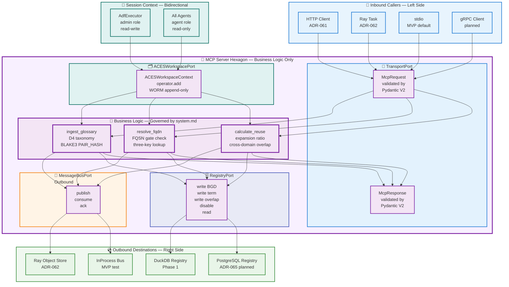
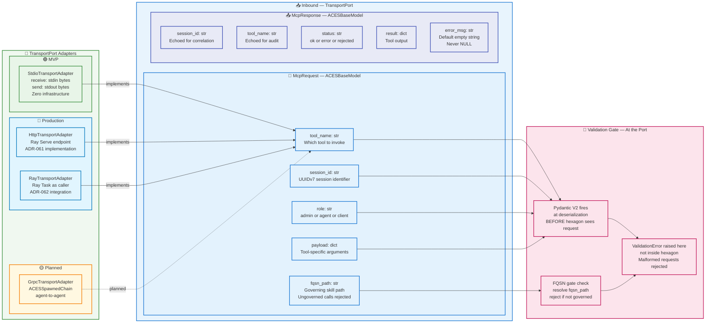
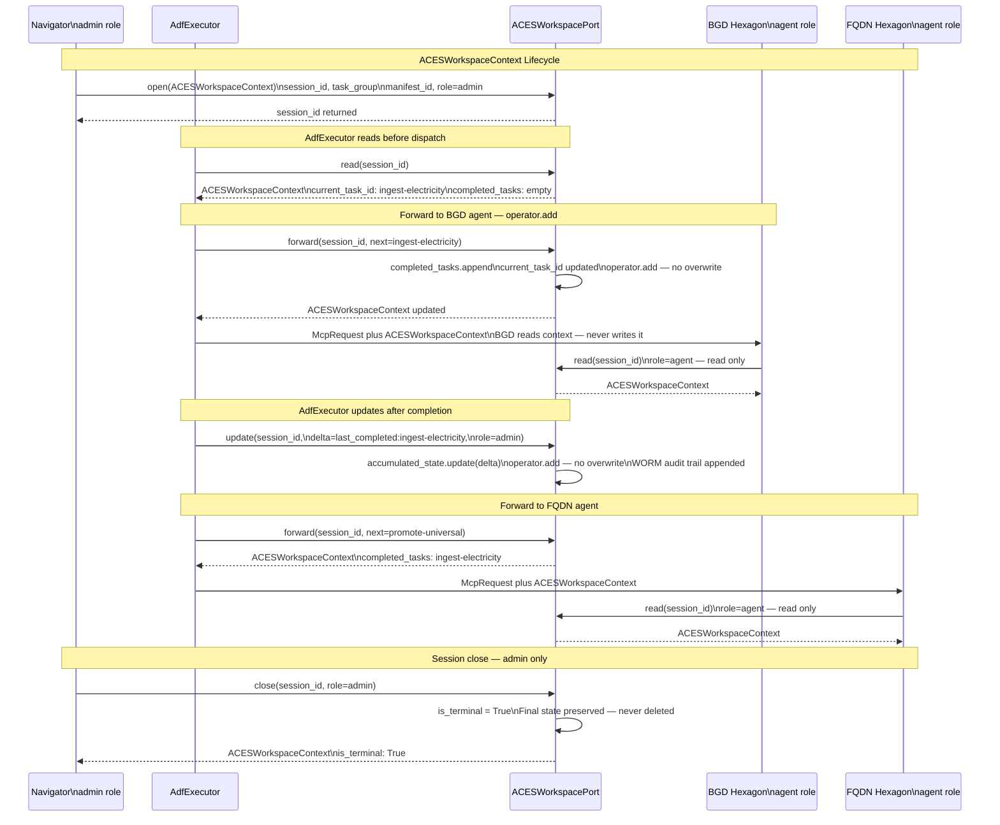
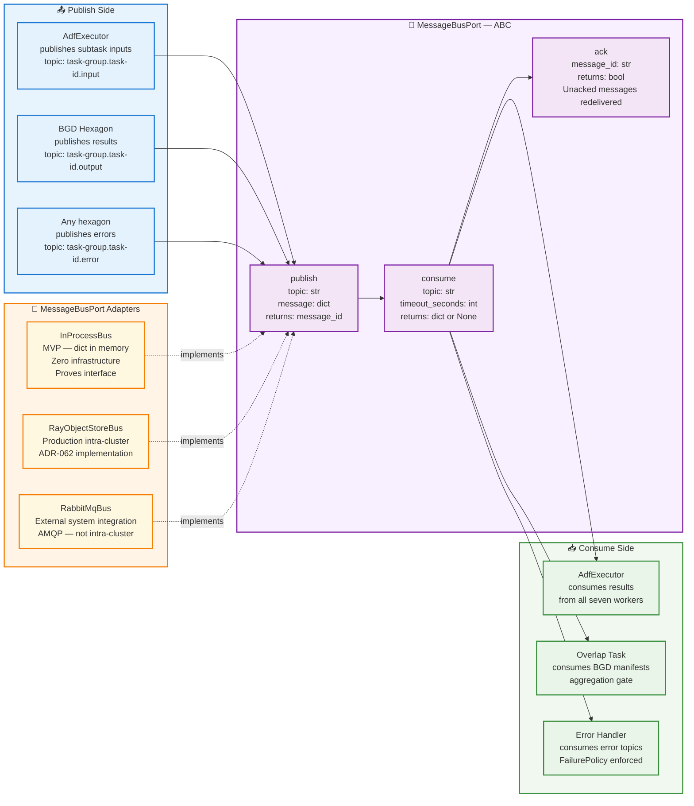
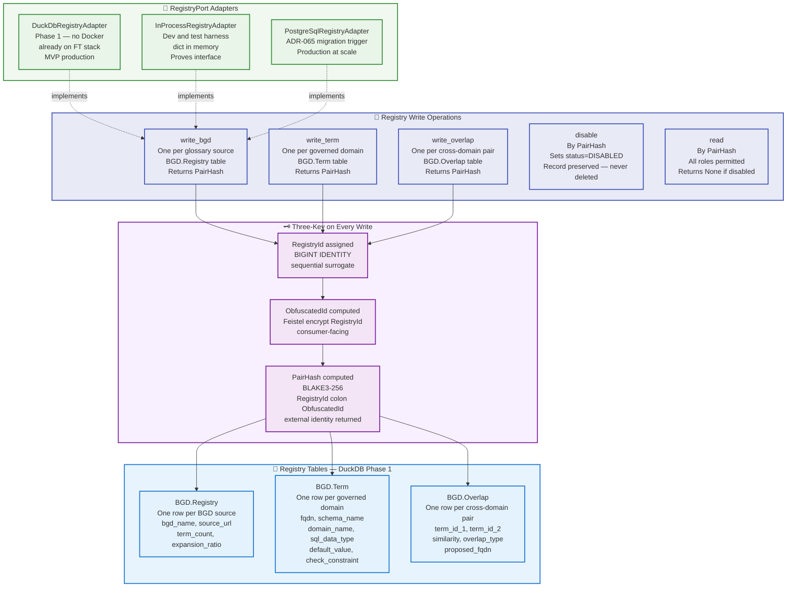
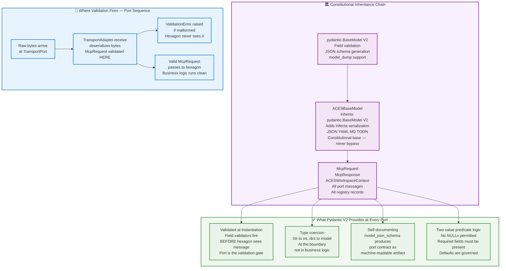
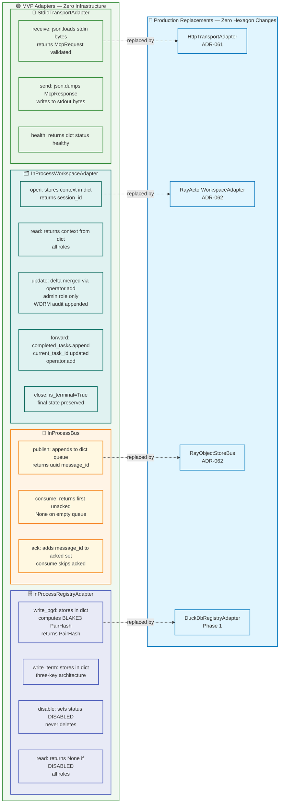
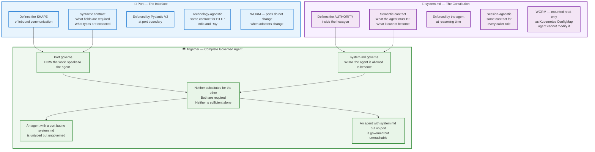
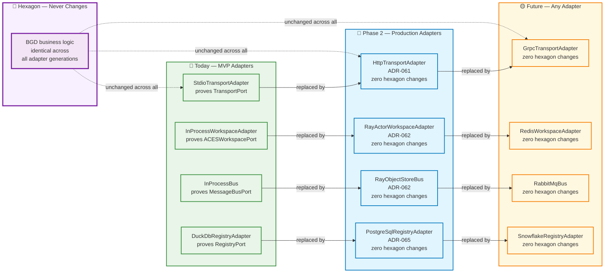
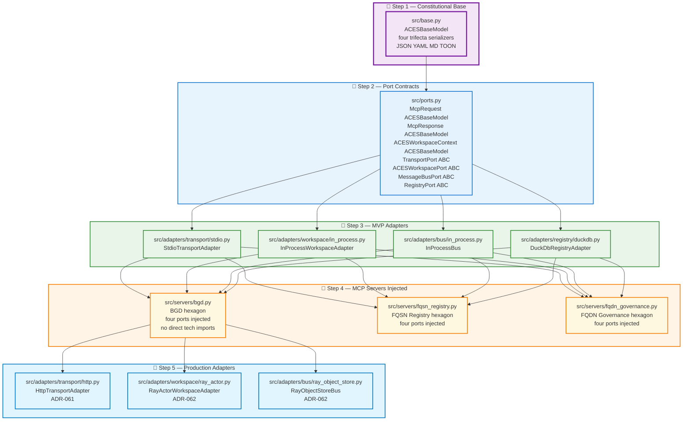

# 🔷 Section 3 — Hexagonal Architecture: Ports and Adapters

> **Continue, but append to a separate section from where you left off
> to avoid duplication and corruption.**
>
> This section is autonomous and self-contained.
> It covers Hexagonal Architecture (Cockburn 2005) as applied to ACES
> exclusively. It does not duplicate content from Section 1
> (Architecture Overview), Section 2 (D⁴ Methodology), or
> Sections 4–6 (forthcoming).

---

## 📋 Section 3 Table of Contents

- [3.1 What Hexagonal Architecture Is](#-31-what-hexagonal-architecture-is)
- [3.2 The ACES Hexagon — One MCP Server](#-32-the-aces-hexagon--one-mcp-server)
- [3.3 Port 1 — TransportPort](#-33-port-1--transportport)
- [3.4 Port 2 — ACESWorkspacePort](#-34-port-2--acesworkspaceport)
- [3.5 Port 3 — MessageBusPort](#-35-port-3--messagebusport)
- [3.6 Port 4 — RegistryPort](#-36-port-4--registryport)
- [3.7 Pydantic V2 as the Message Contract](#-37-pydantic-v2-as-the-message-contract)
- [3.8 MVP Adapter Implementations](#-38-mvp-adapter-implementations)
- [3.9 Port vs system.md — Interface vs Constitution](#-39-port-vs-systemmd--interface-vs-constitution)
- [3.10 Extensibility Guarantee](#-310-extensibility-guarantee)
- [3.11 Implementation Sequence](#-311-implementation-sequence)

---

## 🎯 3.1 What Hexagonal Architecture Is

**Hexagonal Architecture** — also called Ports and Adapters — was
defined by Alistair Cockburn in 2005:

> *"Allow an application to equally be driven by users, programs,
> automated tests or batch scripts, and to be developed and tested
> in isolation from its eventual run-time devices and databases."*

The central insight is deceptively simple:

> *"Define the shape of how the outside world talks to your
> application, then implement that shape as many times as needed."*

In Cockburn's model:

- The **hexagon** is the application — it contains all business logic
- The **port** is the interface contract — the shape the outside world
  must use to talk to the hexagon
- The **adapter** is a specific implementation of that port for a
  specific technology

The hexagon never imports a transport library. It never imports a
database driver. It never imports a message broker. It imports only
port contracts. Every technology concern lives in an adapter — outside
the hexagon.

**Why hexagonal architecture was already present in ACES before it
was named:**

The Navigator observed during Session A (2026-05-03) that
`TransportAdapter` and `MessageBus` were Ports and Adapters in
Cockburn's sense — before that name was applied. That is the sign
of a correct design: the pattern emerges from the problem, not from
the textbook. ADR-063 names what was already being built.

---

## 🔷 3.2 The ACES Hexagon — One MCP Server

Each MCP server in `task-group.d4-database-design` is exactly
one hexagon. The hexagon contains governed business logic and a
`system.md` behavioral contract. It exposes exactly four ports.



### 📐 The Four Ports at a Glance

| Port | Direction | Semantic Role | WORM | Write Authority |
|------|-----------|--------------|------|----------------|
| `TransportPort` | Inbound | Work unit delivery | No | Any caller |
| `ACESWorkspacePort` | Bidirectional | Session context propagation | Yes — append only | Admin role only |
| `MessageBusPort` | Outbound | Work result exchange | No | Hexagon only |
| `RegistryPort` | Outbound | BGD registry writes | Yes — no deletes | Admin role only |

> **The invariant:** The hexagon never knows which adapter is
> plugged into any of its four ports. It imports only port contracts.
> Technology decisions live entirely in adapters.

---

## 🔌 3.3 Port 1 — TransportPort

**Semantic role:** Work unit delivery from callers to the hexagon.

**Direction:** Inbound — callers push `McpRequest` in, the hexagon
pushes `McpResponse` out.

**Why it exists:** Without `TransportPort`, the MCP server must
import HTTP libraries, Ray libraries, or stdio handling directly.
Each import couples the business logic to a specific transport.
When the transport changes — from `stdio` to HTTP (ADR-061), from
HTTP to gRPC — the business logic must change. `TransportPort`
breaks that coupling permanently.



### 🔬 TransportPort Contract

```python
from abc import ABC, abstractmethod
from src.base import ACESBaseModel


class McpRequest(ACESBaseModel):
    """
    Governed inbound request envelope.
    Pydantic V2 validates at instantiation — before hexagon sees it.
    The port is the validation gate. Not the hexagon.
    All callers produce McpRequest. The hexagon receives only McpRequest.
    """
    tool_name:   str
    session_id:  str
    role:        str    # admin | agent | client
    fqsn_path:   str    # ungoverned calls rejected before reaching hexagon
    payload:     dict


class McpResponse(ACESBaseModel):
    """
    Governed outbound response envelope.
    Pydantic V2 validates on construction — malformed responses
    caught before they leave the hexagon.
    """
    session_id:  str
    tool_name:   str
    status:      str        # ok | error | rejected
    result:      dict
    error_msg:   str = ""   # governed default — never NULL


class TransportPort(ABC):
    """
    Inbound port — work unit delivery.
    The hexagon depends on this ABC. Never on a concrete adapter.
    Swap StdioTransportAdapter for HttpTransportAdapter:
    zero changes to hexagon code.
    """

    @abstractmethod
    def receive(self, raw: bytes) -> McpRequest:
        """
        Deserialize raw inbound bytes to validated McpRequest.
        Pydantic V2 ValidationError raised here — not in hexagon.
        """
        ...

    @abstractmethod
    def send(self, response: McpResponse) -> bytes:
        """
        Serialize governed McpResponse to raw outbound bytes.
        Pydantic V2 ensures McpResponse is valid before serialization.
        """
        ...

    @abstractmethod
    def health(self) -> dict:
        """Transport-level health. Not agent health. Not registry health."""
        ...
```

---

## 🗂️ 3.4 Port 2 — ACESWorkspacePort

**Semantic role:** Session context propagation throughout the agent
chain. `ACESWorkspaceContext` is not a message. It is the WORM-governed
session envelope that flows *alongside* messages for the entire
lifetime of a Task Group execution.

**Direction:** Bidirectional — `AdfExecutor` writes and forwards.
All agents read. No agent writes directly.

**Why it is a separate port from `MessageBusPort`:**

This is the most important architectural distinction in the system.
The six differences that make sharing a port with `MessageBusPort`
architecturally wrong:

| Concern | ACESWorkspacePort | MessageBusPort |
|---------|-----------------|----------------|
| **Lifecycle** | Session open to session close | Publish, consume, ack, gone |
| **Write discipline** | `operator.add` — append only | Destructive consume |
| **Read access** | All agents, every call | One consumer per message |
| **Write authority** | Admin role only | Any hexagon |
| **WORM audit** | Full history preserved forever | Acked messages gone |
| **On timeout** | Context still exists | Returns `None` |

**Sharing one port for both would mix two governance models on
one wire. This decision is final. It is filed in ADR-063.**



### 🔬 ACESWorkspacePort Contract

```python
from abc import ABC, abstractmethod
from src.base import ACESBaseModel


class ACESWorkspaceContext(ACESBaseModel):
    """
    WORM-governed session context — the ACES canonical name.

    Forwarded and updated — not event-triggered.
    operator.add write discipline — never overwrite.
    Persists for session lifetime — never destructively consumed.
    Read by all agents. Written only by admin role via port methods.

    Pydantic V2 governs this object at every port boundary.
    No NULL-contaminated context can cross a port boundary.
    The WORM audit trail is a list of validated snapshots.
    """
    session_id:         str
    task_group:         str
    manifest_id:        str
    initiated_at:       str       # ISO-8601
    role:               str       # admin | agent | client
    fqsn_path:          str       # governing skill for current agent
    current_task_id:    str
    completed_tasks:    list[str] # WORM audit trail — append only
    accumulated_state:  dict      # operator.add — never replace
    is_terminal:        bool = False


class ACESWorkspacePort(ABC):
    """
    Bidirectional port — ACESWorkspaceContext propagation.
    Separate from MessageBusPort — different lifecycle,
    different write discipline, different governance model.
    This separation is final. See ADR-063.
    """

    @abstractmethod
    def open(self, context: ACESWorkspaceContext) -> str:
        """Open session. Admin role only. Returns session_id."""
        ...

    @abstractmethod
    def read(self, session_id: str) -> ACESWorkspaceContext:
        """Read current context. All roles permitted."""
        ...

    @abstractmethod
    def update(self, session_id: str, delta: dict,
               role: str) -> ACESWorkspaceContext:
        """
        Merge delta into accumulated_state via operator.add.
        Admin role only. WORM audit trail preserved.
        Never replaces — always appends.
        """
        ...

    @abstractmethod
    def forward(self, session_id: str,
                next_task_id: str) -> ACESWorkspaceContext:
        """
        Forward context to next agent.
        Appends current_task_id to completed_tasks via operator.add.
        Updates current_task_id to next_task_id.
        Called by AdfExecutor at each subtask boundary.
        Not event-triggered — explicitly called.
        """
        ...

    @abstractmethod
    def close(self, session_id: str,
              role: str) -> ACESWorkspaceContext:
        """
        Close session. Sets is_terminal=True.
        Final state preserved — never deleted.
        Admin role only.
        """
        ...
```

---

## 📨 3.5 Port 3 — MessageBusPort

**Semantic role:** Work unit exchange between agents within a
Task Group. Subtask inputs published by `AdfExecutor`. Results
consumed by the aggregation gate.

**Direction:** Outbound from the hexagon. `AdfExecutor` also
consumes results from this bus — the bus is shared infrastructure,
not owned by any single hexagon.

**Why it is separate from ACESWorkspacePort:** The bus
consumes messages destructively — once acked, a work unit
message is gone. `ACESWorkspaceContext` is never destroyed.
The governance models are incompatible on a shared wire.



### 🔬 MessageBusPort Contract

```python
from abc import ABC, abstractmethod


class MessageBusPort(ABC):
    """
    Outbound port — work unit exchange.
    topic convention: task-group.task-id.input | output | error

    The bus never knows what messages contain.
    Agents never know which bus carries their messages.
    Destructive consume — acked messages are gone.
    This is what makes it different from ACESWorkspacePort.
    """

    @abstractmethod
    def publish(self, topic: str, message: dict) -> str:
        """Publish to topic. Returns message_id for ack."""
        ...

    @abstractmethod
    def consume(self, topic: str,
                timeout_seconds: int = 30) -> dict | None:
        """Consume next message. Returns None on timeout — not an error."""
        ...

    @abstractmethod
    def ack(self, message_id: str) -> bool:
        """
        Acknowledge processing. Unacked messages redelivered
        per FailurePolicy in GroupTaskManifest.
        """
        ...
```

---

## 🗄️ 3.6 Port 4 — RegistryPort

**Semantic role:** BGD registry writes — the governed persistence
layer for every term, domain, and overlap record.

**Direction:** Outbound from the hexagon. The hexagon writes
governed records. The registry stores them. No hexagon reads
back what it wrote — reads happen through the FQSN registry
or through direct registry queries by the Navigator.

**WORM enforcement:** No hard deletes. `disable()` is the only
removal primitive. Every record written to the registry is
permanently auditable. The BLAKE3-256 PAIR_HASH on every record
ensures it cannot be modified without detection.



---

## 🏛️ 3.7 Pydantic V2 as the Message Contract

**This is a governing clause. It applies to all four ports.**

Every message object crossing any port boundary is an `ACESBaseModel`
subclass. `ACESBaseModel` inherits from `pydantic.BaseModel` V2.
Pydantic V2 is therefore not an addition to the transport layer.
It is the message contract for all four ports **by constitutional
inheritance** — already true, now named and locked.



### 📐 The Trifecta on Port Messages

Because every port message inherits `ACESBaseModel`, every message
can be serialized in all four trifecta formats without additional code:

```python
request = McpRequest(
    tool_name="ingest_glossary",
    session_id="01966f2a-7b3e-7000-8000-000000000001",
    role="admin",
    fqsn_path="skills/task.d4.bgd",
    payload={"bgd_name": "electricity", "source_format": "json"}
)

# All four trifecta formats — zero additional code
request.model_dump_to_json()   # API payloads, MCP tool arguments
request.model_dump_to_yaml()   # Config files, human review
request.model_dump_to_md()     # Obsidian documentation, narrative
request.model_dump_to_toon()   # Diff-able tabular output, flat data

# Self-documenting port contract
schema = McpRequest.model_json_schema()
# Produces machine-readable contract — same object as the schema
```

---

## 🔧 3.8 Minimum Viable Product (MVP) Adapter Implementations

The MVP adapters prove all four port contracts before any
infrastructure is involved. They are trivial implementations.
Trivial is the point — the interface is proved, the business logic
is tested, and the infrastructure can be introduced incrementally.



---

## 📜 3.9 Port vs system.md — Interface vs Constitution

This distinction is the architectural insight that connects
Hexagonal Architecture to the Navigator/Driver model and to
Article 4 of the Navigator/Driver Medium series
(*Jurisdiction, Not Inheritance*).

**The port defines the shape.**
The `system.md` defines the authority.

In Cockburn's original framing:

> *"The port defines the shape of how the outside world talks
> to the application."*

In ACES terms:

> *"The `system.md` defines what the agent must be.
> The `TransportPort` defines how the outside world speaks to it."*

The `system.md` is not a port. It is the governing authority
*inside* the hexagon. The port is what the hexagon exposes.
The `system.md` governs what the hexagon is allowed to become
in response to anything that enters through the port.



> **The one sentence that ties it together:**
> The port tells the world how to talk to the agent.
> The `system.md` tells the agent what it cannot become
> regardless of what the world says.
> Together they are the complete governed agent.

---

## 🔄 3.10 Extensibility Guarantee

**Cockburn's original guarantee, applied to ACES:**

> *"Implement that shape as many times as needed."*

In operational terms: **zero modified files when a new adapter
is added.** The port contract is WORM. The adapters are governed
mutable. New infrastructure plugs into an existing port. Nothing
inside the hexagon changes.



---

## 📋 3.11 Implementation Sequence

The implementation sequence is locked by the port contracts.
`src/ports.py` must exist before any adapter can be written.
No MCP server can be refactored until all four adapters it
depends on are implemented. No integration test can run until
at least the MVP adapters are in place.



### 📐 File Creation Checklist

| Step | File | Depends On | Blocks |
|------|------|-----------|--------|
| 1 | `src/base.py` | nothing | everything |
| 2 | `src/ports.py` | `src/base.py` | all adapters |
| 3a | `src/adapters/transport/stdio.py` | `src/ports.py` | MCP servers |
| 3b | `src/adapters/workspace/in_process.py` | `src/ports.py` | MCP servers |
| 3c | `src/adapters/bus/in_process.py` | `src/ports.py` | MCP servers |
| 3d | `src/adapters/registry/duckdb.py` | `src/ports.py` | MCP servers |
| 4a | `src/servers/bgd.py` | all four adapters | integration tests |
| 4b | `src/servers/fqsn_registry.py` | all four adapters | integration tests |
| 4c | `src/servers/fqdn_governance.py` | all four adapters | integration tests |
| 5a | `src/adapters/transport/http.py` | ADR-061 filed | K8s deployment |
| 5b | `src/adapters/workspace/ray_actor.py` | ADR-062 filed | Ray cluster |
| 5c | `src/adapters/bus/ray_object_store.py` | ADR-062 filed | Ray cluster |

---

[🔝 Back to Section 3 TOC](#-section-3-table-of-contents)

[🏠 Back to Main TOC](./docs-section-1-overview-architecture.md#-table-of-contents)

---

*Section 3 of 6 — Continue, but append to a separate section from where
you left off to avoid duplication and corruption.*
