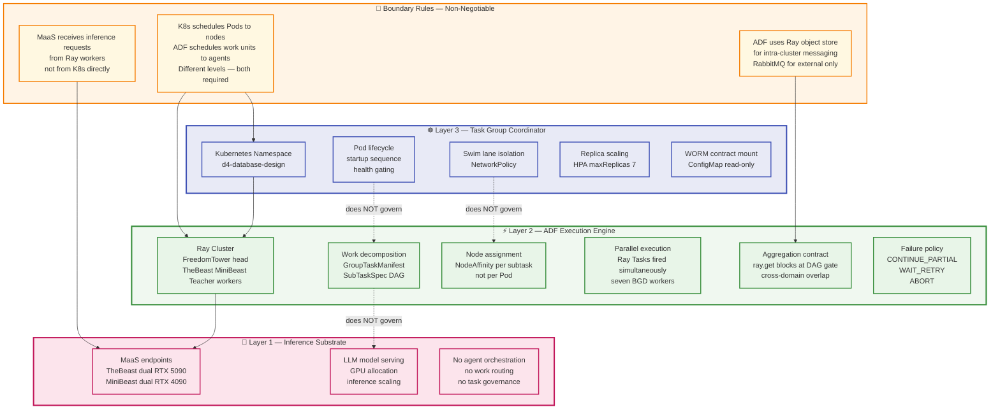
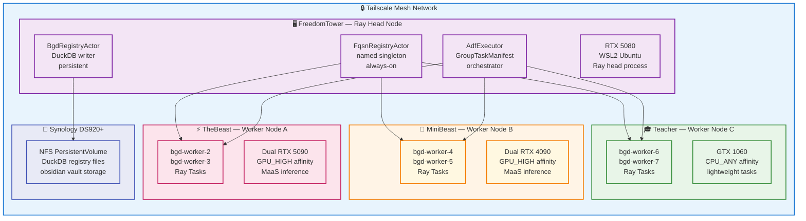
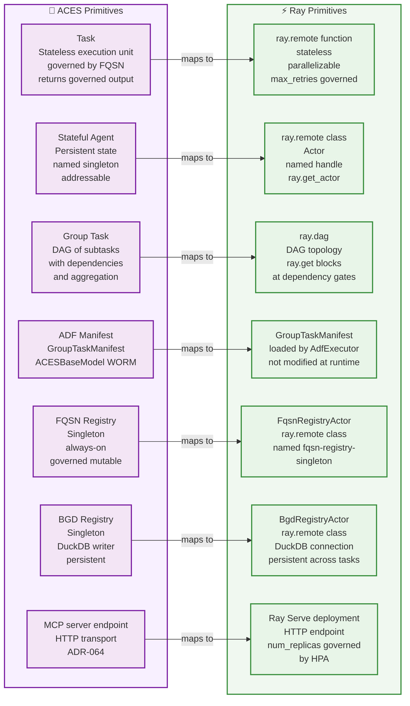
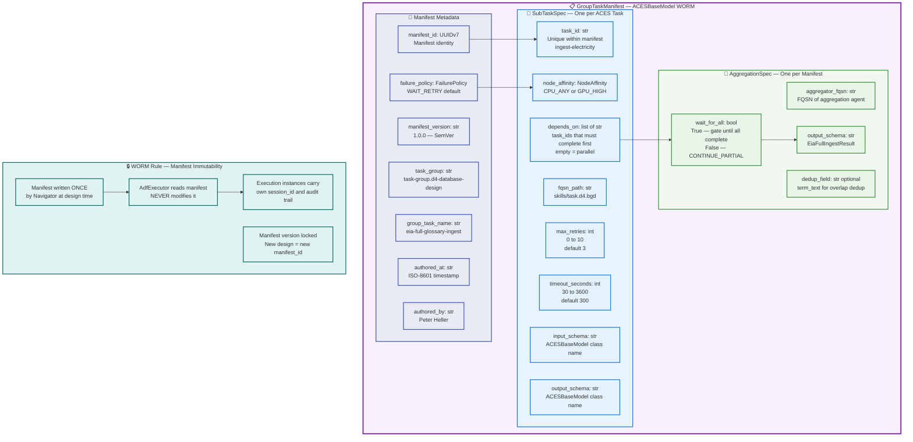
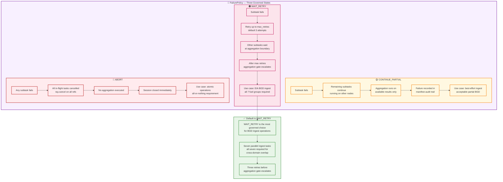
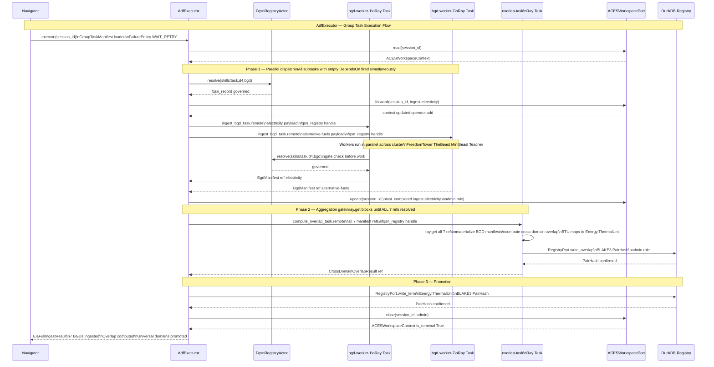
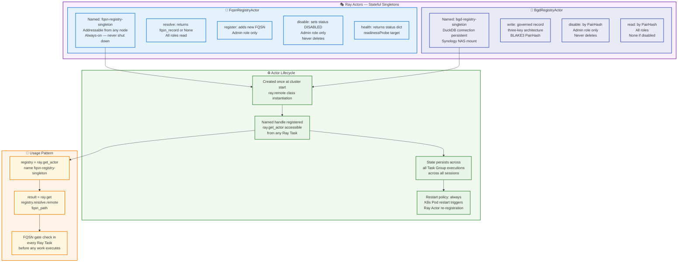
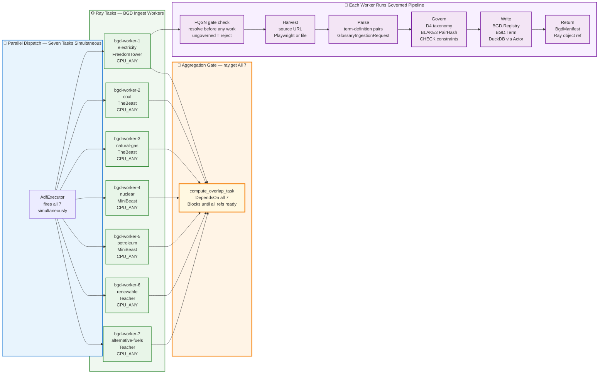
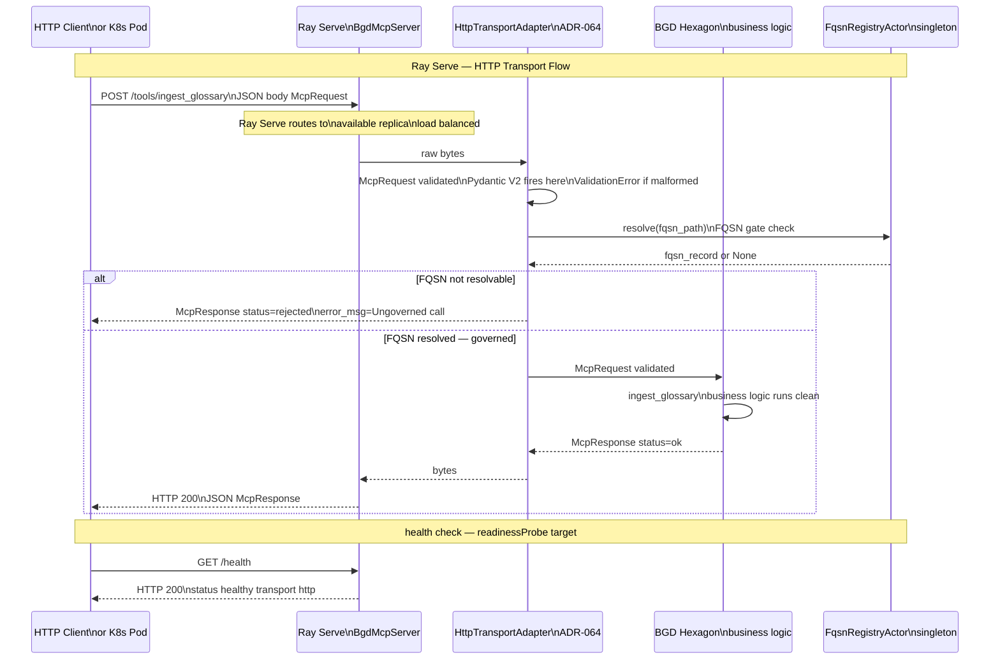
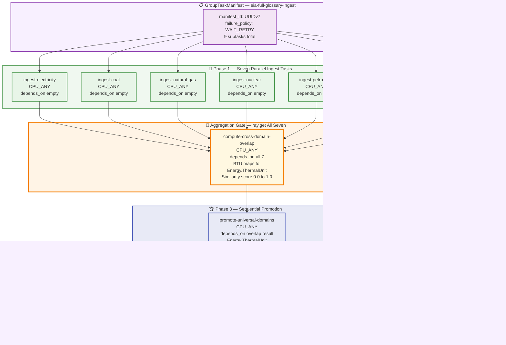

# ⚡ Section 4 — Agentic Distribution Framework (ADF) and Ray

> **Continue, but append to a separate section from where you left off
> to avoid duplication and corruption.**
>
> This section is autonomous and self-contained.
> It covers the ADF execution layer and Ray cluster architecture
> exclusively. It does not duplicate content from Sections 1–3
> or Sections 5–6 (forthcoming).

---

## 📋 Section 4 Table of Contents

- [4.1 What the ADF Is — and What It Is Not](#-41-what-the-adf-is--and-what-it-is-not)
- [4.2 The Three-Layer Responsibility Boundary](#-42-the-three-layer-responsibility-boundary)
- [4.3 Ray Cluster Topology](#-43-ray-cluster-topology)
- [4.4 ACES Primitive to Ray Primitive Mapping](#-44-aces-primitive-to-ray-primitive-mapping)
- [4.5 GroupTaskManifest — The WORM Decomposition Document](#-45-grouptaskmanifest--the-worm-decomposition-document)
- [4.6 FailurePolicy — Eliminating Ambiguity](#-46-failurepolicy--eliminating-ambiguity)
- [4.7 AdfExecutor — The Group Task Orchestrator](#-47-adfexecutor--the-group-task-orchestrator)
- [4.8 Ray Actors — Stateful Singleton Agents](#-48-ray-actors--stateful-singleton-agents)
- [4.9 Ray Tasks — Parallel BGD Ingest Workers](#-49-ray-tasks--parallel-bgd-ingest-workers)
- [4.10 Ray Serve — MCP HTTP Transport](#-410-ray-serve--mcp-http-transport)
- [4.11 Node Affinity and Work Routing](#-411-node-affinity-and-work-routing)
- [4.12 The EIA Full Ingest Group Task End-to-End](#-412-the-eia-full-ingest-group-task-end-to-end)

---

## 🎯 4.1 What the ADF Is — and What It Is Not

**ADF — Agentic Distribution Framework** is the execution layer
that sits between the Task Group coordinator (Kubernetes) and
the inference substrate (MaaS). It answers four questions that
neither K8s nor MaaS can answer:

1. **How is a Group Task decomposed into subtasks?**
   K8s schedules Pods to nodes. It does not know what work
   a Pod should do or in what order.

2. **Which cluster node executes which subtask?**
   K8s node affinity applies to Pods at deployment time.
   ADF node affinity applies to work units at runtime —
   based on FQSN, data locality, and task dependencies.

3. **How do partial results aggregate into a governed output?**
   K8s has no concept of aggregation. The ADF defines the
   aggregation contract via `GroupTaskManifest`.

4. **What happens when a subtask fails?**
   K8s restarts Pods. The ADF enforces `FailurePolicy` —
   `CONTINUE_PARTIAL`, `WAIT_RETRY`, or `ABORT` — per
   manifest specification.

**What ADF is NOT:**

| Confusion | Clarification |
|-----------|--------------|
| ADF is not MaaS | MaaS serves LLM inference. ADF distributes work. They are different layers. |
| ADF is not K8s | K8s schedules Pods. ADF schedules work units. Both are required. |
| ADF is not a message queue | RabbitMQ routes messages. ADF governs work decomposition and aggregation. |
| ADF is not an agent framework | LangGraph, CrewAI orchestrate agents inside a process. ADF distributes across a cluster. |

**Ray is the correct ADF substrate** because Ray Tasks map directly
to ACES Tasks, Ray Actors map to stateful singleton agents, Ray DAGs
are the Group Task execution engine, and Ray Serve provides the HTTP
transport layer — fulfilling ADR-064 in the same implementation that
fulfills ADR-062.

---

## 🏛️ 4.2 The Three-Layer Responsibility Boundary

Each layer owns exactly one concern. No layer reaches into another.



---

## 🖥️ 4.3 Ray Cluster Topology

The Ray cluster runs on existing FreedomTower cluster hardware
over Tailscale mesh. No new infrastructure required for Phase 1.



### 📐 Ray Bootstrap Commands

```bash
# On FreedomTower — start Ray head node
ray start --head \
  --port=6379 \
  --dashboard-host=0.0.0.0 \
  --dashboard-port=8265

# On TheBeast — connect as worker
ray start --address='freedomtower:6379' \
  --num-gpus=2 \
  --num-cpus=32

# On MiniBeast — connect as worker
ray start --address='freedomtower:6379' \
  --num-gpus=2 \
  --num-cpus=16

# On Teacher — connect as worker
ray start --address='freedomtower:6379' \
  --num-gpus=1 \
  --num-cpus=8

# Verify cluster
ray status

# Initialize in Python
import ray
ray.init(address="ray://freedomtower:10001")
```

---

## 🗺️ 4.4 ACES Primitive to Ray Primitive Mapping

Every ACES architectural concept maps to a specific Ray primitive.
This is not a translation layer — it is a direct correspondence
that makes Ray the natural ADF substrate.



---

## 📋 4.5 GroupTaskManifest — The WORM Decomposition Document

The `GroupTaskManifest` is the most important artifact in the ADF
layer. It is written once per Group Task design. Execution instances
carry their own `session_id` and audit trail but do not modify the
manifest.

> **The manifest is the constitution of the Group Task.
> Execution instances are citizens bound by it.**

This sentence connects directly to Article 4 of the Navigator/Driver
series (*Jurisdiction, Not Inheritance*) — the manifest governs
by jurisdiction, not by inheritance. Every subtask is a citizen
bound by the manifest. No subtask can override the manifest's
failure policy, node affinity, or aggregation contract.



### 🔬 GroupTaskManifest Python Implementation

```python
from enum import Enum
from typing import Optional
from src.base import ACESBaseModel
from pydantic import Field


class FailurePolicy(str, Enum):
    """
    ADF failure policy — three governed states, no ambiguity.
    No NULL-equivalent fallback. No undeclared behavior.
    """
    CONTINUE_PARTIAL = "CONTINUE_PARTIAL"  # run on, aggregate available
    WAIT_RETRY       = "WAIT_RETRY"        # retry N times, others wait
    ABORT            = "ABORT"             # any failure cancels all


class NodeAffinity(str, Enum):
    """
    Work unit routing — per subtask, not per Pod.
    K8s node affinity applies to Pods at deployment time.
    ADF node affinity applies to work units at runtime.
    """
    CPU_ANY   = "CPU_ANY"    # any node — BGD ingest, metadata
    GPU_HIGH  = "GPU_HIGH"   # TheBeast or MiniBeast — LLM inference
    GPU_LOW   = "GPU_LOW"    # Teacher — lightweight inference
    HEAD_ONLY = "HEAD_ONLY"  # FreedomTower — coordinator tasks


class SubTaskSpec(ACESBaseModel):
    """One subtask within a Group Task — governed by ACESBaseModel."""
    task_id:         str
    fqsn_path:       str
    node_affinity:   NodeAffinity = NodeAffinity.CPU_ANY
    depends_on:      list[str]    = Field(default_factory=list)
    max_retries:     int          = Field(default=3, ge=0, le=10)
    timeout_seconds: int          = Field(default=300, ge=30, le=3600)
    input_schema:    str          = "GlossaryIngestionRequest"
    output_schema:   str          = "BgdManifest"


class AggregationSpec(ACESBaseModel):
    """Aggregation contract — how N parallel results merge."""
    aggregator_fqsn: str
    wait_for_all:    bool          = True
    output_schema:   str           = "EiaFullIngestResult"
    dedup_field:     Optional[str] = None


class GroupTaskManifest(ACESBaseModel):
    """
    WORM decomposition document — the constitution of the Group Task.
    Written once. Read many times. Never modified at runtime.
    Execution instances are citizens bound by it.
    """
    manifest_id:      str
    manifest_version: str               = "1.0.0"
    task_group:       str               = "task-group.d4-database-design"
    group_task_name:  str
    description:      str
    failure_policy:   FailurePolicy     = FailurePolicy.WAIT_RETRY
    subtasks:         list[SubTaskSpec] = Field(..., min_length=2)
    aggregation:      AggregationSpec
    authored_at:      str
    authored_by:      str               = "Peter Heller"
```

---

## 🚦 4.6 FailurePolicy — Eliminating Ambiguity

`FailurePolicy` is a governed enum — three states, no NULL,
no undeclared behavior. Every `GroupTaskManifest` declares
exactly one. The ADF enforces it without interpretation.



---

## 🎯 4.7 AdfExecutor — The Group Task Orchestrator

`AdfExecutor` is the class that reads `GroupTaskManifest` and
dispatches Ray Tasks accordingly. It owns the dependency ordering,
failure policy enforcement, and aggregation contract. It does not
own the business logic — that lives in the hexagons.



---

## 🎭 4.8 Ray Actors — Stateful Singleton Agents

Ray Actors are the Ray primitive for stateful singleton agents.
They are instantiated once, named, and addressable across all
cluster nodes. The `FqsnRegistryActor` and `BgdRegistryActor`
are the two singleton actors in this Task Group.



### 🔬 Ray Actor Implementation Skeleton

```python
import ray
from src.base import ACESBaseModel


@ray.remote(num_cpus=0.5)
class FqsnRegistryActor:
    """
    Singleton FQSN registry — governed mutable.
    Named and addressable across all cluster nodes.
    Admin: read/update/disable.
    Agent/Client: read only.
    No hard deletes — disable is the governance primitive.
    """

    def __init__(self):
        self._registry: dict[str, dict] = {}

    def resolve(self, fqsn_path: str) -> dict | None:
        record = self._registry.get(fqsn_path)
        if record and record.get("status") == "DISABLED":
            return None
        return record

    def register(self, fqsn_path: str,
                 record: dict, role: str) -> bool:
        if role != "admin":
            raise PermissionError("Registration requires admin role")
        self._registry[fqsn_path] = record
        return True

    def disable(self, fqsn_path: str, role: str) -> bool:
        if role != "admin":
            raise PermissionError("Disable requires admin role")
        if fqsn_path in self._registry:
            self._registry[fqsn_path]["status"] = "DISABLED"
            return True
        return False

    def health(self) -> dict:
        return {
            "status":           "healthy",
            "registered_count": len(self._registry),
            "disabled_count":   sum(
                1 for r in self._registry.values()
                if r.get("status") == "DISABLED"
            )
        }


# Instantiate as named singleton on cluster start
fqsn_registry = FqsnRegistryActor.options(
    name="fqsn-registry-singleton",
    lifetime="detached",        # survives driver restart
    get_if_exists=True          # idempotent — reuses existing actor
).remote()
```

---

## ⚙️ 4.9 Ray Tasks — Parallel BGD Ingest Workers

Ray Tasks are stateless, parallelizable execution units. They
map directly to ACES Tasks. Seven Ray Tasks fire simultaneously —
one per EIA fuel group — each governed by the same FQSN.



### 🔬 Ray Task Implementation Skeleton

```python
import ray
from src.harvester import harvest
from src.parser import parse
from src.governer import govern
from src.base import ACESBaseModel


@ray.remote(num_cpus=1)
def ingest_bgd_task(
    glossary_request: dict,
    fqsn_registry: ray.actor.ActorHandle
) -> dict:
    """
    Stateless BGD ingest task — one per fuel group.
    Resolves FQSN before executing — ungoverned calls rejected.
    Returns BgdManifest as dict for Ray object store.
    Governance rule: FQSN gate check is always first.
    No exceptions. No shortcuts.
    """
    # Gate check — ungoverned calls rejected before any work
    fqsn_path = "skills/task.d4-database-design.bgd"
    fqsn_record = ray.get(fqsn_registry.resolve.remote(fqsn_path))

    if fqsn_record is None:
        raise RuntimeError(
            f"Ungoverned call rejected — FQSN not resolvable: {fqsn_path}"
        )

    # Governed pipeline — four stages
    raw     = harvest(glossary_request["source_url"],
                      glossary_request["source_format"])
    parsed  = parse(raw)
    governed_manifest = govern(parsed, glossary_request["bgd_name"])

    # Write to registry via Actor — not directly to DuckDB
    bgd_actor = ray.get_actor("bgd-registry-singleton")
    ray.get(bgd_actor.write.remote(governed_manifest.model_dump(),
                                   role="admin"))

    return governed_manifest.model_dump()
```

---

## 🌐 4.10 Ray Serve — MCP HTTP Transport

Ray Serve is the HTTP endpoint layer for all three MCP servers.
It fulfills the ADR-064 HTTP transport prerequisite within the
same implementation that fulfills ADR-062. One implementation,
two ADRs satisfied.



### 🔬 Ray Serve Deployment

```python
from ray import serve
from src.ports import TransportPort, McpRequest, McpResponse
from src.adapters.transport.http import HttpTransportAdapter
from src.adapters.workspace.ray_actor import RayActorWorkspaceAdapter
from src.adapters.bus.ray_object_store import RayObjectStoreBus
from src.adapters.registry.duckdb import DuckDbRegistryAdapter


@serve.deployment(
    name="bgd-mcp-server",
    num_replicas=3,              # matches HPA minReplicas in ADR-061
    ray_actor_options={"num_cpus": 1}
)
class BgdMcpServer:
    """
    BGD MCP server as Ray Serve deployment.
    HTTP transport — fulfills ADR-064 prerequisite.
    Four ports injected — fulfills ADR-063 hexagonal pattern.
    Each replica is a stateless hexagon. Actors are shared.
    """

    def __init__(self):
        # Four ports injected — hexagon never imports tech directly
        self._transport  = HttpTransportAdapter()
        self._workspace  = RayActorWorkspaceAdapter()
        self._message_bus = RayObjectStoreBus()
        self._registry   = DuckDbRegistryAdapter()

    async def __call__(self, request):
        raw = await request.body()

        # Port 1 — TransportPort receives and validates
        mcp_request = self._transport.receive(raw)

        # Port 2 — ACESWorkspacePort provides session context
        ctx = self._workspace.read(mcp_request.session_id)

        # Hexagon business logic — governed, clean
        result = self._dispatch(mcp_request, ctx)

        response = McpResponse(
            session_id=mcp_request.session_id,
            tool_name=mcp_request.tool_name,
            status="ok",
            result=result
        )

        # Port 1 — TransportPort sends response
        return self._transport.send(response)

    async def health(self, request):
        return {"status": "healthy", "transport": "http",
                "adr": "ADR-064", "replicas": 3}

    def _dispatch(self, request: McpRequest, ctx) -> dict:
        """Route to correct business logic by tool_name."""
        if request.tool_name == "ingest_glossary":
            from src.servers.bgd import ingest_glossary
            return ingest_glossary(request.payload, ctx,
                                   self._registry)
        raise ValueError(f"Unknown tool: {request.tool_name}")
```

---

## 📍 4.11 Node Affinity and Work Routing

Node affinity in the ADF operates at the work unit level —
not at the Pod level. K8s node affinity assigns Pods to nodes
at deployment time based on labels. ADF `NodeAffinity` assigns
Ray Tasks to nodes at runtime based on FQSN and task type.

| NodeAffinity | Target Nodes | Task Types | Ray Resource |
|-------------|-------------|-----------|-------------|
| `CPU_ANY` | Any node | BGD ingest, metadata extraction, overlap computation | `num_cpus=1` |
| `GPU_HIGH` | TheBeast, MiniBeast | LLM inference, embedding generation | `num_gpus=1` |
| `GPU_LOW` | Teacher | Lightweight inference, classification | `num_gpus=0.5` |
| `HEAD_ONLY` | FreedomTower | Coordinator tasks, manifest loading | `resources={"head": 1}` |

```python
# NodeAffinity applied in AdfExecutor._dispatch()

NODE_AFFINITY_OPTIONS = {
    NodeAffinity.CPU_ANY:   {"num_cpus": 1},
    NodeAffinity.GPU_HIGH:  {"num_gpus": 1, "num_cpus": 2},
    NodeAffinity.GPU_LOW:   {"num_gpus": 0.5, "num_cpus": 1},
    NodeAffinity.HEAD_ONLY: {"resources": {"node:freedomtower": 1}},
}

def _dispatch(self, subtask: SubTaskSpec) -> ray.ObjectRef:
    options = NODE_AFFINITY_OPTIONS[subtask.node_affinity]
    return ingest_bgd_task.options(
        **options,
        max_retries=subtask.max_retries,
        name=subtask.task_id
    ).remote(
        {"bgd_name": subtask.task_id,
         "source_url": "https://www.eia.gov/tools/glossary/",
         "source_format": "html-dynamic"},
        self._fqsn_registry
    )
```

---

## 🔄 4.12 The EIA Full Ingest Group Task End-to-End

The canonical Group Task that proves the complete ADF architecture:
seven glossaries in parallel, cross-domain overlap computed at the
aggregation gate, universal domains promoted to the `Energy.` schema.



---

[🔝 Back to Section 4 TOC](#-section-4-table-of-contents)

[🏠 Back to Main TOC](./docs-section-1-overview-architecture.md#-table-of-contents)

---

*Section 4 of 6 — Continue, but append to a separate section from where
you left off to avoid duplication and corruption.*
