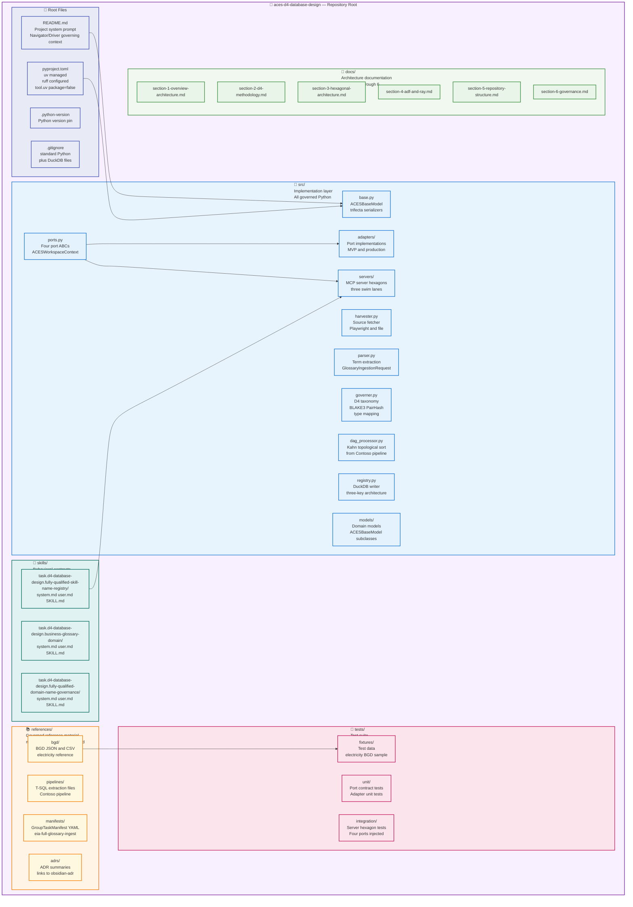
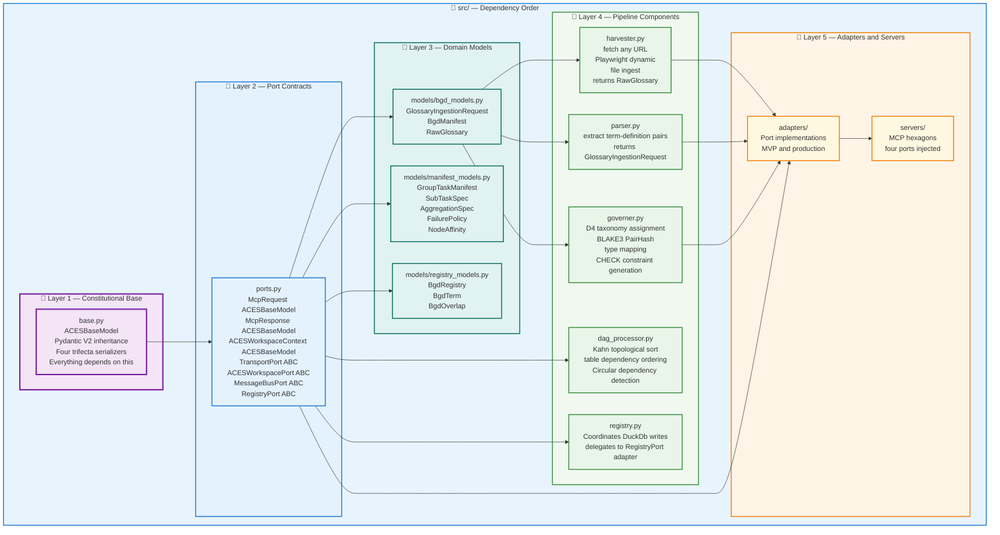
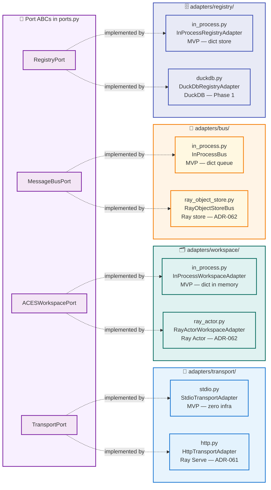
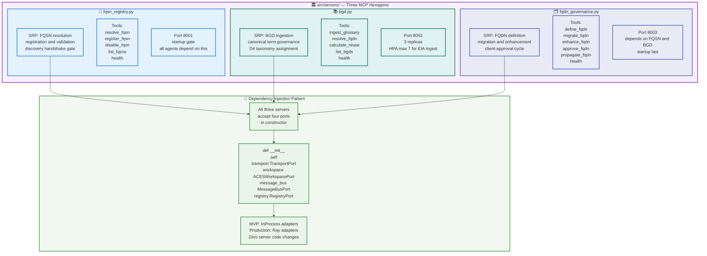
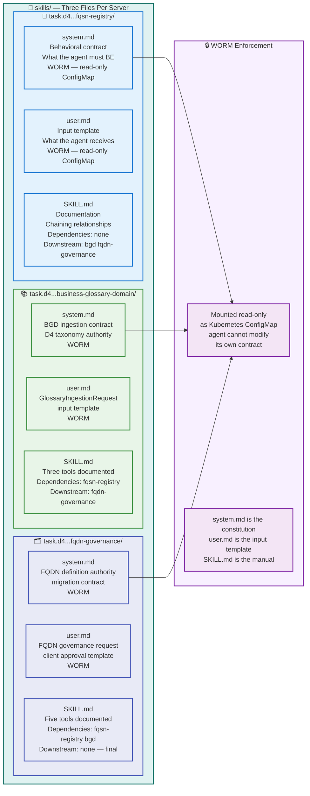
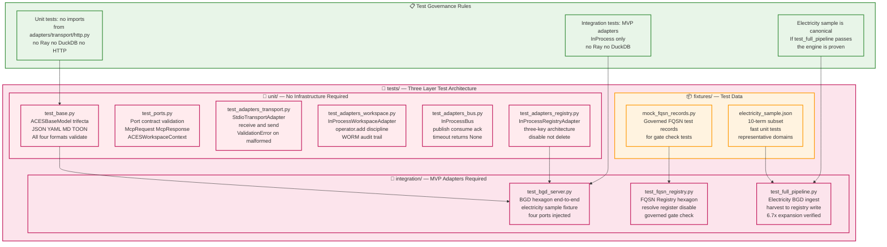

# 📁 Section 5 — Repository Structure

> **Continue, but append to a separate section from where you left off
> to avoid duplication and corruption.**
>
> This section is autonomous and self-contained.
> It covers the `aces-d4-database-design` repository layout,
> file inventory, naming conventions, and src map exclusively.
> It does not duplicate content from Sections 1–4 or Section 6.

---

## 📋 Section 5 Table of Contents

- [5.1 Repository Identity](#-51-repository-identity)
- [5.2 Top-Level Directory Map](#-52-top-level-directory-map)
- [5.3 src/ — Implementation Layer](#-53-src--implementation-layer)
- [5.4 src/adapters/ — Port Implementations](#-54-srcadapters--port-implementations)
- [5.5 src/servers/ — MCP Server Hexagons](#-55-srcservers--mcp-server-hexagons)
- [5.6 skills/ — Behavioral Contracts](#-56-skills--behavioral-contracts)
- [5.7 references/ — Governed Reference Material](#-57-references--governed-reference-material)
- [5.8 tests/ — Test Architecture](#-58-tests--test-architecture)
- [5.9 File Creation Sequence](#-59-file-creation-sequence)
- [5.10 Naming Conventions](#-510-naming-conventions)

---

## 🏠 5.1 Repository Identity

| Field | Value |
|-------|-------|
| **Repo name** | `aces-d4-database-design` |
| **GitHub** | `QCadjunct/aces-d4-database-design` |
| **Synology** | `/volume1/git/aces-d4-database-design.git` |
| **WSL path** | `/mnt/e/WSLData/Projects/aces-d4-database-design/` |
| **Windows path** | `E:\WSLData\Projects\aces-d4-database-design\` |
| **HEAD** | `87f7665` (both remotes in sync) |
| **Package manager** | `uv` exclusively — no pip, no conda |
| **Linter** | `ruff` exclusively |
| **Base class** | `ACESBaseModel` — never raw `pydantic.BaseModel` |
| **Git interface** | WSL authoritative — dual remote always |

---

## 🗺️ 5.2 Top-Level Directory Map



### 📐 Flat Directory Listing

```
aces-d4-database-design/
│
├── README.md                          ← Project system prompt
├── pyproject.toml                     ← uv managed, ruff configured
├── .python-version                    ← Python version pin
├── .gitignore
│
├── src/
│   ├── __init__.py
│   ├── base.py                        ← ACESBaseModel — everything depends on this
│   ├── ports.py                       ← Four port ABCs + message models
│   ├── harvester.py                   ← Source fetcher (static/dynamic/file)
│   ├── parser.py                      ← Term extraction → GlossaryIngestionRequest
│   ├── governer.py                    ← D⁴ taxonomy + BLAKE3 + type mapping
│   ├── dag_processor.py               ← Kahn's topological sort
│   ├── registry.py                    ← DuckDB writer coordination
│   ├── adapters/
│   │   ├── __init__.py
│   │   ├── transport/
│   │   │   ├── __init__.py
│   │   │   ├── stdio.py               ← StdioTransportAdapter (MVP)
│   │   │   └── http.py                ← HttpTransportAdapter (ADR-061)
│   │   ├── workspace/
│   │   │   ├── __init__.py
│   │   │   ├── in_process.py          ← InProcessWorkspaceAdapter (MVP)
│   │   │   └── ray_actor.py           ← RayActorWorkspaceAdapter (ADR-062)
│   │   ├── bus/
│   │   │   ├── __init__.py
│   │   │   ├── in_process.py          ← InProcessBus (MVP)
│   │   │   └── ray_object_store.py    ← RayObjectStoreBus (ADR-062)
│   │   └── registry/
│   │       ├── __init__.py
│   │       ├── in_process.py          ← InProcessRegistryAdapter (MVP)
│   │       └── duckdb.py              ← DuckDbRegistryAdapter (Phase 1)
│   ├── servers/
│   │   ├── __init__.py
│   │   ├── fqsn_registry.py           ← MCP Server 1 hexagon
│   │   ├── bgd.py                     ← MCP Server 2 hexagon
│   │   └── fqdn_governance.py         ← MCP Server 3 hexagon
│   └── models/
│       ├── __init__.py
│       ├── bgd_models.py              ← GlossaryIngestionRequest, BgdManifest
│       ├── manifest_models.py         ← GroupTaskManifest, SubTaskSpec
│       └── registry_models.py         ← BgdRegistry, BgdTerm, BgdOverlap
│
├── skills/
│   ├── task.d4-database-design.fully-qualified-skill-name-registry/
│   │   ├── system.md                  ← WORM behavioral contract
│   │   ├── user.md                    ← WORM input template
│   │   └── SKILL.md                   ← Documentation + chaining
│   ├── task.d4-database-design.business-glossary-domain/
│   │   ├── system.md
│   │   ├── user.md
│   │   └── SKILL.md
│   └── task.d4-database-design.fully-qualified-domain-name-governance/
│       ├── system.md
│       ├── user.md
│       └── SKILL.md
│
├── references/
│   ├── bgd/
│   │   └── electricity/
│   │       ├── electricity-domain-kg.json     ← 847 governed domains
│   │       ├── electricity-domain-reuse.csv   ← 6.7x expansion analysis
│   │       ├── electricity-domain-taxonomy.md ← D⁴ taxonomy tree
│   │       └── UPGRADE-NOTES.md               ← SHA-256→BLAKE3, sentinel fixes
│   ├── pipelines/
│   │   ├── 01_sp_GetTableMetadataForMigration.sql
│   │   ├── 02_qry_FullColumnInventory.sql
│   │   └── 03_qry_ConstraintsAndDependencies.sql
│   ├── manifests/
│   │   └── group-task-eia-full-ingest.yaml    ← GroupTaskManifest YAML
│   └── adrs/
│       └── ADR-INDEX.md                       ← Links to obsidian-adr
│
├── tests/
│   ├── __init__.py
│   ├── unit/
│   │   ├── test_base.py               ← ACESBaseModel trifecta serializers
│   │   ├── test_ports.py              ← Port contract validation
│   │   ├── test_adapters_transport.py ← StdioTransportAdapter
│   │   ├── test_adapters_workspace.py ← InProcessWorkspaceAdapter
│   │   ├── test_adapters_bus.py       ← InProcessBus
│   │   └── test_adapters_registry.py  ← InProcessRegistryAdapter
│   ├── integration/
│   │   ├── test_bgd_server.py         ← BGD hexagon end-to-end
│   │   ├── test_fqsn_registry.py      ← FQSN Registry hexagon
│   │   └── test_full_pipeline.py      ← Electricity BGD ingest
│   └── fixtures/
│       ├── electricity_sample.json    ← 10-term subset for fast tests
│       └── mock_fqsn_records.py       ← Governed FQSN test records
│
└── docs/
    ├── section-1-overview-architecture.md
    ├── section-2-d4-methodology.md
    ├── section-3-hexagonal-architecture.md
    ├── section-4-adf-and-ray.md
    ├── section-5-repository-structure.md
    └── section-6-governance.md
```

---

## 🔷 5.3 src/ — Implementation Layer

The `src/` directory contains only governed Python. No transport
libraries. No database drivers. No Ray imports — except in the
adapter files where they belong.



### 📐 Key Files — What Each Does

| File | SRP Responsibility | Key Classes/Functions |
|------|-------------------|----------------------|
| `base.py` | Constitutional base model | `ACESBaseModel`, four trifecta methods |
| `ports.py` | Port contracts | `TransportPort`, `ACESWorkspacePort`, `MessageBusPort`, `RegistryPort`, `McpRequest`, `McpResponse`, `ACESWorkspaceContext` |
| `harvester.py` | Source fetching | `harvest(url, format)` → `RawGlossary` |
| `parser.py` | Term extraction | `parse(raw)` → `GlossaryIngestionRequest` |
| `governer.py` | D⁴ taxonomy + BLAKE3 | `govern(request, bgd_name)` → `BgdManifest`, `get_duckdb_type_mapping()`, `compute_pair_hash()` |
| `dag_processor.py` | Dependency ordering | `get_table_dependencies(metadata_df)` → ordered list |
| `registry.py` | Registry coordination | `write(manifest)` → delegates to `RegistryPort` |

---

## 🔌 5.4 src/adapters/ — Port Implementations

Each subdirectory in `adapters/` maps to one port.
Each port has at minimum two adapters: an MVP InProcess
adapter and a production adapter. The hexagon never imports
from `adapters/` — adapters are injected at construction.



---

## 🏛️ 5.5 src/servers/ — MCP Server Hexagons

Each server is a pure hexagon — business logic only.
No transport imports. No database imports. No Ray imports.
Four ports injected at construction via dependency injection.



### 🔬 Server Construction Pattern

```python
# All three servers follow this identical pattern.
# The hexagon is pure business logic.
# Technology lives entirely in adapters.

from src.ports import (
    TransportPort, ACESWorkspacePort,
    MessageBusPort, RegistryPort
)


class BgdServer:
    """
    BGD MCP Server — one hexagon.
    SRP: BGD ingestion, canonical term governance, D⁴ taxonomy.
    Knows nothing about HTTP, Ray, DuckDB, or stdio.
    Imports only port contracts from src/ports.py.
    """

    def __init__(
        self,
        transport:   TransportPort,
        workspace:   ACESWorkspacePort,
        message_bus: MessageBusPort,
        registry:    RegistryPort
    ):
        self._transport   = transport
        self._workspace   = workspace
        self._message_bus = message_bus
        self._registry    = registry

    def ingest_glossary(
        self,
        request: dict,
        session_id: str
    ) -> dict:
        """Core tool — business logic only. No tech imports."""
        ctx = self._workspace.read(session_id)
        # ... governed ingest pipeline ...
        pair_hash = self._registry.write_bgd(result, role=ctx.role)
        return {"pair_hash": pair_hash, "status": "ok"}


# MVP wiring — for development and unit tests
from src.adapters.transport.stdio import StdioTransportAdapter
from src.adapters.workspace.in_process import InProcessWorkspaceAdapter
from src.adapters.bus.in_process import InProcessBus
from src.adapters.registry.in_process import InProcessRegistryAdapter

bgd_server = BgdServer(
    transport=StdioTransportAdapter(),
    workspace=InProcessWorkspaceAdapter(),
    message_bus=InProcessBus(),
    registry=InProcessRegistryAdapter()
)

# Production wiring — Ray Serve deployment
from src.adapters.transport.http import HttpTransportAdapter
from src.adapters.workspace.ray_actor import RayActorWorkspaceAdapter
from src.adapters.bus.ray_object_store import RayObjectStoreBus
from src.adapters.registry.duckdb import DuckDbRegistryAdapter

bgd_server_prod = BgdServer(
    transport=HttpTransportAdapter(),
    workspace=RayActorWorkspaceAdapter(),
    message_bus=RayObjectStoreBus(),
    registry=DuckDbRegistryAdapter()
)
# Zero server code changes between MVP and production.
```

---

## 📄 5.6 skills/ — Behavioral Contracts

Each MCP server has exactly one skill directory. Each skill
directory contains exactly three files. This is ADR-007
(Three-File Skill Standard) applied to this Task Group.



---

## 📚 5.7 references/ — Governed Reference Material

The `references/` directory contains material that is never
generated by the build and never modified by the pipeline.
It is the governed source of truth for tests, documentation,
and planning.

| Path | Contents | Status |
|------|---------|--------|
| `references/bgd/electricity/electricity-domain-kg.json` | 847 governed domains — the reference BGD | ✅ Committed `87f7665` |
| `references/bgd/electricity/electricity-domain-reuse.csv` | Reuse analysis — 6.7x expansion ratio | ✅ Committed |
| `references/bgd/electricity/electricity-domain-taxonomy.md` | D⁴ taxonomy tree — electricity domain | ✅ Committed |
| `references/bgd/electricity/UPGRADE-NOTES.md` | SHA-256→BLAKE3 + sentinel value fixes required | ✅ Committed |
| `references/pipelines/01_sp_GetTableMetadataForMigration.sql` | Stored procedure — Contoso pipeline | ✅ Committed `87f7665` |
| `references/pipelines/02_qry_FullColumnInventory.sql` | Four inventory queries | ✅ Committed |
| `references/pipelines/03_qry_ConstraintsAndDependencies.sql` | PK/FK/DAG/circular dependency | ✅ Committed |
| `references/manifests/group-task-eia-full-ingest.yaml` | GroupTaskManifest — EIA full ingest | 🔲 Pending |
| `references/adrs/ADR-INDEX.md` | Links to obsidian-adr vault | 🔲 Pending |

> **Governance rule:** Files in `references/` are never modified
> by pipeline code. They are input artifacts — read by tests and
> documentation, not written by `governer.py` or `registry.py`.
> If a reference file needs updating, it is a Navigator decision,
> not a pipeline operation.

---

## 🧪 5.8 tests/ — Test Architecture

Tests are organized in three layers matching the implementation
dependency chain. Unit tests run without infrastructure.
Integration tests require MVP adapters. No test requires Ray,
DuckDB, or HTTP infrastructure.



---

## 📋 5.9 File Creation Sequence

The sequence is governed by the dependency chain.
No file can be created before its dependency exists.
No exceptions.

```mermaid
flowchart TD

    subgraph S1 ["🥇    Sprint    1    —    Foundation"]
        F1[src/base.py\nACESBaseModel\ntrifecta serializers\nNo dependencies]
        F2[src/ports.py\nFour port ABCs\nDepends: base.py only]
        F3[src/models/bgd_models.py\nGlossaryIngestionRequest\nBgdManifest\nDepends: base.py]
        F4[src/models/manifest_models.py\nGroupTaskManifest\nFailurePolicy\nDepends: base.py]
        F5[src/models/registry_models.py\nBgdRegistry BgdTerm BgdOverlap\nDepends: base.py]
    end

    subgraph S2 ["🥈    Sprint    2    —    MVP    Adapters"]
        A1[src/adapters/transport/stdio.py\nStdioTransportAdapter\nDepends: ports.py]
        A2[src/adapters/workspace/in_process.py\nInProcessWorkspaceAdapter\nDepends: ports.py]
        A3[src/adapters/bus/in_process.py\nInProcessBus\nDepends: ports.py]
        A4[src/adapters/registry/in_process.py\nInProcessRegistryAdapter\nDepends: ports.py]
    end

    subgraph S3 ["🥉    Sprint    3    —    Pipeline    Components"]
        P1[src/harvester.py\nDepends: bgd_models.py]
        P2[src/parser.py\nDepends: bgd_models.py]
        P3[src/governer.py\nDepends: bgd_models.py\nregistry_models.py]
        P4[src/dag_processor.py\nDepends: base.py only]
        P5[src/registry.py\nDepends: ports.py\nregistry_models.py]
    end

    subgraph S4 ["🏅    Sprint    4    —    MCP    Server    Hexagons"]
        SV1[src/servers/fqsn_registry.py\nDepends: ports.py all MVP adapters]
        SV2[src/servers/bgd.py\nDepends: ports.py all MVP adapters\nharvester parser governer]
        SV3[src/servers/fqdn_governance.py\nDepends: ports.py all MVP adapters]
    end

    subgraph S5 ["🎯    Sprint    5    —    Production    Adapters"]
        PA1[src/adapters/transport/http.py\nHttpTransportAdapter\nADR-061 prerequisite filed]
        PA2[src/adapters/workspace/ray_actor.py\nRayActorWorkspaceAdapter\nADR-062 prerequisite filed]
        PA3[src/adapters/bus/ray_object_store.py\nRayObjectStoreBus\nADR-062 prerequisite filed]
        PA4[src/adapters/registry/duckdb.py\nDuckDbRegistryAdapter\nPhase 1 — already on stack]
    end

    F1 --> F2
    F1 --> F3 & F4 & F5
    F2 --> A1 & A2 & A3 & A4
    F3 --> P1 & P2 & P3
    F2 --> P5
    A1 & A2 & A3 & A4 --> SV1 & SV2 & SV3
    P1 & P2 & P3 --> SV2
    SV1 & SV2 & SV3 --> PA1 & PA2 & PA3
    F2 --> PA4

    style S1 fill:#f3e5f5,stroke:#7b1fa2,stroke-width:3px
    style S2 fill:#e8f5e8,stroke:#388e3c,stroke-width:2px
    style S3 fill:#e3f2fd,stroke:#1976d2,stroke-width:2px
    style S4 fill:#fff4e6,stroke:#f57c00,stroke-width:2px
    style S5 fill:#e1f5fe,stroke:#0277bd,stroke-width:2px

    classDef s1Style fill:#f3e5f5,stroke:#7b1fa2,stroke-width:2px
    classDef s2Style fill:#e8f5e8,stroke:#388e3c,stroke-width:2px
    classDef s3Style fill:#e3f2fd,stroke:#1976d2,stroke-width:2px
    classDef s4Style fill:#fff8e1,stroke:#f57c00,stroke-width:2px
    classDef s5Style fill:#e1f5fe,stroke:#0277bd,stroke-width:2px

    class F1,F2,F3,F4,F5 s1Style
    class A1,A2,A3,A4 s2Style
    class P1,P2,P3,P4,P5 s3Style
    class SV1,SV2,SV3 s4Style
    class PA1,PA2,PA3,PA4 s5Style
```



---

## 📐 5.10 Naming Conventions

All naming conventions follow ADR-029 (Acronym-First-Use Standard)
and the KISS principle — Keep It Simple and Standard.

### Python Files and Classes

| Convention | Rule | Example |
|-----------|------|---------|
| Module names | `snake_case` | `bgd_models.py`, `dag_processor.py` |
| Class names | `PascalCase` | `ACESBaseModel`, `GroupTaskManifest` |
| Method names | `snake_case` | `ingest_glossary`, `compute_pair_hash` |
| Constants | `UPPER_SNAKE` | `WAIT_RETRY`, `CPU_ANY` |
| Port ABCs | `PascalCase` + `Port` suffix | `TransportPort`, `RegistryPort` |
| Adapters | `PascalCase` + technology + `Adapter` | `StdioTransportAdapter`, `DuckDbRegistryAdapter` |
| MCP servers | `PascalCase` + `Server` suffix | `BgdServer`, `FqsnRegistryServer` |
| Ray Actors | `PascalCase` + `Actor` suffix | `FqsnRegistryActor`, `BgdRegistryActor` |

### File and Directory Names

| Convention | Rule | Example |
|-----------|------|---------|
| Python source | `snake_case.py` | `dag_processor.py` |
| SQL reference files | `NN_prefix_description.sql` | `01_sp_GetTableMetadataForMigration.sql` |
| YAML manifests | `kebab-case.yaml` | `group-task-eia-full-ingest.yaml` |
| Markdown docs | `section-N-kebab-description.md` | `section-3-hexagonal-architecture.md` |
| ADR files | `ADR-NNN-kebab-title.md` | `ADR-063-hexagonal-ports-adapters.md` |
| Skill directories | Full FQSN path as directory name | `task.d4-database-design.business-glossary-domain/` |
| BGD reference files | `{bgd-name}-domain-{type}.{ext}` | `electricity-domain-kg.json` |

### Git Commit Convention

```
type(scope): description

types: feat docs fix refactor test chore
scope: bgd fqsn fqdn ports adapters models tests docs adr

Examples:
feat(bgd): implement InProcessRegistryAdapter MVP
docs(section-5): add repository structure
fix(governer): replace SHA-256 with BLAKE3-256
refactor(servers): inject four ports into BgdServer
test(adapters): add InProcessWorkspaceAdapter operator.add test
adr: ADR-063 hexagonal ports and adapters
```

### Commit Sequence Discipline

Every session close commits to both remotes:

```bash
cd /mnt/e/WSLData/Projects/aces-d4-database-design
git add -A
git commit -m "type(scope): description"
git push origin
git push synology
```

**Dual remote is mandatory — every commit, every session.**

---

[🔝 Back to Section 5 TOC](#-section-5-table-of-contents)

[🏠 Back to Main TOC](./docs-section-1-overview-architecture.md#-table-of-contents)

---

*Section 5 of 6 — Continue, but append to a separate section from where
you left off to avoid duplication and corruption.*
