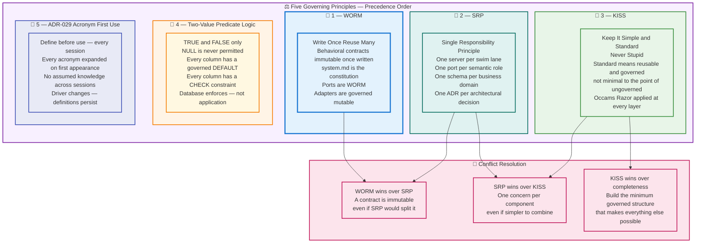
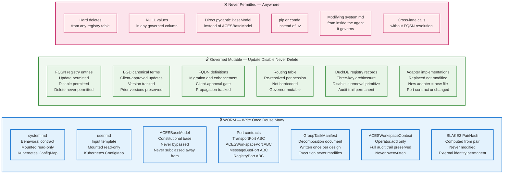
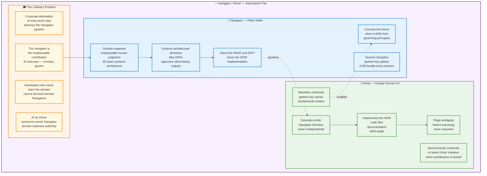
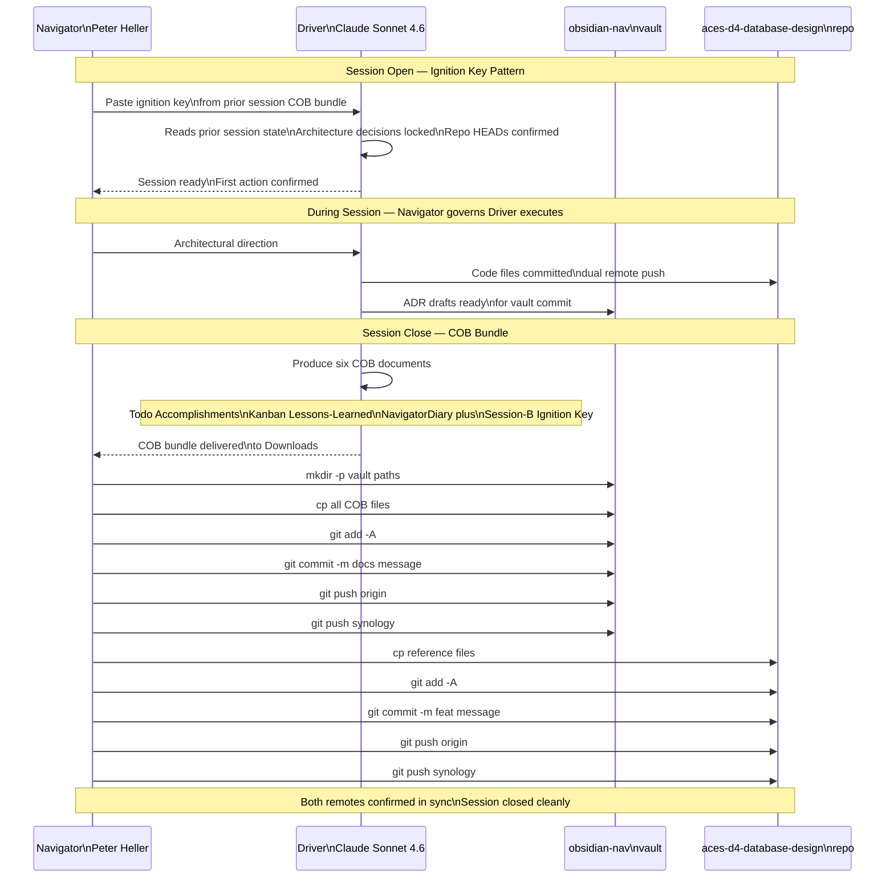
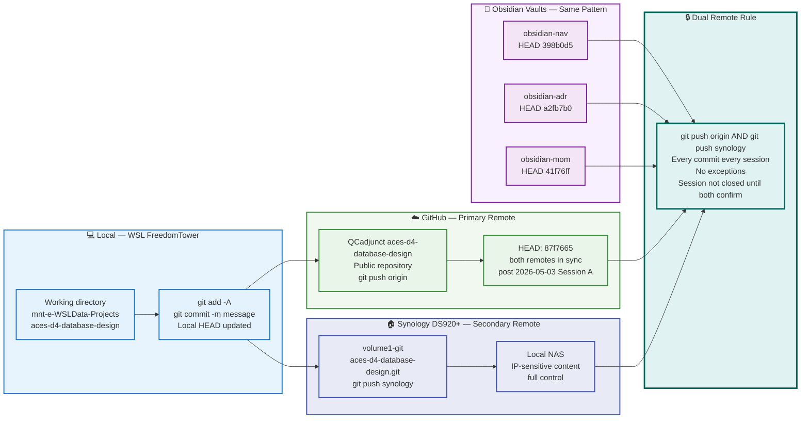
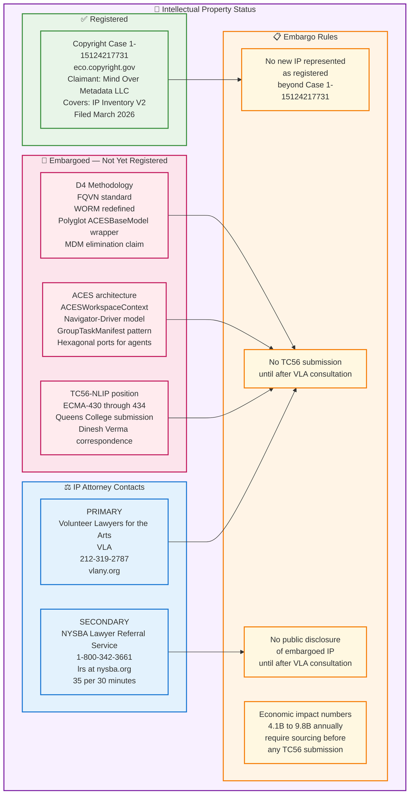
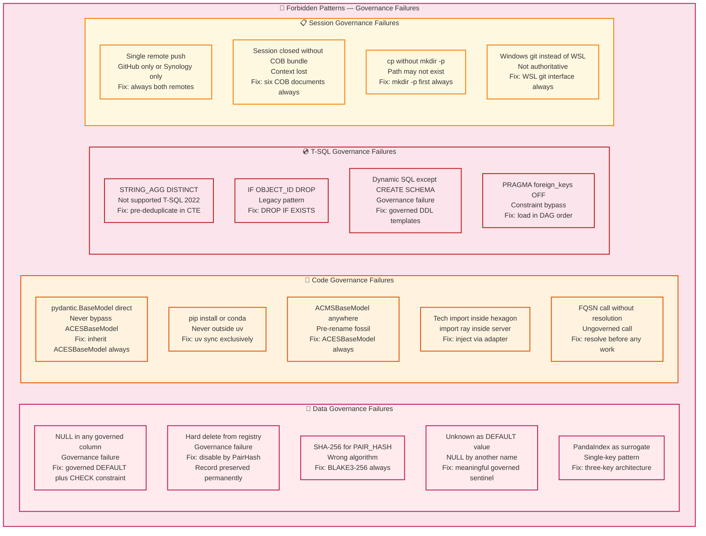

# 🏛️ Section 6 — Governance and Session Discipline

> **Continue, but append to a separate section from where you left off
> to avoid duplication and corruption.**
>
> This section is autonomous and self-contained.
> It covers governance frameworks, session discipline, ADR lifecycle,
> IP notice, and toolchain constraints exclusively.
> It does not duplicate content from Sections 1–5.

---

## 📋 Section 6 Table of Contents

- [6.1 Governing Principles](#-61-governing-principles)
- [6.2 WORM vs Governed Mutable](#-62-worm-vs-governed-mutable)
- [6.3 The Navigator/Driver Model](#-63-the-navigatordriver-model)
- [6.4 ADR Lifecycle](#-64-adr-lifecycle)
- [6.5 Session Discipline — Ignition Key Pattern](#-65-session-discipline--ignition-key-pattern)
- [6.6 Toolchain Governance](#-66-toolchain-governance)
- [6.7 Dual Remote Git Sovereignty](#-67-dual-remote-git-sovereignty)
- [6.8 IP Notice and Embargo Policy](#-68-ip-notice-and-embargo-policy)
- [6.9 Forbidden Patterns](#-69-forbidden-patterns)
- [6.10 Governance Verification Checklist](#-610-governance-verification-checklist)

---

## ⚖️ 6.1 Governing Principles

Five governing principles apply to every decision in this system.
They are listed in precedence order. When two principles conflict,
the higher-ranked principle wins.



---

## 🔄 6.2 WORM vs Governed Mutable

Every artifact in the system is classified as either WORM or
Governed Mutable. This classification governs how the artifact
can be changed, who can change it, and what happens to prior
versions.



---

## 🧭 6.3 The Navigator/Driver Model

The Navigator/Driver model is the session governance framework
that governs every interaction between Peter Heller (Navigator)
and Claude Sonnet (Driver). It is asymmetric by design —
the Navigator governs, the Driver executes.



---

## 📋 6.4 ADR Lifecycle

Every architectural decision that meets the ADR threshold is
captured as an Architectural Decision Record. ADRs are flat
files in the `obsidian-adr` vault — one per decision, numbered
sequentially, never deleted, only superseded.

```mermaid
flowchart TD

    subgraph LIFECYCLE ["📋    ADR    Lifecycle    —    Five    Stages"]

        subgraph PROPOSED ["💡    Proposed"]
            PR1[Navigator identifies\nan architectural decision]
            PR2[Driver drafts ADR\nfollowing standard template]
            PR3[Context Decision Consequences\nthree mandatory sections]
        end

        subgraph REVIEW ["🔍    Under    Review"]
            RV1[Navigator reviews\nDriver-drafted ADR]
            RV2[Corrections applied\nuntil Navigator approves]
            RV3[Prerequisites verified\nDependency chain confirmed]
        end

        subgraph FILED ["✅    Filed"]
            FL1[ADR committed flat\nto obsidian-adr root\nADR-NNN-kebab-title.md]
            FL2[Dual remote push\nGitHub and Synology\nboth remotes in sync]
            FL3[ADR number retired\nNext available incremented\nsequence never reused]
        end

        subgraph SUPERSEDED ["🔄    Superseded"]
            SP1[New ADR filed\nwith Supersedes field\npointing to old ADR]
            SP2[Old ADR updated\nSuperseded By field\npoints to new ADR]
            SP3[Old ADR never deleted\nHistorical record\npermanently auditable]
        end

        subgraph DEPRECATED ["📦    Deprecated"]
            DP1[Technology replaced\nPattern no longer valid]
            DP2[Deprecation note filed\nas Amendment\nADR-NNN-Amendment-N.md]
            DP3[Original ADR unchanged\nAmendment documents\nthe deprecation reason]
        end

    end

    subgraph CURRENT ["📐    Current    ADR    Registry"]
        CR1[ADR-001 to ADR-060\nFiled and active\nobsidian-adr HEAD a2fb7b0]
        CR2[ADR-061 K8s Task Group\nADR-062 Ray ADF\nADR-063 Hexagonal Ports\nFiled 2026-05-03]
        CR3[ADR-061 HTTP Transport\nADR-062 Repo Baseline\nADR-063 FQSN Access Model\nADR-064 BLAKE3 Standard\nADR-065 DuckDB Phase 1\nPending filing]
        CR4[Next available: ADR-065\nFiling sequence:\nADR-061 through ADR-064 filed\nADR-065 DuckDB migration next]
    end

    PR1 --> PR2 --> PR3
    PR3 --> RV1 --> RV2 --> RV3
    RV3 --> FL1 --> FL2 --> FL3
    FL3 -.->|when superseded| SP1
    FL3 -.->|when deprecated| DP1
    SP1 --> SP2 --> SP3
    DP1 --> DP2 --> DP3

    style LIFECYCLE fill:#f8f0ff,stroke:#7b1fa2,stroke-width:2px
    style PROPOSED fill:#e3f2fd,stroke:#1976d2,stroke-width:2px
    style REVIEW fill:#fff4e6,stroke:#f57c00,stroke-width:2px
    style FILED fill:#e8f5e8,stroke:#388e3c,stroke-width:2px
    style SUPERSEDED fill:#e8eaf6,stroke:#3f51b5,stroke-width:2px
    style DEPRECATED fill:#fce4ec,stroke:#c2185b,stroke-width:2px
    style CURRENT fill:#e0f2f1,stroke:#00695c,stroke-width:2px

    classDef proposedStyle fill:#e3f2fd,stroke:#1976d2,stroke-width:2px
    classDef reviewStyle fill:#fff8e1,stroke:#f57c00,stroke-width:2px
    classDef filedStyle fill:#e8f5e8,stroke:#388e3c,stroke-width:2px
    classDef supersededStyle fill:#e8eaf6,stroke:#3f51b5,stroke-width:2px
    classDef deprecatedStyle fill:#fce4ec,stroke:#c2185b,stroke-width:2px
    classDef currentStyle fill:#e0f2f1,stroke:#00695c,stroke-width:2px

    class PR1,PR2,PR3 proposedStyle
    class RV1,RV2,RV3 reviewStyle
    class FL1,FL2,FL3 filedStyle
    class SP1,SP2,SP3 supersededStyle
    class DP1,DP2,DP3 deprecatedStyle
    class CR1,CR2,CR3,CR4 currentStyle
```



### 📐 ADR Template

```markdown
# ADR-NNN — Title

| Field | Value |
|---|---|
| **ADR Number** | ADR-NNN |
| **Title** | Short descriptive title |
| **Status** | Proposed / Filed / Superseded / Deprecated |
| **Date** | YYYY-MM-DD |
| **Author** | Peter Heller — Navigator |
| **Driver** | Claude Sonnet 4.6 |
| **Supersedes** | None or ADR-NNN |
| **Superseded By** | None or ADR-NNN |
| **Related ADRs** | ADR-NNN, ADR-NNN |

## Context

What situation or requirement prompted this decision?
What were the forces at play?

## Decision

What was decided? State it precisely and completely.
One paragraph. No hedging.

## Consequences

### Positive
- What does this decision enable?

### Negative
- What does this decision constrain?

### Neutral
- What is unchanged but worth noting?

## Implementation Sequence

Ordered steps to implement this decision.

## Filing Note

Prerequisites, dependency chain, and any embargo conditions.

---
*Mind Over Metadata LLC © YYYY*
*ADR-NNN authored YYYY-MM-DD — Navigator: Peter Heller, Driver: Claude Sonnet 4.6*
```

---

## 🔑 6.5 Session Discipline — Ignition Key Pattern

Every session opens with an Ignition Key and closes with a
COB (Close of Business) bundle. This is ADR-045 (Session
Ignition Key Pattern) applied to this Task Group.



### 📐 COB Bundle Contents

Every session close produces these six documents plus the
next session ignition key:

| Document | Purpose |
|----------|---------|
| `YYYY-MM-DD-SESSION-X-Todo.md` | Completed and carried-forward items |
| `YYYY-MM-DD-SESSION-X-Accomplishments.md` | What was built, decided, committed |
| `YYYY-MM-DD-SESSION-X-Kanban.md` | Done / In Progress / Backlog |
| `YYYY-MM-DD-SESSION-X-Lessons-Learned.md` | Patterns discovered, bugs fixed, insights |
| `YYYY-MM-DD-SESSION-X-NavigatorDiary.md` | Session narrative from Navigator perspective |
| `YYYY-MM-DD-SESSION-X+1-IGNITION-KEY.md` | Next session context — architecture locked decisions |

### 📐 Ignition Key Required Fields

```markdown
| Field | Value |
|---|---|
| Session | A/B/C — resets each calendar day |
| Date | YYYY-MM-DD |
| Authored | COB YYYY-MM-DD-Session-X |
| Recommended Driver | Claude Sonnet 4.6 — continuity preferred |
| Prior session reference | Session X (date) — bundle location |

## First Actions For The Incoming Driver
1. FreedomTower migration status review
2. Vault commit — COB bundle
3. Repo commits — ADRs and reference files
4. First implementation action

## What Happened In Prior Session
[Architecture decisions locked]
[Files committed with HEADs]

## Locked Decisions (Do Not Relitigate)
[Every decision that is final]

## ADR Candidates Pending
[Filed sequence and prerequisites]

## Repo State
| Repo | HEAD | Remotes |
```

---

## 🔧 6.6 Toolchain Governance

Every tool in the stack is governed by an explicit choice.
No tool is used by default or convenience. Each choice is
justified and locked.

```mermaid
flowchart LR

    subgraph TOOLS ["🔧    Governed    Toolchain"]

        subgraph PKG ["📦    Package    Management"]
            T1[uv\nExclusive package manager\nNo pip anywhere\nNo conda anywhere\nuv sync only]
        end

        subgraph LINT ["🔍    Linting"]
            T2[ruff\nExclusive linter\nFastest Python linter\nconfigured in pyproject.toml]
        end

        subgraph MODELS ["🏗️    Base    Models"]
            T3[ACESBaseModel\nExclusive base class\nNever raw pydantic.BaseModel\nConstitutional inheritance]
        end

        subgraph DB ["💾    Registry    Database"]
            T4[DuckDB Phase 1\nNo Docker required\nAlready on FT stack\nSynology NAS PVC\nPostgreSQL on ADR-065 trigger]
        end

        subgraph GIT ["🔀    Version    Control"]
            T5[WSL authoritative\ngit interface\nNever Windows git\nNever Obsidian Git plugin\nuninstalled]
        end

        subgraph SERIAL ["📄    Serialization"]
            T6[Trifecta standard\nJSON for API payloads\nYAML for config\nMD for documentation\nTOON for tabular diff-able]
        end

        subgraph HASH ["🔐    Cryptographic    Hashing"]
            T7[BLAKE3-256 for PAIR_HASH\nNever SHA-256\n8x faster same security\nImmune to extension attacks]
        end

        subgraph ENCRYPT ["🔒    Obfuscation"]
            T8[Feistel network\nfor ObfuscatedId\nFour-round bijective\ndeterministic reversible]
        end

    end

    subgraph FORBIDDEN ["❌    Forbidden    Tools    and    Patterns"]
        F1[pip install — use uv sync]
        F2[conda — use uv]
        F3[pydantic.BaseModel direct — use ACESBaseModel]
        F4[SHA-256 for PAIR_HASH — use BLAKE3-256]
        F5[Windows git — use WSL git]
        F6[Obsidian Git plugin — uninstalled]
        F7[Hard deletes — use disable]
        F8[NULL columns — use governed DEFAULT]
        F9[Dynamic SQL except CREATE SCHEMA — use governed DDL]
        F10[STRING_AGG DISTINCT T-SQL 2022 — pre-deduplicate in CTE]
        F11[IF OBJECT_ID DROP — use DROP IF EXISTS]
        F12[ACMSBaseModel — fossil name use ACESBaseModel]
    end

    style TOOLS fill:#f0f8f0,stroke:#388e3c,stroke-width:2px
    style PKG fill:#e3f2fd,stroke:#1976d2,stroke-width:2px
    style LINT fill:#e0f2f1,stroke:#00695c,stroke-width:2px
    style MODELS fill:#f3e5f5,stroke:#7b1fa2,stroke-width:2px
    style DB fill:#e8eaf6,stroke:#3f51b5,stroke-width:2px
    style GIT fill:#fff4e6,stroke:#f57c00,stroke-width:2px
    style SERIAL fill:#e8f5e8,stroke:#388e3c,stroke-width:2px
    style HASH fill:#e0f2f1,stroke:#00695c,stroke-width:2px
    style ENCRYPT fill:#f8f0ff,stroke:#7b1fa2,stroke-width:2px
    style FORBIDDEN fill:#fce4ec,stroke:#c2185b,stroke-width:2px

    classDef toolStyle fill:#e8f5e8,stroke:#388e3c,stroke-width:2px
    classDef forbiddenStyle fill:#ffebee,stroke:#c2185b,stroke-width:2px

    class T1,T2,T3,T4,T5,T6,T7,T8 toolStyle
    class F1,F2,F3,F4,F5,F6,F7,F8,F9,F10,F11,F12 forbiddenStyle
```



### 📐 pyproject.toml Governance

```toml
[project]
name = "aces-d4-database-design"
version = "0.1.0"
requires-python = ">=3.12"
dependencies = [
    "pydantic>=2.0.0",
    "blake3>=0.4.1",
    "duckdb>=0.10.0",
    "playwright>=1.40.0",
    "pyyaml>=6.0.0",
]

[tool.uv]
package = false                  # not a distributable package

[tool.setuptools]
packages = []

[tool.ruff]
line-length = 88
target-version = "py312"

[tool.ruff.lint]
select = ["E", "F", "I", "N", "W"]
ignore = []
```

---

## 🌐 6.7 Dual Remote Git Sovereignty

Every repo in the system maintains dual-remote sovereignty.
No commit is complete until it exists on both remotes.
This is ADR-023 (Git Sovereignty Architecture) applied to
this Task Group.



### 📐 Standard Session Close Git Sequence

```bash
# aces-d4-database-design repo
cd /mnt/e/WSLData/Projects/aces-d4-database-design
git add -A
git commit -m "type(scope): description"
git push origin
git push synology

# obsidian-nav vault
cd /mnt/e/Obsidian/NavigatorDiary
git add -A
git commit -m "docs: YYYY-MM-DD Session X COB bundle"
git push origin
git push synology

# obsidian-adr vault (when ADRs filed)
cd /mnt/e/Obsidian/Architectural-Decision-Records
git add -A
git commit -m "feat: ADR-NNN description"
git push origin
git push synology

# Verify both remotes
git log --oneline -3
git remote -v
```

---

## 🔐 6.8 IP Notice and Embargo Policy



---

## 🚫 6.9 Forbidden Patterns

These patterns are explicitly forbidden. Encountering any of them
in existing code or documentation is a defect requiring immediate
correction. They are not preferences — they are governance failures.



---

## ✅ 6.10 Governance Verification Checklist

Run this checklist at every session close before committing.
Zero failures required. Every failure is a defect — fix before
committing, not after.

```mermaid
flowchart TD

    subgraph CHECKLIST ["✅    Session    Close    Governance    Checklist"]

        subgraph CODE_CHECK ["🐍    Code    Checks"]
            CC1[All new models inherit ACESBaseModel\nnot pydantic.BaseModel]
            CC2[No tech imports inside server hexagons\ntransport bus workspace registry\ninjected only]
            CC3[All new columns have DEFAULT and CHECK\nno NULLs anywhere]
            CC4[BLAKE3-256 for all new PairHash\nnot SHA-256]
            CC5[uv sync used\npip not present in any command]
            CC6[ACESBaseModel not ACMSBaseModel\nsweep all new files]
        end

        subgraph SQL_CHECK ["💿    SQL    Checks"]
            SC1[No STRING_AGG DISTINCT\npre-deduplicate in CTE]
            SC2[DROP IF EXISTS not IF OBJECT_ID\nmodern T-SQL]
            SC3[No dynamic SQL except CREATE SCHEMA\ngoverned DDL only]
            SC4[All FKs reference PairHash\nnot RegistryId]
        end

        subgraph GIT_CHECK ["🔀    Git    Checks"]
            GC1[git push origin confirmed\nGitHub remote updated]
            GC2[git push synology confirmed\nSynology remote updated]
            GC3[Both remotes at same HEAD\ngit log --oneline -1 matches]
            GC4[mkdir -p before every cp\nno path-not-exists errors]
        end

        subgraph COB_CHECK ["📋    COB    Bundle    Checks"]
            BC1[Todo.md produced\nCompleted and carried items]
            BC2[Accomplishments.md produced\nWhat was built and committed]
            BC3[Kanban.md produced\nDone In-Progress Backlog]
            BC4[Lessons-Learned.md produced\nPatterns bugs insights]
            BC5[NavigatorDiary.md produced\nSession narrative]
            BC6[Next session ignition key produced\nArchitecture locked decisions]
        end

        subgraph RESULT ["🎯    Result"]
            OK[Zero failures\nSession closed cleanly\nContext preserved\nNext Driver ready]
            FAIL[Any failure\nFix before committing\nnot after]
        end

    end

    CC1 & CC2 & CC3 & CC4 & CC5 & CC6 --> OK
    SC1 & SC2 & SC3 & SC4 --> OK
    GC1 & GC2 & GC3 & GC4 --> OK
    BC1 & BC2 & BC3 & BC4 & BC5 & BC6 --> OK
    CC1 & SC1 & GC1 & BC1 -.->|any fails| FAIL

    style CHECKLIST fill:#f0f8f0,stroke:#388e3c,stroke-width:2px
    style CODE_CHECK fill:#e3f2fd,stroke:#1976d2,stroke-width:2px
    style SQL_CHECK fill:#e8eaf6,stroke:#3f51b5,stroke-width:2px
    style GIT_CHECK fill:#e0f2f1,stroke:#00695c,stroke-width:2px
    style COB_CHECK fill:#f8f0ff,stroke:#7b1fa2,stroke-width:2px
    style RESULT fill:#e8f5e8,stroke:#388e3c,stroke-width:2px

    classDef codeCheckStyle fill:#e3f2fd,stroke:#1976d2,stroke-width:2px
    classDef sqlCheckStyle fill:#e8eaf6,stroke:#3f51b5,stroke-width:2px
    classDef gitCheckStyle fill:#e0f2f1,stroke:#00695c,stroke-width:2px
    classDef cobCheckStyle fill:#f3e5f5,stroke:#7b1fa2,stroke-width:2px
    classDef okStyle fill:#e8f5e8,stroke:#388e3c,stroke-width:3px
    classDef failStyle fill:#ffebee,stroke:#c2185b,stroke-width:3px

    class CC1,CC2,CC3,CC4,CC5,CC6 codeCheckStyle
    class SC1,SC2,SC3,SC4 sqlCheckStyle
    class GC1,GC2,GC3,GC4 gitCheckStyle
    class BC1,BC2,BC3,BC4,BC5,BC6 cobCheckStyle
    class OK okStyle
    class FAIL failStyle
```



### 📐 Quick Reference — Locked Decisions Summary

Every decision in this table is final. None may be relitigated
without a new ADR that explicitly supersedes the relevant prior ADR.

| Decision | Locked Value | ADR |
|----------|-------------|-----|
| Package manager | `uv sync` exclusively | ADR-023 |
| Base class | `ACESBaseModel` — never `pydantic.BaseModel` | ADR-010 |
| Hash algorithm | BLAKE3-256 for PAIR_HASH | ADR-064 |
| Obfuscation | Feistel network for `ObfuscatedId` | ADR-064 |
| Registry removal | Disable only — never hard delete | ADR-063 |
| NULL policy | Never — governed DEFAULT + CHECK always | ADR-009 |
| Transport MVP | `StdioTransportAdapter` | ADR-063 |
| Transport production | `HttpTransportAdapter` via Ray Serve | ADR-061 |
| Session context | `ACESWorkspaceContext` — separate port | ADR-063 |
| Write discipline | `operator.add` — never overwrite | ADR-063 |
| ADF engine | Ray — not K8s, not MaaS | ADR-062 |
| Task Group runtime | Kubernetes Namespace | ADR-061 |
| Governing pattern | Hexagonal Architecture — Cockburn 2005 | ADR-063 |
| Registry database | DuckDB Phase 1 — PostgreSQL on trigger | ADR-065 |
| Git interface | WSL — never Windows, never Obsidian plugin | ADR-023 |
| Dual remote | GitHub + Synology — both every commit | ADR-023 |
| Cluster network | Tailscale mesh | ADR-042 |
| KISS meaning | Keep It Simple and Standard — never Stupid | ADR-001 |
| Fossil class name | `ACMSBaseModel` — never use, sweep and remove | — |
| T-SQL drop syntax | `DROP PROCEDURE IF EXISTS` — modern | — |
| T-SQL STRING_AGG | Pre-deduplicate in CTE — no DISTINCT | — |
| Filing sequence | ADR-063 first then ADR-061 ADR-061 ADR-062 | ADR-063 |

---

[🔝 Back to Section 6 TOC](#-section-6-table-of-contents)

[🏠 Back to Main TOC](./docs-section-1-overview-architecture.md#-table-of-contents)

---

*Section 6 of 6 — Documentation complete.*
*All six sections autonomous, self-contained, and mutually exclusive.*
*Mind Over Metadata LLC © 2026 — Navigator: Peter Heller, Driver: Claude Sonnet 4.6*
*Prepared: 05/03/2026*
