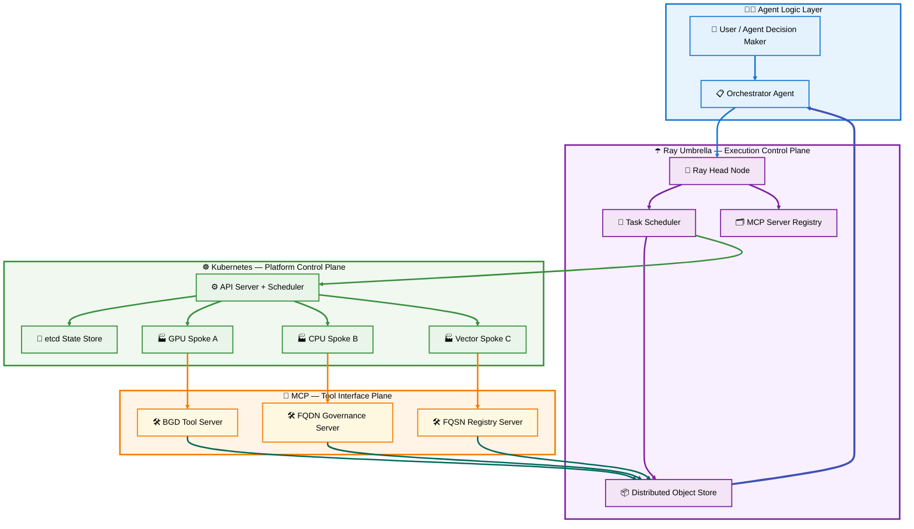
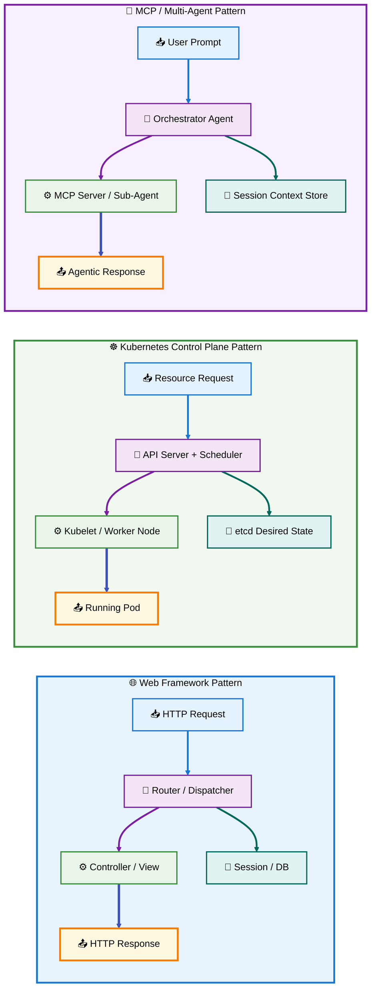
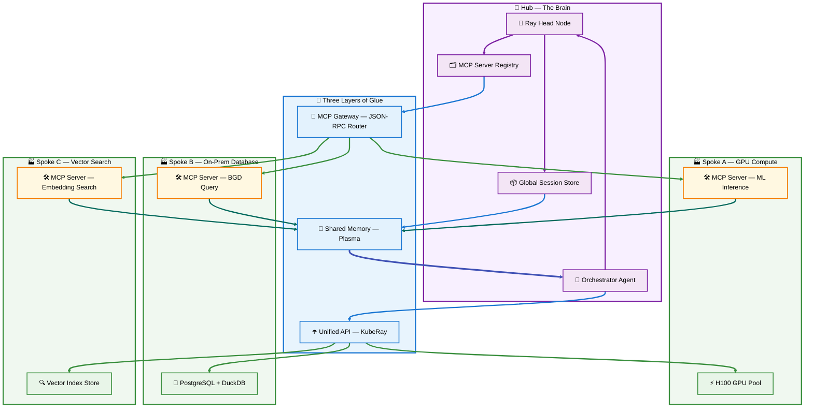
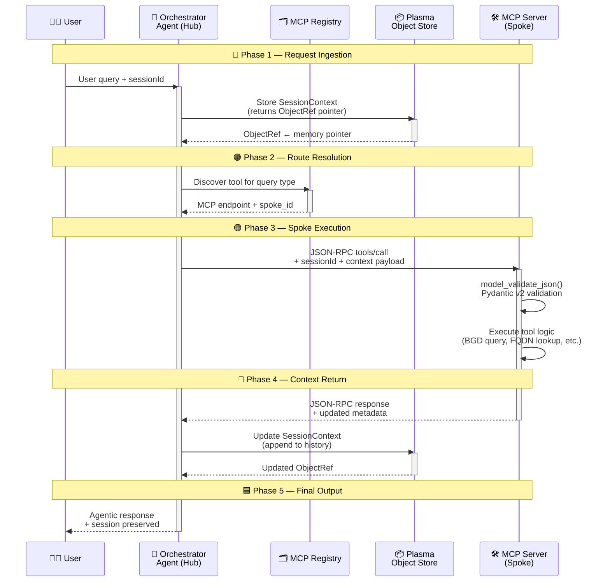
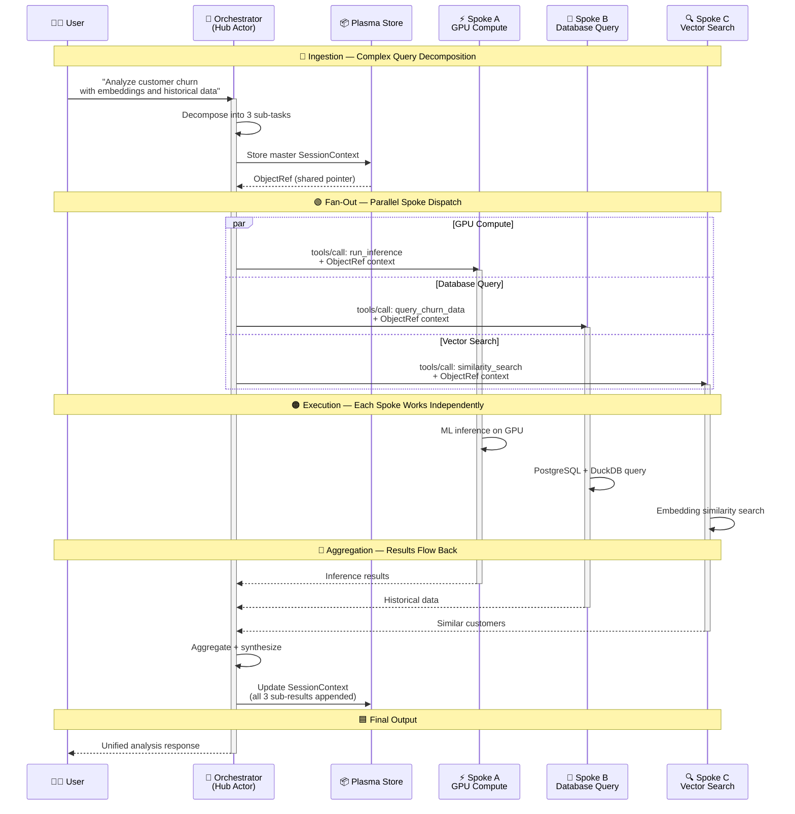

# 📐 Section 7 — K8s / Ray / MCP Umbrella Architecture

> **Project:** aces-d4-database-design
> **Path:** `docs/Section 7 — K8s Ray MCP Umbrella Architecture.md`
> **Author:** Peter Heller / Mind Over Metadata LLC
> **Date:** 2026-05-05 (revised 2026-05-06)
> **Status:** Research / Pre-ADR
> **Related ADRs:** ADR-061 (Kubernetes Task Group Runtime), ADR-062 (Ray ADF Execution Engine), ADR-063 (Hexagonal Ports & Adapters)
> **Predecessor:** `docs/k8s-ray-mcp-umbrella-architecture.md` (superseded)

---

## 📑 Table of Contents

- [7.1 🏗️ Architectural Overview — The Three Planes](#71-️-architectural-overview--the-three-planes)
- [7.2 🧠 The Plane Mental Model](#72--the-plane-mental-model)
- [7.3 ☂️ The Umbrella Architecture — Hub and Spoke](#73-️-the-umbrella-architecture--hub-and-spoke)
- [7.4 🔄 Session Context Management](#74--session-context-management)
- [7.5 🐍 Pydantic v2 Models — Session Context](#75--pydantic-v2-models--session-context)
- [7.6 🤖 Hub Orchestrator — Ray Actor Blueprint](#76--hub-orchestrator--ray-actor-blueprint)
- [7.7 ☸️ KubeRay Deployment — RayService YAML](#77-️-kuberay-deployment--rayservice-yaml)
- [7.8 🔧 Construction Principles](#78--construction-principles)
- [7.9 🎯 ACES Integration Points](#79--aces-integration-points)
- [7.10 📋 Next Steps](#710--next-steps)

---

## 7.1 🏗️ Architectural Overview — The Three Planes

[⬆️ Back to TOC](#-table-of-contents)

The modern distributed AI stack separates into three planes, each solving a different class of problem:

| Plane | Owner | Manages | Analogy |
|-------|-------|---------|---------|
| **Platform Control Plane** | Kubernetes (K8s) | Containers, nodes, networking, raw hardware (GPU/CPU/RAM) | Operating System for the data center |
| **Execution Control Plane** | Ray.io | Python objects, actors, tasks, distributed memory | Runtime for the AI application |
| **Tool Interface Plane** | Model Context Protocol (MCP) | Agent↔tool communication, session context, JSON-RPC routing | User interface for agents |

The relationship is hierarchical: **Ray on K8s** (not K8s on Ray). Kubernetes provides the infrastructure "utility layer" while Ray provides the application-level "umbrella" that makes multiple K8s clusters feel like a single computer.

### 📊 Diagram 7.1 — Three-Plane Stack Architecture



---

## 7.2 🧠 The Plane Mental Model

[⬆️ Back to TOC](#-table-of-contents)

### 7.2.1 Kubernetes — The Platform Control Plane

Kubernetes popularized the transition from managing individual servers to managing a desired state through declarative configurations.

The **Control Plane** acts as the "brain" — it makes global decisions about the cluster (scheduling pods, detecting state drift) through the API Server, Scheduler, Controller Manager, and etcd state store.

The **Data Plane** (Worker Nodes) acts as the "muscle" — running actual applications via Kubelets, kube-proxy, and container runtimes.

This pattern enables Platform Engineering: internal developer platforms that provide infrastructure as a service, freeing developers to focus on code while the planes handle reliability, scaling, and networking.

### 7.2.2 Dispatcher Router Parallel

The K8s Control Plane has a direct structural parallel to web framework dispatching routers (Struts, React, FastAPI):

| Feature | Web Framework (FastAPI/React) | Kubernetes Control Plane |
|---------|-------------------------------|--------------------------|
| The "Brain" | Router/Dispatcher — matches URL to function | API Server & Scheduler — matches resource request to worker node |
| The "Muscle" | Controller/View — executes business logic | Data Plane (Kubelet) — runs containerized apps |
| The State | Session/DB — stores user data | etcd — stores desired cluster state |
| Logic Type | Imperative ("if path X, run function Y") | Declarative ("ensure 3 instances of App X always run") |

**Key Differences:**

- **Request vs. Lifecycle:** A FastAPI router handles a single transient request. The K8s Control Plane manages the full lifecycle — continuously monitoring and re-scheduling if a node fails.
- **Routing vs. Orchestration:** A router directs traffic. The Control Plane is an orchestrator — it ensures the destination exists and has sufficient resources.

### 7.2.3 Ray.io — The Execution Control Plane

Ray acts as the Distributed Execution Layer bridging K8s infrastructure and high-performance AI code.

- **K8s is for Platform Engineers:** manages container lifecycle, networking, raw hardware allocation
- **Ray is for ML Engineers:** manages Python objects, actors, tasks — handles parallelization without requiring YAML

**KubeRay** is the industry standard bridge:

- Defines a `RayCluster` as a standard Kubernetes resource
- KubeRay operator tells K8s to spin up pods as Ray head/worker nodes
- **Hybrid Autoscaling:** Ray detects when a task needs more compute → requests pods from K8s → K8s requests VMs from cloud provider

### 7.2.4 MCP — The AI Control Plane

As AI shifts from single-agent chats to complex workflows, MCP is emerging as the Control Plane for AI tool orchestration.

- Just as K8s orchestrates containers, MCP orchestrates how agents interact with tools, APIs, and data sources
- **Migration path from static K8s services:** wrap existing services as MCP Servers → decompose workflows into micro-agents → deploy as K8s pods using K8s for scaling and MCP for reasoning-based tool discovery

### 📊 Diagram 7.2 — Dispatcher Router Parallel



---

## 7.3 ☂️ The Umbrella Architecture — Hub and Spoke

[⬆️ Back to TOC](#-table-of-contents)

### 7.3.1 The Pivotal Insight

K8s becomes the "Utility Layer" (electricity/water) and Ray becomes the "Application Operating System" (the Umbrella). The developer never writes `deployment.yaml` — they write Python code, and Ray commands the underlying K8s planes.

This solves three problems:

1. **Unified Control Plane for Agents:** If an agent needs to move from K8s Cluster A (AWS) to Cluster B (on-prem) for GPU availability, Ray handles the handoff without the agent losing its memory state.
2. **MCP as the Interface:** MCP Servers live under the Ray umbrella. When an agent needs a tool, the Ray Control Plane routes the session context to the correct K8s cluster with sub-millisecond latency.
3. **Global Session Passing:** Traditional K8s requires Redis for inter-agent sessions. Under Ray, agents share a Distributed Object Store (Plasma) — passing pointers instead of data blobs.

### 7.3.2 Hub and Spoke Construction

The Umbrella is not a single super-cluster — it is a **Logical Control Plane** over physical infrastructure.

**The Hub (The "Brain"):**
- Centralized management cluster in a high-availability K8s environment
- Stores global session state, maintains MCP Server Registry, hosts Orchestrator Agent
- Decides which spoke handles each sub-task based on GPU availability or data locality

**The Spokes (The "Muscle"):**
- Specialized regional clusters (e.g., one for H100 GPUs, another for high-memory vector search)
- Run Spoke Agents and MCP Servers that interact with local data/hardware
- Stateless execution — receive context from Hub with each request

**Three Layers of Glue:**

1. **Unified API Layer (Ray/KubeRay):** Head Node in the Hub, Worker Groups federated across K8s namespaces/clusters
2. **Shared Memory Fabric:** Distributed Object Store (Plasma) spanning hub and spokes — agents pass pointers, not copies
3. **MCP Gateway:** Hub-level MCP Router translates tool calls to standardized JSON-RPC and routes to the correct Spoke

### 📊 Diagram 7.3 — Hub-and-Spoke Umbrella Construction



### 7.3.3 Extensibility — Single App and Shared Platform

The architecture serves both use cases because Ray allows custom Resource Requirements and Placement Groups:

**Single Large-Scale App (Vertical Scaling):**
- Ray Umbrella acts as Global Scheduler
- Complex Python objects (500MB vector memory state) passed between agents via shared memory pointers
- No serialization overhead — orders of magnitude faster than JSON over network

**Shared Platform (Horizontal Extensibility):**
- Ray becomes Internal Developer Platform (IDP)
- Virtual Clusters via Ray Job Submission — Team A deploys "Swarm of Researchers," Team B deploys "Customer Support Agent," sharing GPU pool
- Central MCP Server Registry on the Umbrella — any team's agent discovers and calls tools across clusters

---

## 7.4 🔄 Session Context Management

[⬆️ Back to TOC](#-table-of-contents)

### 7.4.1 The Problem — Context Rot

Passing session contexts between agents is critical. Without a standard, context degrades ("rots") as it hops between services. Each hop risks data loss, type corruption, or stale state.

**State Management Patterns:**

| Pattern | Description |
|---------|-------------|
| Root Agent Coordination | Root Agent maintains master session state, passes relevant snippets to specialized agents |
| Stateless Servers | MCP servers remain stateless for compliance — receive context with each request |
| Metadata Propagation | Headers/markers (like `x-forwarded-for` in web traffic) allow downstream agents to load correct context |
| Ray Object Refs | Pointers to distributed memory — actual session data stays in Ray's Object Store |
| Checkpointed Continuity | `MemorySaver` checkpointing ensures sessions survive worker node failures |

### 7.4.2 Session Context Flow — Sequence Diagram

The canonical flow for a single user request through the Umbrella:

### 📊 Diagram 7.4a — Single-Turn Session Context Flow



### 7.4.3 Multi-Spoke Routing — Sequence Diagram

When a single user request requires coordination across multiple Spokes:

### 📊 Diagram 7.4b — Multi-Spoke Fan-Out and Aggregation



### 7.4.4 MCP JSON-RPC Session Payload

The standardized payload for Hub → Spoke communication:

```json
{
  "jsonrpc": "2.0",
  "method": "tools/call",
  "params": {
    "name": "execute_data_query",
    "arguments": {
      "query": "Get user analytics",
      "sessionId": "user_session_99",
      "context": {
        "history": [
          {"role": "user", "content": "Analyze my last job."},
          {"role": "assistant", "content": "Job 45 was successful."}
        ],
        "metadata": {
          "priority": "high",
          "cluster_id": "spoke_gpu_01"
        }
      }
    }
  },
  "id": 1
}
```

### 📊 Diagram 7.4c — Session Context Lifecycle

```mermaid
graph LR
    subgraph CREATE ["📥    Context    Creation"]
        C1["🆕 New SessionContext"]
        C2["✅ Pydantic Validation"]
    end

    subgraph PASS ["🔄    Context    Propagation"]
        P1["📦 Store in Plasma"]
        P2["🔗 Pass ObjectRef"]
        P3["📨 Embed in JSON-RPC"]
    end

    subgraph VALIDATE ["🛡️    Spoke    Validation"]
        V1["📥 Receive JSON-RPC"]
        V2["✅ model_validate_json"]
        V3["🛠️ Execute Tool"]
    end

    subgraph UPDATE ["📤    Context    Update"]
        U1["📝 Append to History"]
        U2["📦 Write Back to Plasma"]
        U3["🔗 Return Updated Ref"]
    end

    subgraph ERR ["⚠️    Error    Recovery"]
        E1["❌ Validation Failure"]
        E2["🔄 MemorySaver Checkpoint"]
    end

    C1 --> C2
    C2 --> P1
    P1 --> P2
    P2 --> P3
    P3 --> V1
    V1 --> V2
    V2 --> V3
    V3 --> U1
    U1 --> U2
    U2 --> U3

    %% Error flows (dashed)
    V2 -.-> E1
    V3 -.-> E2
    E2 -.-> P1

    linkStyle 0 stroke:#1976d2,stroke-width:3px
    linkStyle 1 stroke:#1976d2,stroke-width:3px
    linkStyle 2 stroke:#7b1fa2,stroke-width:3px
    linkStyle 3 stroke:#7b1fa2,stroke-width:3px
    linkStyle 4 stroke:#388e3c,stroke-width:3px
    linkStyle 5 stroke:#388e3c,stroke-width:3px
    linkStyle 6 stroke:#f57c00,stroke-width:3px
    linkStyle 7 stroke:#f57c00,stroke-width:3px
    linkStyle 8 stroke:#3f51b5,stroke-width:4px
    linkStyle 9 stroke:#3f51b5,stroke-width:4px
    linkStyle 10 stroke:#c2185b,stroke-width:2px
    linkStyle 11 stroke:#c2185b,stroke-width:2px
    linkStyle 12 stroke:#c2185b,stroke-width:2px

    style CREATE fill:#e8f4fd,stroke:#1976d2,stroke-width:3px,color:#000
    style PASS fill:#f8f0ff,stroke:#7b1fa2,stroke-width:3px,color:#000
    style VALIDATE fill:#f0f8f0,stroke:#388e3c,stroke-width:3px,color:#000
    style UPDATE fill:#fff4e6,stroke:#f57c00,stroke-width:3px,color:#000
    style ERR fill:#fef7f7,stroke:#c2185b,stroke-width:3px,color:#000

    classDef inputStyle fill:#e3f2fd,stroke:#1976d2,stroke-width:2px,color:#000
    classDef processStyle fill:#f3e5f5,stroke:#7b1fa2,stroke-width:2px,color:#000
    classDef routeStyle fill:#e8f5e8,stroke:#388e3c,stroke-width:2px,color:#000
    classDef outputStyle fill:#fff8e1,stroke:#f57c00,stroke-width:2px,color:#000
    classDef errorStyle fill:#fce4ec,stroke:#c2185b,stroke-width:2px,color:#000

    class C1,C2 inputStyle
    class P1,P2,P3 processStyle
    class V1,V2,V3 routeStyle
    class U1,U2,U3 outputStyle
    class E1,E2 errorStyle
```



---

## 7.5 🐍 Pydantic v2 Models — Session Context

[⬆️ Back to TOC](#-table-of-contents)

Pydantic v2 provides strict typing, fast serialization, and validation for the session context as it travels through the Umbrella.

### 7.5.1 Message and Session Models

```python
from typing import List, Dict, Any, Optional, Literal
from pydantic import BaseModel, Field


class Message(BaseModel):
    """Individual message in the session history."""
    role: Literal["user", "assistant", "system"]
    content: str


class SessionContext(BaseModel):
    """The 'Thread' — context passed between Hub and Spokes."""
    history: List[Message] = Field(default_factory=list)
    metadata: Dict[str, Any] = Field(default_factory=dict)
    memory_embeddings: Optional[List[float]] = None  # extensible


class ToolArguments(BaseModel):
    """MCP tool call arguments with session context."""
    query: str
    sessionId: str
    context: SessionContext


class MCPToolCall(BaseModel):
    """Top-level JSON-RPC 2.0 envelope for MCP wire format."""
    jsonrpc: str = "2.0"
    method: str = "tools/call"
    params: Dict[str, Any]
    id: int
```

### 7.5.2 Design Rationale

| Decision | Why |
|----------|-----|
| `Literal["user", "assistant", "system"]` | Prevents context rot from malformed roles |
| `model_dump()` over `dict()` | Pydantic v2 standard — clean serialization for Ray Object Store or MCP JSON-RPC |
| `Optional` fields | Extensible without breaking existing serialized contexts |
| `model_validate_json()` on receive | Spoke rejects corrupted context immediately rather than crashing mid-execution |

### 7.5.3 Serialization Example

```python
# Create the context
ctx = SessionContext(
    history=[
        Message(role="user", content="Analyze my last job."),
        Message(role="assistant", content="Job 45 was successful.")
    ],
    metadata={"priority": "high", "cluster_id": "spoke_gpu_01"}
)

# Create the arguments
args = ToolArguments(
    query="Get user analytics",
    sessionId="user_session_99",
    context=ctx
)

# Wrap in the RPC envelope
mcp_request = MCPToolCall(
    params={"name": "execute_data_query", "arguments": args.model_dump()},
    id=1
)

# Output as JSON for the wire
print(mcp_request.model_dump_json(indent=2))
```

---

## 7.6 🤖 Hub Orchestrator — Ray Actor Blueprint

[⬆️ Back to TOC](#-table-of-contents)

```python
import ray
from typing import Dict, Any


ray.init(ignore_reinit_error=True)


@ray.remote
class HubOrchestrator:
    """The 'Brain' of the Umbrella architecture.

    A Ray Actor — stays alive in memory across multiple user turns.
    Manages the session 'Thread' and routes to Spokes.
    """

    def __init__(self):
        self.mcp_registry = {
            "k8s_cluster_gpu": "mcp://10.0.1.5:5000",   # Spoke A
            "on_prem_db": "mcp://192.168.1.50:5001",     # Spoke B
        }
        self.sessions: Dict[str, Any] = {}

    def process_request(self, session_id: str, user_query: str):
        # Retrieve or initialize session context
        context = self.sessions.get(
            session_id, {"history": [], "metadata": {}}
        )

        # Route to appropriate Spoke
        target_spoke = self._route_logic(user_query)
        mcp_endpoint = self.mcp_registry[target_spoke]

        # Pass session context to Spoke via MCP/Ray
        response = self._call_spoke_mcp(mcp_endpoint, context, user_query)

        # Update global context
        context["history"].append(
            {"user": user_query, "assistant": response}
        )
        self.sessions[session_id] = context

        return response

    def _route_logic(self, query: str) -> str:
        return "k8s_cluster_gpu" if "compute" in query else "on_prem_db"

    def _call_spoke_mcp(
        self, endpoint: str, context: dict, query: str
    ) -> str:
        # Production: use mcp-python-sdk for JSON-RPC
        return (
            f"Processed by {endpoint} "
            f"with context history size: {len(context['history'])}"
        )


# --- Execution ---
hub = HubOrchestrator.remote()

# Turn 1
print(ray.get(hub.process_request.remote("user_123", "Run a compute job.")))

# Turn 2 — context is preserved in the Hub Umbrella
print(ray.get(
    hub.process_request.remote("user_123", "Check the database for my job status.")
))
```

---

## 7.7 ☸️ KubeRay Deployment — RayService YAML

[⬆️ Back to TOC](#-table-of-contents)

```yaml
apiVersion: ray.io/v1
kind: RayService
metadata:
  name: agent-hub-umbrella
spec:
  serveConfigV2: |
    applications:
      - name: orchestrator_hub
        import_path: hub_logic.app
        route_prefix: /
  rayClusterConfig:
    headGroupSpec:
      rayStartParams:
        dashboard-host: '0.0.0.0'
      template:
        spec:
          containers:
            - name: ray-head
              image: rayproject/ray:2.9.0
              resources:
                limits:
                  cpu: "2"
                  memory: "4Gi"
    workerGroupSpecs:
      - replicas: 2
        groupName: gpu-spoke-pool
        template:
          spec:
            containers:
              - name: ray-worker
                image: rayproject/ray:2.9.0
                resources:
                  limits:
                    nvidia.com/gpu: 1
```

---

## 7.8 🔧 Construction Principles

[⬆️ Back to TOC](#-table-of-contents)

| Principle | Implementation |
|-----------|---------------|
| **Unified Memory** | Size each Ray pod to consume an entire K8s node — maximizes shared-memory Object Store efficiency |
| **Lifecycle Management** | Ray Actors in Hub (stateful session management), Ray Tasks in Spokes (stateless tool execution) |
| **Security** | Least privilege per container — agents only get permissions for their specific Spoke cluster |
| **Isolation** | Deploy different Spokes into separate K8s namespaces — prevents cross-contamination |
| **Autoscaling** | Ray internal autoscaler detects compute needs → requests pods from K8s → K8s requests VMs from cloud |

---

## 7.9 🎯 ACES Integration Points

[⬆️ Back to TOC](#-table-of-contents)

This architecture maps directly to the ACES framework:

| ACES Concept | Umbrella Mapping |
|-------------|------------------|
| ACESGroupTask | Ray Actor managing a group of coordinated tasks |
| ACESPublicTaskPod | Spoke K8s pod running an MCP Server |
| ACESPrivateTaskPod | Hub-internal Ray Actor with restricted context |
| ACESController | HubOrchestrator — the root scheduling actor |
| ACESSpawnedChain | Ray Task chain across Spokes |
| WorkspaceState (WORM) | SessionContext — forwarded/updated, never mutated in place |
| DCG topology | `McpResponse.status="continue"` — agent signals AdfExecutor to re-dispatch; `DcgTerminationOverride` in SessionContext parameterizes per-instance termination without mutating `system.md` |
| system.md | Behavioral contract loaded into each Spoke's MCP Server |
| MaaS Tiers | Spokes hosting different model tiers (local Ollama, Ray Serve, SageMaker) |

### 📊 Diagram 7.9 — ACES ↔ Umbrella Mapping

```mermaid
graph TB
    subgraph ACES ["🎯    ACES    Framework    Concepts"]
        AC1["📋 ACESGroupTask"]
        AC2["🌐 ACESPublicTaskPod"]
        AC3["🔒 ACESPrivateTaskPod"]
        AC4["🎛️ ACESController"]
        AC5["⛓️ ACESSpawnedChain"]
        AC6["📝 WorkspaceState — WORM"]
        AC7["📜 system.md"]
    end

    subgraph UMBRELLA ["☂️    Umbrella    Implementation"]
        UM1["🤖 Ray Actor — Group Coordinator"]
        UM2["🏭 Spoke K8s Pod + MCP Server"]
        UM3["🧠 Hub Ray Actor — Restricted"]
        UM4["🎯 HubOrchestrator"]
        UM5["🔀 Ray Task Chain — Cross-Spoke"]
        UM6["📦 SessionContext — Pydantic v2"]
        UM7["📄 Spoke Behavioral Contract"]
    end

    AC1 --> UM1
    AC2 --> UM2
    AC3 --> UM3
    AC4 --> UM4
    AC5 --> UM5
    AC6 --> UM6
    AC7 --> UM7

    linkStyle 0 stroke:#1976d2,stroke-width:3px
    linkStyle 1 stroke:#388e3c,stroke-width:3px
    linkStyle 2 stroke:#7b1fa2,stroke-width:3px
    linkStyle 3 stroke:#f57c00,stroke-width:3px
    linkStyle 4 stroke:#00695c,stroke-width:3px
    linkStyle 5 stroke:#3f51b5,stroke-width:4px
    linkStyle 6 stroke:#c2185b,stroke-width:3px

    style ACES fill:#f8f0ff,stroke:#7b1fa2,stroke-width:3px,color:#000
    style UMBRELLA fill:#f0f8f0,stroke:#388e3c,stroke-width:3px,color:#000

    classDef acesStyle fill:#f3e5f5,stroke:#7b1fa2,stroke-width:2px,color:#000
    classDef umbrellaStyle fill:#e8f5e8,stroke:#388e3c,stroke-width:2px,color:#000

    class AC1,AC2,AC3,AC4,AC5,AC6,AC7 acesStyle
    class UM1,UM2,UM3,UM4,UM5,UM6,UM7 umbrellaStyle
```



---

---

## 7.X — Hexagonal Ports in the Umbrella Architecture

> **Governing ADR:** ADR-063 (Hexagonal Architecture: Ports and Adapters)
> **Pattern:** Ports and Adapters — Alistair Cockburn, 2005

The Umbrella architecture is not just a K8s/Ray/MCP infrastructure concern. Every agent
interaction — inbound tool call, outbound session state, inter-cluster message, registry
write — crosses a **Port boundary** defined in ADR-063. The four ports map directly onto
Umbrella roles.

### 7.X.1 — Four-Port Mapping Table

| Port | Interface | Umbrella Role | Intra-Cluster Adapter | Inter-Cluster Adapter |
|------|-----------|---------------|-----------------------|-----------------------|
| `TransportPort` | `send()` / `receive()` | HTTP entry point into each Spoke — Ray Serve exposes the MCP server endpoint. All tool calls cross this port. | `HttpTransportAdapter` (Ray Serve) | `HttpTransportAdapter` (Ray Serve) — same adapter, different cluster |
| `ACESWorkspacePort` | `load()` / `save()` | SessionContext propagation — the WORM thread that carries conversation state across Hub→Spoke hops. Forwarded, never mutated. | Ray Plasma Object Store (`ray.put()` / `ray.get()`) | Redis (hot re-hydration) + PostgreSQL+WAL (durable fallback) |
| `MessageBusPort` | `publish()` / `consume()` / `ack()` | Work result exchange between Hub and Spoke agents. DCG `continue` signals travel this bus before AdfExecutor re-dispatches. | Ray Object Store (`RayObjectStoreBus`) | RabbitMQ (`RabbitMQAdapter`) |
| `RegistryPort` | `register()` / `resolve()` / `list_tools()` | BGD/FQDN/FQSN registry — governed writes to DuckDB on Synology. No deletes. WORM lifecycle enforced. | `DuckDbRegistryAdapter` (local DuckDB) | `DuckDbRegistryAdapter` (remote DuckDB on Synology via pydbconnect) |

### 7.X.2 — The Cross-Cluster Context Gap

Within a single Ray cluster, agents share the **Plasma Object Store** — zero-copy,
shared-memory, microsecond latency. An `ObjectRef` is a pointer into that cluster's
memory address space.

Crossing a cluster boundary (FreedomTower Hub → TheBeast Spoke) invalidates the
`ObjectRef`. Context **must** be serialized and transmitted. This is the
**Context Gap** — a fundamental property of distributed systems, not a design flaw.

```
Intra-Cluster (fast path):
  Agent A → ray.put(SessionContext) → ObjectRef → Agent B
  Latency: microseconds | Technology: Plasma Object Store

Inter-Cluster (bridge path):
  Hub → flush SessionContext → Redis (hot) / PostgreSQL+WAL (durable)
     → transmit via RabbitMQ or HTTP → Spoke
     → Spoke re-hydrates into local Plasma store
  Latency: milliseconds | Technology: ACESWorkspacePort bridge adapter
```

**Bridge Adapter pattern:** The `ACESWorkspacePort` implementation detects cluster
boundary crossings and automatically selects the inter-cluster path. The agent never
changes its code — it always calls `workspace_port.save()` and `workspace_port.load()`.
The adapter owns the routing decision.

**RayFed** is the candidate native solution for cross-cluster context passing — evaluated
as part of §7.10 next steps.

### 7.X.3 — Port Governance Rules

These rules apply to all Umbrella-level port implementations:

- **No direct infrastructure calls from domain code.** Agents call ports only. Never `ray.put()` directly from agent logic.
- **Adapters are swappable without agent changes.** MVP uses `InProcessBus` + `MockAdapter`. Production uses Ray + RabbitMQ. Same port interface.
- **`InProcessBus` uses `uuid_utils.uuid7()`** for message IDs — time-ordered, monotonic, ADR-005 standard. (`uuid.uuid7()` is Python 3.14+ only; project floor is Python 3.13.)
- **Circuit Breaker wraps all inter-cluster adapters.** If TheBeast Spoke is unavailable, the Hub receives a governed fallback — not a hang.
- **All port implementations must be registered in the FQSN registry** before they can be invoked by an ACES agent.

## 7.10 📋 Next Steps

[⬆️ Back to TOC](#-table-of-contents)

- [x] ADR-061 filed — Kubernetes as ACES Task Group Runtime (2026-05-03)
- [x] ADR-062 filed — Ray as ACES ADF Execution Engine (2026-05-03)
- [x] ADR-062 Amendment-1 — DCG topology: `TopologyType`, `DcgPolicy`, `DcgTerminationOverride`, `AdfExecutor` DCG execution loop (2026-05-06)
- [x] ADR-063 filed — Hexagonal Architecture: Ports and Adapters (2026-05-03)
- [x] ADR-063 Amendment-1 — `McpResponse.status="continue"`, `ACESWorkspaceContext.dcg_override` (2026-05-06)
- [x] ADR-063 Amendment-2 — InProcessBus UUIDv4 → `uuid_utils.uuid7()` (2026-05-06)
- [x] ADR-063 Amendment-3 — `uuid.uuid7()` is Python 3.14+ only; `uuid-utils>=0.14.1` confirmed for Python 3.13 floor; `pyproject.toml` updated (2026-05-06)
- [ ] ADR-064 — MCP HTTP Stateless Transport (reserved — prerequisite gate, not yet written)
- [ ] Implement `SessionContext` Pydantic models in `src/servers/`
- [ ] Build MCP Server skeleton using Ray Serve for BGD tool
- [ ] Define `.worm-manifest` for this project's WORM candidates
- [ ] KubeRay operator installation on FreedomTower (Docker Desktop K8s)
- [ ] Response model — Spoke → Hub return payload (Pydantic v2)
- [ ] Restore runbook for KubeRay cluster state
- [ ] Map FreedomTower cluster nodes to Spoke roles (FT=Hub, TheBeast=GPU Spoke, MiniBeast=GPU Spoke)

---

*Mind Over Metadata LLC © 2026*
